# Speaker Diarization & Transcription Tool

Whisper Diarize is a tool designed for speaker diarization, identifying "who spoke when" in an audio file. It primarily utilizes `pyannote.audio` (version 3.3 or newer) for diarization and performs speech transcription using WhisperX. The tool offers both a command-line interface (CLI) and a Gradio-based web UI for user interaction. It supports various audio formats, batch processing, audio trimming, and exports results in text and JSON formats. Access to Hugging Face models for online download requires user authentication via `huggingface-cli login`. The tool now also supports running with locally stored models for offline operation.

The project aims to provide a user-friendly way to perform speaker diarization and transcription, leveraging powerful open-source models and libraries. It includes features for handling single files or batches, customizing speaker information, managing output formats, and options for both online and offline model usage.

## Core Functionality

Whisper Diarize combines two main functionalities: speaker diarization and speech-to-text transcription.

### Speaker Diarization
This is the primary function of the tool. It uses the `pyannote.audio` library to process an audio file and determine the segments of speech attributable to different speakers. The system can either automatically detect the number of speakers or allow manual specification.

The core diarization logic is handled by the `process_diarization` function (found in `diarize_huggingface_cli.py`), which interacts with a `pyannote.audio` pipeline.
```python
# diarize_huggingface_cli.py excerpt
def process_diarization(pipeline, wav_file, known_speakers=None):
    """Process the diarization with progress updates"""
    try:
        # ... progress updates ...
        diarization_kwargs = {}
        if known_speakers:
            diarization_kwargs["num_speakers"] = int(known_speakers)
            
        diarization = pipeline(wav_file, **diarization_kwargs)
        # ... formatting results and calculating stats ...
        return diarization, output_lines, unique_speakers, speaker_times
    except Exception as e:
        # ... error handling ...
        return None, [], set(), {}
```

### Speech Transcription
The tool transcribes the spoken content in the audio using WhisperX, which provides robust transcription with word-level timestamps and alignment with diarization results.

The transcription process is managed by the `transcribe_audio` function.
```python
# diarize_huggingface_cli.py excerpt
def transcribe_audio(whisper_model, audio_path, language=None, diarization=None):
    """Transcribe audio using WhisperX with speaker diarization"""
    if whisper_model is None:
        return None
    try:
        # ... progress updates and options setup ...
        # Assumes WHISPERX_AVAILABLE is True and whisper_model is a WhisperX model
        # result = _transcribe_with_whisperx(whisper_model, audio_path, options, language, diarization, device)
        pass # Placeholder for actual call
        return result # Simplified
    except Exception as e:
        # ... error handling ...
        return None
```

## Features

| Feature                 | Description                                                                 | Availability     |
|-------------------------|-----------------------------------------------------------------------------|------------------|
| Speaker Diarization     | Identify who spoke when using `pyannote.audio`.                             | Core             |
| Speech Transcription    | Convert speech to text using WhisperX.                                      | Core (if enabled)|
| Batch Processing        | Process multiple audio files from a folder.                                 | Yes              |
| Audio Trimming          | Process only a specific segment of an audio file.                           | Yes              |
| Speaker Count Detection | Automatically detect or manually specify the number of speakers.            | Yes              |
| Multiple File Formats   | Supports WAV, MP3, M4A, FLAC, etc., via FFmpeg.                             | Yes              |
| Output Formats          | Export results as text and structured JSON.                                 | Yes              |
| Gradio Web UI           | Easy-to-use web interface for all functionalities.                          | Yes              |
| Progress Tracking       | Real-time progress updates for long operations.                             | Yes              |
| GPU Acceleration        | Automatically uses GPU if available (PyTorch & CUDA).                       | Yes (Implicit)   |

## Repository Overview

This repository consists of a handful of files to keep things simple:

* **`diarize_huggingface_cli.py`** – main Python script providing the command-line interface and Gradio web UI. It handles model loading, audio conversion and output formatting.
* **`install.sh`** and **`install.bat`** – optional helper scripts for Unix and Windows that set up a virtual environment, install dependencies (including WhisperX) and ensure FFmpeg is available.
* **`requirements.txt`** – list of Python packages required to run the tool.
* **`LICENSE`** – MIT license for this project.
* **`README.md`** – this documentation file.

If you are new to the codebase, start by running the main script, then explore the installation helpers to see how the environment is configured. The
`pyannote.audio` and `WhisperX` documentation are helpful next reads if you
want to understand how the underlying models work or swap them for other
variants.

## Quick Start

Follow these steps for a minimal working setup:

1. **Clone and install dependencies:**
   ```bash
   git clone https://github.com/ass45sin/whisper_diarize.git
   cd whisper_diarize
   pip install -r requirements.txt
   ```
   *(You can also run `install.sh` or `install.bat` for a guided installation.)*

2. **Launch the app:**
   ```bash
   python diarize_huggingface_cli.py
   ```
   This opens a Gradio web interface in your browser.

3. **Upload audio and run diarization.** Adjust options as desired and click
   **Run Diarization**. Results can be saved as text and JSON files.

For more detailed setup instructions, including offline model usage, see the
[Setup](#setup) section.

## System Overview

The system is built around Python and leverages several key libraries.
1.  **Audio Input Layer:** Handles audio file input, supporting various formats. Includes audio conversion to WAV and trimming.
2.  **Diarization Engine:** Uses `pyannote.audio` for speaker segmentation.
3.  **Transcription Engine:** Uses `WhisperX` for speech-to-text.
4.  **Output Formatting:** Generates text and JSON outputs.
5.  **User Interface:** Command-Line Interface (CLI) and Gradio Web UI.

### System Flow Diagram
This diagram illustrates the general processing flow:
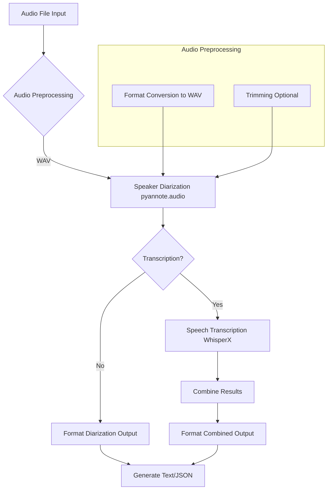

### High-Level Component Interaction
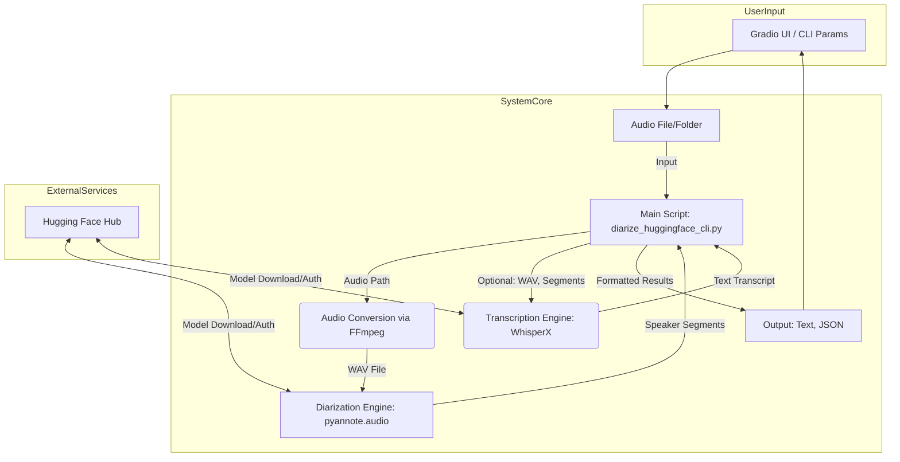

### Single File Processing Sequence
The `process_single_file` function (or equivalent logic called by the UI) orchestrates the processing for one audio file.
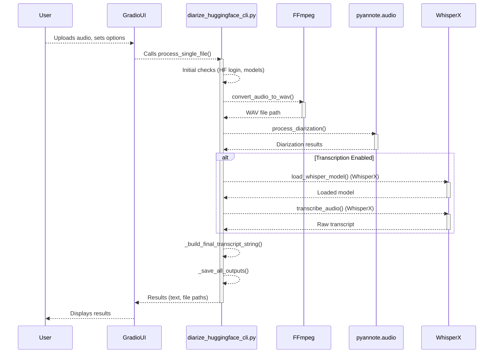

## Workflow Details

### Audio Processing Workflow Visualization
The overall audio processing workflow can be visualized as follows:

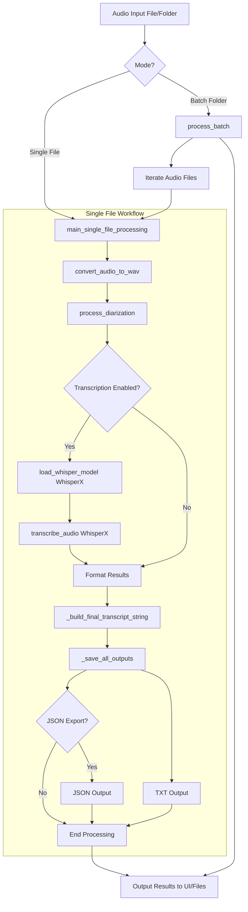


A more detailed sequence for a single file with transcription:
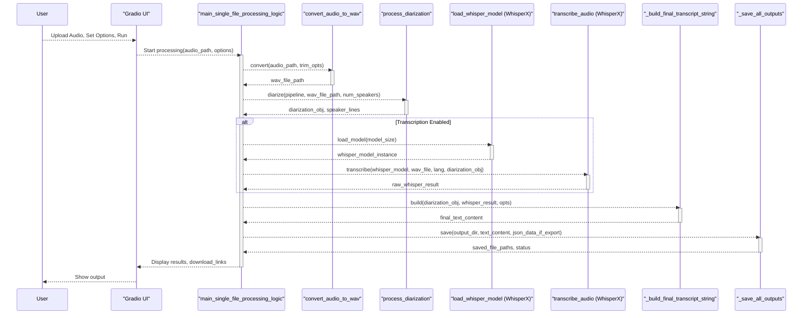

### Speaker Diarization Feature Workflow
High-level workflow for diarization:
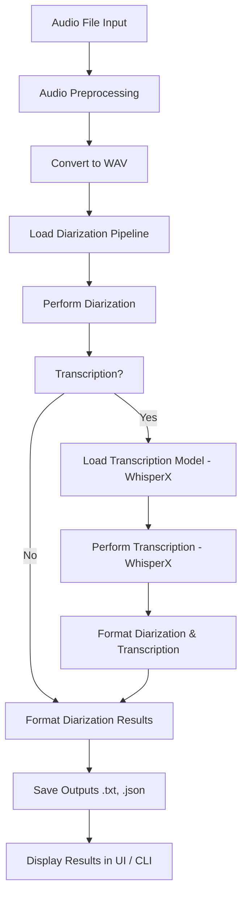

Sequence Diagram for `diarize()` function call (core diarization and transcription with WhisperX):
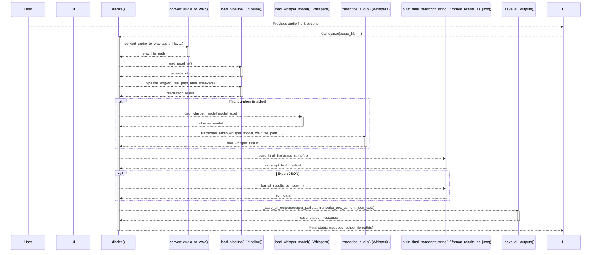

### Speech Transcription Feature Workflow (WhisperX)
Transcription process flow using WhisperX:
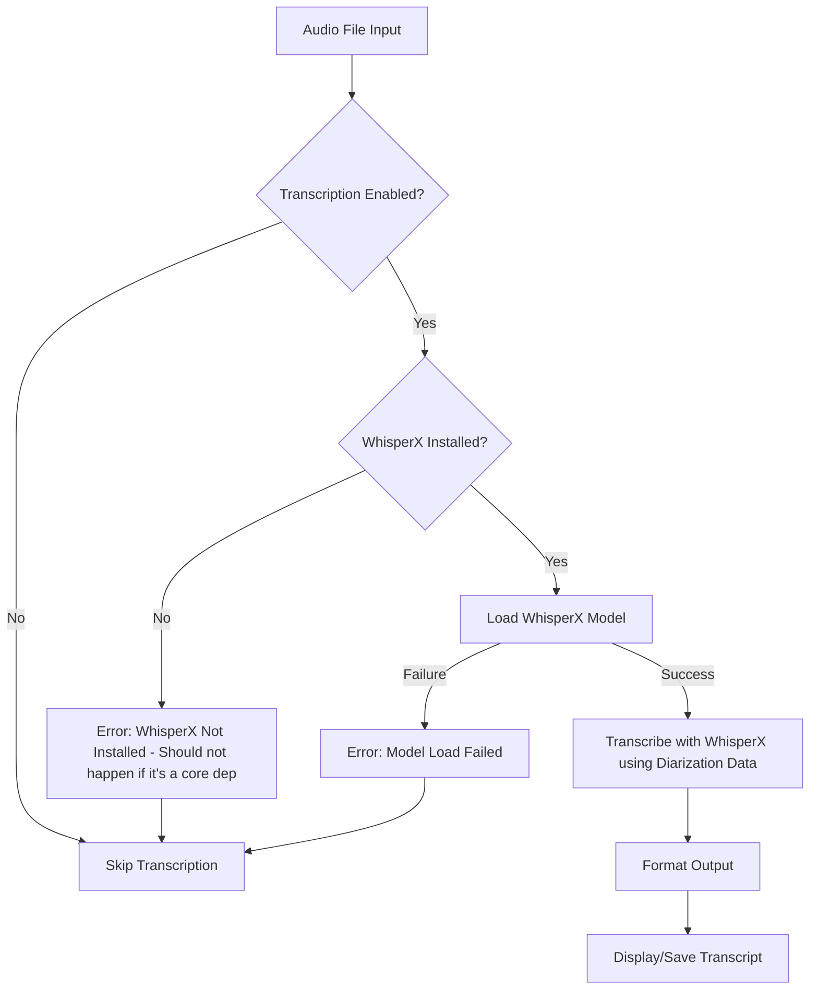

Sequence of operations in `transcribe_audio` (using WhisperX):
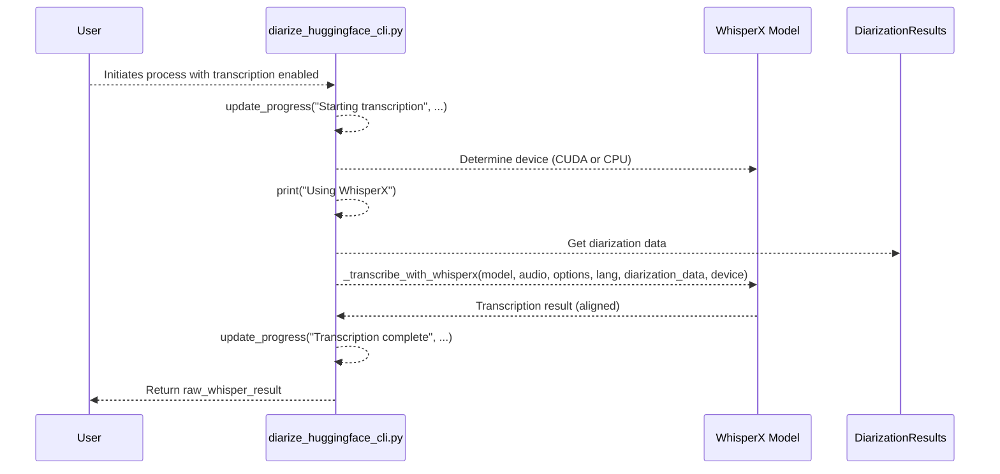

## Output Formats

The tool generates results in both plain text and structured JSON formats.

### Text Output (`.txt`)
The text output includes:
- Detected number of speakers.
- Speaking time and percentage for each speaker.
- Diarized segments with timestamps and speaker labels.
- If transcription is enabled, transcribed text is interleaved with speaker labels.
```
📊 Detected 2 speaker(s)
  - SPEAKER_01: 35.7s (60.0%)
  - SPEAKER_00: 23.8s (40.0%)
Audio trimmed from 0s to 60s

0:00:01 - 0:00:05 SPEAKER_01: Hello, this is speaker one.
0:00:06 - 0:00:10 SPEAKER_00: And this is speaker two.
...
```

### JSON Output (`.json`)
A structured JSON file containing detailed information.
JSON Output Structure Diagram:
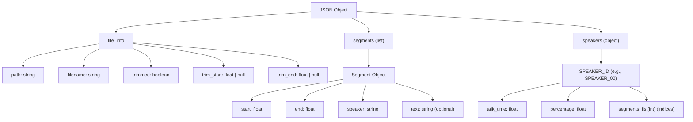

## Gradio Web UI Guide

The Gradio Web UI provides an interactive way to use the tool.
Main UI Structure:
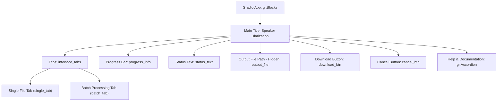

Single File Processing Tab Components:
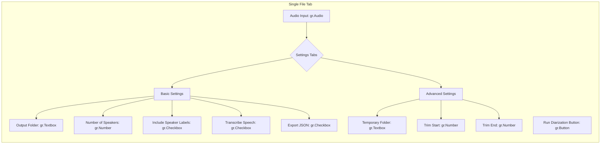

Single File Processing Flow via UI:
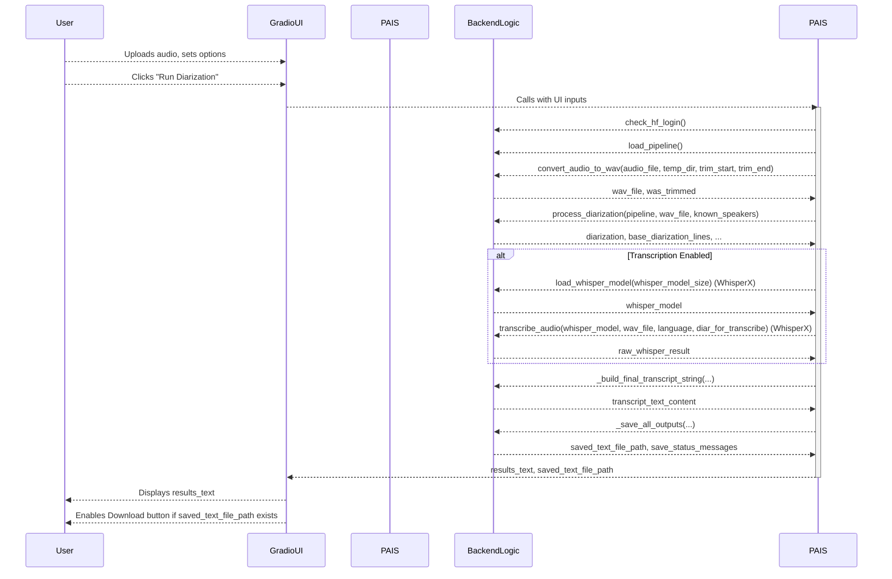

Key Features Accessible via UI:

| Feature                  | UI Control(s)                                                                                                 |
| ------------------------ | ------------------------------------------------------------------------------------------------------------- |
| Speaker Diarization      | "Run Diarization" / "Run Batch Diarization" buttons                                                           |
| Multiple File Formats    | `gr.Audio` input (handles various types via FFmpeg)                                                           |
| Speaker Statistics       | Output text includes speaker times                                                                            |
| Batch Processing         | "Batch Processing" tab, Input/Output folder textboxes                                                         |
| Audio Trimming           | "Trim start" / "Trim end" number inputs (Single File tab)                                                     |
| Transcription            | "Transcribe speech" checkbox, Whisper model dropdown, Language dropdown                                       |
| Structured JSON Output   | "Export results as JSON" checkbox                                                                             |
| Progress Tracking        | `gr.Progress` bar and `gr.Textbox` for status messages                                                        |


## Setup

This section guides you through setting up the project on your local machine manually. For a more automated approach, see the "Automated Installation" section below.

### 0. Prerequisites: Python Installation

Ensure you have Python 3.8 or newer installed.

*   **General Recommendation:** Download the official Python installer from [python.org](https://www.python.org/downloads/).

*   **macOS:**
    *   Using Homebrew (recommended):
        ```bash
        brew install python
        ```
    *   Alternatively, use the installer from [python.org](https://www.python.org/downloads/macos/).

*   **Linux (Ubuntu/Debian based):**
    ```bash
    sudo apt update
    sudo apt install python3 python3-pip python3-venv
    ```
    For other distributions, please refer to their respective package managers and documentation.

*   **Windows:**
    *   Download and run the installer from [python.org](https://www.python.org/downloads/windows/). **Important:** Check the box "Add Python to PATH" during installation.
    *   Alternatively, Python can be installed via the Microsoft Store or using winget:
        ```bash
        winget install Python.Python.3
        ```

Verify your installation by opening a terminal or command prompt and typing:
```bash
python3 --version  # or python --version on Windows if python3 isn't aliased
pip3 --version     # or pip --version
```

### 1. Project Setup (Manual)

1.  **Clone the repository (if you haven't already):**
    ```bash
    git clone https://github.com/ass45sin/whisper_diarize.git
    cd whisper_diarize
    ```

2.  **Create and Activate a Virtual Environment:**
    It's highly recommended to use a virtual environment to manage project dependencies and avoid conflicts with other Python projects or your global Python installation.

    *   **Create the virtual environment** (e.g., named `venv`):
        ```bash
        python3 -m venv venv
        ```
        (On Windows, you might use `python` instead of `python3` if `python3` is not recognized: `python -m venv venv`)

    *   **Activate the virtual environment:**
        *   On macOS and Linux:
            ```bash
            source venv/bin/activate
            ```
        *   On Windows (Command Prompt):
            ```bash
            venv\Scripts\activate.bat
            ```
        *   On Windows (PowerShell):
            ```bash
            .\venv\Scripts\Activate.ps1
            ```
            (If you get an error about script execution policy in PowerShell, you might need to run: `Set-ExecutionPolicy RemoteSigned -Scope CurrentUser` and then try activating again.)

    Your terminal prompt should change to indicate that the virtual environment is active (e.g., `(venv) your-prompt$`).

3.  **Install dependencies:**
    ```bash
    pip install -r requirements.txt
    ```
    *(WhisperX is now included in `requirements.txt` and will be installed automatically.)*

4.  **Install FFmpeg:** This is an essential external dependency for audio processing.
    *   **macOS (using Homebrew):**
        ```bash
        brew install ffmpeg
        ```
    *   **Linux (Ubuntu/Debian):**
        ```bash
        sudo apt update && sudo apt install ffmpeg
        ```
    *   **Windows:** Download FFmpeg builds from [ffmpeg.org](https://ffmpeg.org/download.html#build-windows) or [BtbN/FFmpeg-Builds](https://github.com/BtbN/FFmpeg-Builds/releases). After downloading, you'll need to add the `bin` directory (containing `ffmpeg.exe`) to your system's PATH environment variable.

5.  **Model Setup: Hugging Face (Online) or Local (Offline):**

    Depending on whether you want the tool to download models automatically or use pre-downloaded local models, follow the relevant subsection.

    #### Using Hugging Face for Model Download (Online Operation)
    This is the default mode where the tool fetches models from Hugging Face.
    *   **Login to Hugging Face:**
        ```bash
        huggingface-cli login
        ```
        You'll be prompted to enter a Hugging Face User Access Token. Create one with "read" permissions at [huggingface.co/settings/tokens](https://huggingface.co/settings/tokens).
    *   **Accept Model Licenses:** You *must* accept the user agreements for the models on the Hugging Face website using the *same account* you logged in with:
        *   [pyannote/speaker-diarization-3.1](https://huggingface.co/pyannote/speaker-diarization-3.1) (Click "Access repository")
        *   [pyannote/segmentation-3.0](https://huggingface.co/pyannote/segmentation-3.0) (Click "Access repository")

    #### Using Local Models (for Offline Operation)
    This mode allows you to run the tool without an active internet connection, provided models are downloaded beforehand. You can clone the models manually as shown below, or simply choose the download option when running `install.sh` or `install.bat`.
    *   **`pyannote.audio` models:**
        *   You need to clone the `pyannote/speaker-diarization-3.1` model repository. The segmentation model (`pyannote/segmentation-3.0`) is typically a dependency of the diarization pipeline and will be loaded from the `speaker-diarization-3.1` local directory if structured correctly by pyannote, or you may need to ensure it's also locally available if issues arise.
        *   Ensure `git-lfs` is installed (`git lfs install`).
        *   Clone the main diarization model:
            ```bash
            # For pyannote/speaker-diarization-3.1
            git clone https://huggingface.co/pyannote/speaker-diarization-3.1
            cd speaker-diarization-3.1
            git lfs pull
            cd ..

            # It's also good practice to have the segmentation model locally.
            # pyannote usually handles finding it if speaker-diarization-3.1 is local,
            # but if not, clone it as well:
            git clone https://huggingface.co/pyannote/segmentation-3.0
            cd segmentation-3.0
            git lfs pull
            cd ..
            ```
        *   You will need the local file path to the *directory* containing the `pytorch_model.bin`, `config.yaml`, etc., for `speaker-diarization-3.1` (e.g., `/path/to/your/cloned/speaker-diarization-3.1`).

    *   **`WhisperX` models:**
        *   WhisperX models (e.g., 'base', 'medium', 'large-v3') also need to be downloaded. These models are typically directories containing files like `model.bin`, `config.json`, `tokenizer.json`, and `vocabulary.json`.
        *   Many Whisper-compatible models that work with WhisperX are available on Hugging Face. For example, to download the `faster-whisper-large-v3` model (which is compatible with WhisperX):
            ```bash
            # Example for faster-whisper-large-v3
            git clone https://huggingface.co/guillaumekln/faster-whisper-large-v3
            cd faster-whisper-large-v3
            # If LFS is used (check .gitattributes), you might need git lfs pull
            # git lfs pull # Uncomment if LFS files are present
            cd ..
            ```
            (Refer to WhisperX documentation or Hugging Face for other model sizes or sources like `openai/whisper-<size>` if you are using the standard Whisper portion, though WhisperX primarily uses its own converted model format like `faster-whisper`).
        *   You will need the local file path to the *directory* containing these model files (e.g., `/path/to/your/cloned/faster-whisper-large-v3`).

    *   **Configuration:**
        *   Provide the paths to these local model folders using the **"Local Pyannote Model Path"** and **"Local Whisper Model Path"** fields in the Gradio interface (or the equivalent CLI options).
        *   If valid local paths are supplied, the tool loads the models directly from disk and Hugging Face login is not required.

### Setup and Dependency Check Flow
This diagram illustrates the general flow of checking system requirements, including options for online and offline model setup.
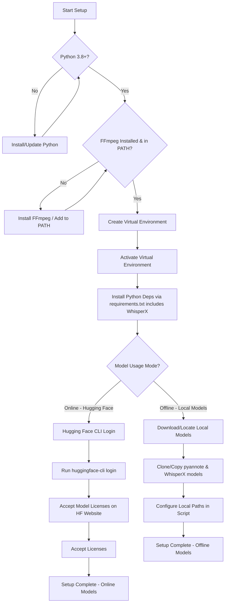

## 🚀 Automated Installation (Experimental)

For convenience, platform-specific installation scripts are provided to automate some of the setup steps. These scripts are experimental and aim to simplify the process. It's recommended to understand the manual steps they perform.

### Windows (`install.bat`)

1.  **Download `install.bat`** to the root directory of the cloned project.
2.  **Run the script:** You can either double-click `install.bat` or run it from a Command Prompt:
    ```cmd
    install.bat
    ```
3.  **Follow the prompts:** The script will:
    *   Check for an existing Python installation.
    *   Offer to create a Python virtual environment (in a folder named `venv`).
    *   Attempt to activate the virtual environment for the script's duration.
    *   Install Python dependencies from `requirements.txt` (includes WhisperX).
    *   Check if FFmpeg is accessible in your system's PATH and provide guidance if not.
    *   Guide you on the manual steps for Hugging Face CLI login and model license acceptance.

### macOS and Linux (`install.sh`)

1.  **Download `install.sh`** to the root directory of the cloned project.
2.  **Make the script executable:** Open your terminal and navigate to the project directory, then run:
    ```bash
    chmod +x install.sh
    ```
3.  **Run the script:**
    ```bash
    ./install.sh
    ```
4.  **Follow the prompts:** The script will:
    *   Check for Python 3 and pip3.
    *   Offer to create a Python virtual environment (in a folder named `venv`).
    *   Attempt to activate the virtual environment for the script's duration.
    *   Install Python dependencies from `requirements.txt` (includes WhisperX).
    *   Check if FFmpeg is accessible and provide OS-specific installation advice if not (Homebrew for macOS, apt for Debian/Ubuntu, etc.).
    *   Guide you on the manual steps for Hugging Face CLI login and model license acceptance.

### Important Notes for Automated Installation

*   **Review Scripts:** These scripts automate the manual setup steps. You can review the content of `install.bat` or `install.sh` in a text editor to understand the commands they execute.
*   **FFmpeg Installation:** While the scripts check for FFmpeg and provide common installation commands, you might need to perform additional manual steps depending on your specific OS distribution or if you choose a manual FFmpeg installation. Ensuring FFmpeg is correctly added to your system's PATH is crucial.
*   **Hugging Face Authentication:** The scripts will guide you, but the `huggingface-cli login` process and accepting model licenses on the Hugging Face website are interactive steps you must complete carefully using your Hugging Face account.
*   **Virtual Environment Activation:** After the installation script completes, you **must manually activate the virtual environment** in your terminal session before running the main Python application.
    *   Windows (Command Prompt): `venv\Scripts\activate.bat`
    *   Windows (PowerShell): `.\venv\Scripts\Activate.ps1`
    *   macOS/Linux: `source venv/bin/activate`
*   **Offline Setup Option:** The installation scripts can now download the default `pyannote` and `WhisperX` models for you. This requires that you log in to Hugging Face and have accepted the model licenses. When completed, you'll have all dependencies locally for offline use.

## Usage

Run the script from your terminal (ensure your virtual environment is activated):

```bash
python diarize_huggingface_cli.py
```

This will launch a Gradio web interface in your browser.

Refer to the "Help & Documentation" section within the Gradio UI or the sections below for more detailed instructions on using the interface, supported formats, and troubleshooting.

## 📦 System Requirements

### Essential Software & Libraries

*   **Python**: 3.8 or newer
*   **FFmpeg**: Required for audio processing and conversion. Must be installed and accessible in your system's PATH.
*   **Python Libraries** (installed via `pip install -r requirements.txt`):
    *   `gradio`: For the web user interface.
    *   `pyannote.audio` (version 3.3.2 or newer, as specified in `requirements.txt`): Core library for speaker diarization.
    *   `torch` (PyTorch, >= 1.12.0 recommended): Deep learning framework used by `pyannote.audio` and `WhisperX`.
    *   `torchaudio`: Audio library for PyTorch.
    *   `pandas`: For data manipulation.
    *   `huggingface_hub`: Provides `huggingface-cli` for authentication and model downloads, and is used by `pyannote.audio`.
    *   `whisperx`: For speech transcription (installed automatically from `requirements.txt`).

### Hardware Recommendations

*   **CPU**: A modern multi-core processor is recommended.
*   **RAM**:
    *   Minimum: 8GB.
    *   Recommended: 16GB or more, particularly when using larger Whisper models for transcription.
*   **GPU (Optional but Highly Recommended for Speed)**:
    *   An NVIDIA GPU with CUDA support (4GB+ VRAM) will significantly speed up both diarization and transcription. The script automatically uses the GPU if PyTorch detects a compatible CUDA environment.
*   **Disk Space**:
    *   At least 10-15GB of free space is recommended for storing downloaded models (which can be several gigabytes each, especially transcription models) and temporary files.

### Internet Connection

*   **Required for Initial Setup**: An active internet connection is generally necessary for:
    *   Initial download of Python packages (including WhisperX from GitHub and other dependencies from PyPI).
    *   Downloading models from Hugging Face *if you are not using pre-downloaded local models*.
    *   Hugging Face authentication (`huggingface-cli login`) *if you are using the online model download feature*.
*   **Offline Operation**:
    *   Once all Python packages are installed, and if you are using pre-downloaded local models for both `pyannote` and `WhisperX` (and have configured the tool to use them), an internet connection is **not required** for normal operation.
    *   If using the default online model download, then once models are downloaded and cached by Hugging Face libraries, the script can often run offline for subsequent processing of the *same models*, provided no new models or remote configurations need to be fetched. However, for true, guaranteed offline use, the local model setup is recommended.

## ⚠️ Common Issues & Solutions

This section provides solutions to common problems you might encounter.

### Authentication & Model Access Issues
*(These issues are primarily relevant if you are *not* using a fully offline setup with local models, or if Hugging Face access is still attempted for any reason.)*

*   **Error**: `"❌ Not logged in to Hugging Face CLI"` or `"AUTHORIZATION ERROR:"` or `"401 Unauthorized"`
    *   **Solution**:
        1.  Ensure you have run `huggingface-cli login` and entered a valid Hugging Face User Access Token with "read" permissions.
        2.  Crucially, verify you have accepted the license agreements for **both** required `pyannote` models using the *same Hugging Face account* used for `huggingface-cli login`:
            *   [pyannote/speaker-diarization-3.1](https://huggingface.co/pyannote/speaker-diarization-3.1) (Click "Access repository")
            *   [pyannote/segmentation-3.0](https://huggingface.co/pyannote/segmentation-3.0) (Click "Access repository")
        3.  If issues persist, try logging in again: `huggingface-cli login`.

### Model Loading & Network Issues

*   **Error**: `"SSL ERROR: There might be a network or proxy issue"`
    *   **Solution**: This often indicates a problem with SSL certificate verification, possibly due to a corporate proxy or outdated certificates. Try:
        ```bash
        pip install --upgrade certifi
        ```
*   **Error**: `"ONNX RUNTIME ERROR: This is a known issue with the model"`
    *   **Solution**: This can be due to incompatibilities with the ONNX model version. Try reinstalling a specific version of `onnxruntime`:
        ```bash
        pip uninstall onnxruntime onnxruntime-gpu
        pip install onnxruntime==1.15.1
        ```
        (You might need to experiment with other `onnxruntime` versions if 1.15.1 doesn't resolve it, depending on model updates.)
*   **Error**: `"MODEL NOT FOUND ERROR: The model file couldn't be downloaded"` or errors containing `"could not download"`
    *   **Solution**:
        1.  Check your internet connection.
        2.  Ensure you have accepted all necessary model licenses on Hugging Face (see "Authentication & Model Access Issues").
        3.  Try clearing the Hugging Face cache and then re-login:
            *   macOS/Linux: `rm -rf ~/.cache/huggingface`
            *   Windows: `del /s /q %USERPROFILE%\.cache\huggingface`
            Then run `huggingface-cli login` again.

### Audio Processing Issues

*   **Error**: `"❌ FFmpeg is not installed or not in PATH."` or `"Error converting audio file"`
    *   **Solution**: FFmpeg is essential for converting audio files to the format required by the diarization pipeline.
        *   Ensure FFmpeg is installed on your system. See "Install FFmpeg" in the Setup section.
        *   Verify that the directory containing `ffmpeg` (or `ffmpeg.exe` on Windows) is included in your system's PATH environment variable.
        *   If the audio file is corrupted, try a different file.

### Transcription Issues (WhisperX)

*   **Error**: `"❌ Failed to load transcription model (WhisperX)."`
    *   **Solution**:
        *   Ensure WhisperX installed correctly via `pip install -r requirements.txt`. Check for any errors during installation.
        *   Check you have enough RAM/VRAM for the selected model size (see "Model Sizes" in the UI's Transcription help tab). Try a smaller model (e.g., "base" or "small").
        *   Ensure all dependencies for WhisperX (like `faster-whisper`) were installed correctly. This should be handled by `pip install .` if the WhisperX `setup.py` is correctly configured.

### General Troubleshooting

*   **Check Console Output**: The script prints detailed status messages, warnings, and errors to the console (terminal). This output is invaluable for diagnosing issues.
*   **Restart Environment**: If you've made changes or installed new packages, try restarting your Python environment (deactivate and reactivate your virtual environment) or even your machine.
*   **Upgrade Packages**: Consider upgrading key packages if you suspect a version incompatibility:
    ```bash
    pip install --upgrade pyannote.audio huggingface_hub torch torchaudio gradio whisperx
    ```

## Contributing

Contributions are welcome! Please fork the repository, create a new branch for your features or bug fixes, and submit a pull request.

## Open Source and Offline Usage Considerations

*   **This Tool (MIT Licensed):** The "Speaker Diarization & Transcription Tool" (this project) is open source under the MIT License. This means the code of the tool itself is freely available for you to use, modify, and distribute, subject to the terms of the MIT License.

*   **Core Dependencies:** This tool integrates and relies on several powerful external libraries and pre-trained models, each with its own licensing and usage terms:
    *   **`pyannote.audio`:** The `pyannote.audio` library and its associated pre-trained models (e.g., `pyannote/speaker-diarization-3.1`, `pyannote/segmentation-3.0`) are developed by pyannote.io. Using these models, even when downloaded for local/offline use, typically requires users to agree to specific terms and conditions on their respective Hugging Face model pages (e.g., a Creative Commons license for the model weights, or specific research/commercial use clauses).
    *   **`WhisperX` and `Whisper` Models:**
        *   `WhisperX` itself (the library code) is often provided under a permissive open-source license like Apache 2.0.
        *   `WhisperX` utilizes speech recognition models based on OpenAI's `Whisper` architecture. The original `Whisper` models released by OpenAI have their own usage terms and licenses (often research-focused, with some restrictions).
        *   The specific Whisper models used with WhisperX (whether downloaded via WhisperX's default mechanisms or provided locally) may be OpenAI's original weights, or fine-tuned/converted versions by the WhisperX authors or the community. It is crucial to check the license associated with the particular Whisper model checkpoint you are using.
    *   **FFmpeg:** This tool uses FFmpeg for audio format conversion. FFmpeg is typically licensed under the LGPL or GPL.

*   **"Offline" Capability:** The offline functionality described in this README means the tool can operate without an active internet connection *after* all necessary software components (Python, FFmpeg, this tool's code, the WhisperX library) and the required pre-trained models (`pyannote` models, `WhisperX` compatible speech recognition models) have been downloaded and correctly configured for local access. The offline mode does not alter the underlying licenses or terms of use of these components.

*   **User Responsibility:** Users of this tool are responsible for understanding and adhering to the licenses and terms of use for all components they utilize. This includes the MIT license for this tool itself, the terms for `pyannote.audio` models, the licenses for the specific `WhisperX` library and `Whisper` speech recognition models employed, and the license for FFmpeg. The goal of providing offline capabilities is to offer operational flexibility, not to bypass or alter the licensing agreements of any third-party software or models.

## License

This project is licensed under the MIT License. See the `LICENSE` file for details.
