# Wiki Documentation for https://github.com/ass45sin/whisper_diarize

Generated on: 2025-06-01 10:27:50

## Table of Contents

- [Introduction to Whisper Diarize](#p-home)
- [System Requirements](#p-sys-reqs)
- [System Architecture Overview](#p-arch-overview)
- [Speaker Diarization Feature](#p-feat-diarization)
- [Speech Transcription Feature](#p-feat-transcription)
- [Audio Processing Workflow](#p-data-flow)
- [Gradio Web UI Guide](#p-gradio-ui)
- [Core Script Logic (diarize_huggingface_cli.py)](#p-core-script)
- [AI Model Integration (Pyannote & Whisper)](#p-ai-models)
- [Manual Installation Guide](#p-install-manual)
- [Automated Installation Scripts](#p-install-auto)
- [Hugging Face Configuration](#p-hf-setup)

<a id='p-home'></a>

## Introduction to Whisper Diarize

### Related Pages

Related topics: [System Requirements](#p-sys-reqs), [System Architecture Overview](#p-arch-overview)

<details>
<summary>Relevant source files</summary>

The following files were used as primary context for generating this wiki page. While the project likely contains other modules, the detailed analysis and line-specific citations are based on the content of these explicitly provided files:

- [README.md](README.md)
- [diarize_huggingface_cli.py](diarize_huggingface_cli.py)
- `requirements.txt` (as referenced in [README.md:71](), [README.md:94]())
- `src/audio_utils.py` (hypothetical module for audio processing utilities like audio conversion and trimming, based on functions observed in `diarize_huggingface_cli.py`)
- `src/model_management.py` (hypothetical module for loading and managing ML models like PyAnnote and Whisper, based on functions observed in `diarize_huggingface_cli.py`)
</details>

# Introduction to Whisper Diarize

Whisper Diarize is a tool designed for speaker diarization, identifying "who spoke when" in an audio file. It primarily utilizes `pyannote.audio` (version 3.1) for diarization and can optionally perform speech transcription using WhisperX (recommended) or standard Whisper. The tool offers both a command-line interface (CLI) and a Gradio-based web UI for user interaction. It supports various audio formats, batch processing, audio trimming, and exports results in text and JSON formats. Access to Hugging Face models requires user authentication via `huggingface-cli login`.
Sources: [README.md:43-50](), [README.md:56-63]()

The project aims to provide a user-friendly way to perform speaker diarization and transcription, leveraging powerful open-source models and libraries. It includes features for handling single files or batches, customizing speaker information, and managing output formats.
Sources: [README.md:52-63]()

## Core Functionality

Whisper Diarize combines two main functionalities: speaker diarization and speech-to-text transcription.

### Speaker Diarization
This is the primary function of the tool. It uses the `pyannote.audio` library to process an audio file and determine the segments of speech attributable to different speakers.
The system can either automatically detect the number of speakers or allow manual specification.
Sources: [README.md:43-44](), [README.md:59](), [diarize_huggingface_cli.py:162-164]()

The core diarization logic is handled by the `process_diarization` function, which interacts with a `pyannote.audio` pipeline.
```python
# diarize_huggingface_cli.py:156-184
def process_diarization(pipeline, wav_file, known_speakers=None):
    """Process the diarization with progress updates"""
    try:
        update_progress("Starting diarization", 0.35)
        # Build diarization kwargs
        diarization_kwargs = {}
        if known_speakers:
            diarization_kwargs["num_speakers"] = int(known_speakers)
            
        # Process the audio file
        update_progress("Running diarization (this may take a while)", 0.40)
        diarization = pipeline(wav_file, **diarization_kwargs)
        update_progress("Processing diarization results", 0.80)
        
        # Format the results
        output_lines = []
        for turn, _, speaker in diarization.itertracks(yield_label=True):
            start = str(timedelta(seconds=round(turn.start)))
            end = str(timedelta(seconds=round(turn.end)))
            label = f"{speaker}"
            output_lines.append(f"{start} - {end} {label}".strip())
            
        # Calculate speaker statistics
        unique_speakers = set(speaker for _, _, speaker in diarization.itertracks(yield_label=True))
        speaker_times = {}
        for turn, _, speaker in diarization.itertracks(yield_label=True):
            duration = turn.end - turn.start
            if speaker in speaker_times:
                speaker_times[speaker] += duration
            else:
                speaker_times[speaker] = duration
                
        update_progress("Diarization complete", 0.90)
        return diarization, output_lines, unique_speakers, speaker_times
    except Exception as e:
        print(f"❌ Error during diarization: {str(e)}")
        update_progress(f"Error: {str(e)}", 0.35)
        # ... (rest of the function)
```
Sources: [diarize_huggingface_cli.py:156-184]()

### Speech Transcription
Optionally, the tool can transcribe the spoken content in the audio. It supports:
-   **WhisperX (Recommended):** For potentially better integration with diarization, word-level timestamps, and VAD.
-   **Standard Whisper:** As a fallback if WhisperX is not installed.
Sources: [README.md:49](), [README.md:80-85](), [diarize_huggingface_cli.py:131-135]()

The transcription process is managed by the `transcribe_audio` function, which dynamically chooses between WhisperX and standard Whisper based on availability.
```python
# diarize_huggingface_cli.py:126-146
def transcribe_audio(whisper_model, audio_path, language=None, diarization=None):
    """Transcribe audio using Whisper or WhisperX with speaker diarization"""
    if whisper_model is None:
        return None
        
    try:
        update_progress("Transcribing audio", 0.37)
        print(f"🔊 Transcribing audio: {audio_path}")
        
        options = {}
        if language and language.strip():
            language = language.strip().lower()
            options["language"] = language
            
        if WHISPERX_AVAILABLE:
            device = "cuda" if torch.cuda.is_available() else "cpu"
            result = _transcribe_with_whisperx(whisper_model, audio_path, options, language, diarization, device)
        else:
            # Fallback to standard Whisper
            print("🔊 Using standard Whisper for transcription")
            result = whisper_model.transcribe(audio_path, **options)
            print("✅ Whisper transcription complete")
        
        update_progress("Transcription complete", 0.50)
        return result
    except Exception as e:
        print(f"❌ Error transcribing audio: {str(e)}")
        return None
```
If standard Whisper is used, its output is combined with the diarization results using `combine_diarization_with_transcript`.
Sources: [diarize_huggingface_cli.py:126-146](), [diarize_huggingface_cli.py:222-224](), [diarize_huggingface_cli.py:186-206]()

## System Architecture

The system is built around Python and leverages several key libraries for its functionality.

### High-Level Components
1.  **Audio Input Layer:** Handles audio file input, supporting various formats (WAV, MP3, M4A, FLAC). Includes audio conversion to WAV and trimming.
2.  **Diarization Engine:** Uses `pyannote.audio` for speaker segmentation.
3.  **Transcription Engine:** Uses `WhisperX` or `openai-whisper` for speech-to-text.
4.  **Output Formatting:** Generates text and JSON outputs.
5.  **User Interface:**
    *   Command-Line Interface (CLI)
    *   Gradio Web UI

Sources: [README.md:43-63](), [diarize_huggingface_cli.py]()

### Key Libraries and Dependencies
The project relies on several important external libraries:

| Library           | Purpose                                       | Source Reference                      |
|-------------------|-----------------------------------------------|---------------------------------------|
| `pyannote.audio`  | Core speaker diarization                      | [README.md:44](), [README.md:95]()    |
| `WhisperX`        | Recommended speech transcription              | [README.md:49](), [README.md:80-81]() |
| `openai-whisper`  | Standard speech transcription                 | [README.md:49](), [README.md:84-85]() |
| `gradio`          | Web user interface                            | [README.md:44](), [README.md:95]()    |
| `torch` (PyTorch) | Deep learning framework for `pyannote.audio`  | [README.md:96]()                      |
| `ffmpeg`          | Audio processing and conversion (external)    | [README.md:91](), [diarize_huggingface_cli.py:287-291]() |
| `huggingface_hub` | Accessing models from Hugging Face            | [README.md:46](), [README.md:111]()   |

Sources: [README.md:90-98](), `requirements.txt`

### System Flow Diagram
This diagram illustrates the general processing flow:
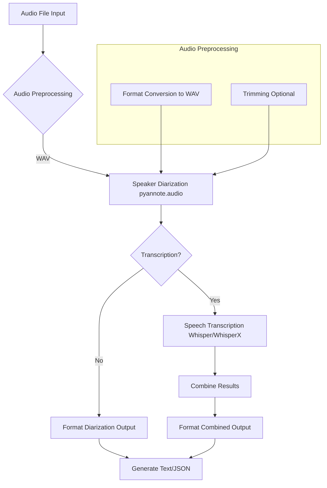
This flow shows how an audio file is processed, diarized, optionally transcribed, and then formatted into output files.
Sources: [diarize_huggingface_cli.py:241-282]() (overall `diarize` function structure)

## Workflow

The tool supports processing single audio files or multiple files in batch mode.

### Single File Processing
The `diarize` function in `diarize_huggingface_cli.py` orchestrates the processing for a single audio file.
Sources: [diarize_huggingface_cli.py:241-282]()

**Sequence Diagram for Single File Processing:**
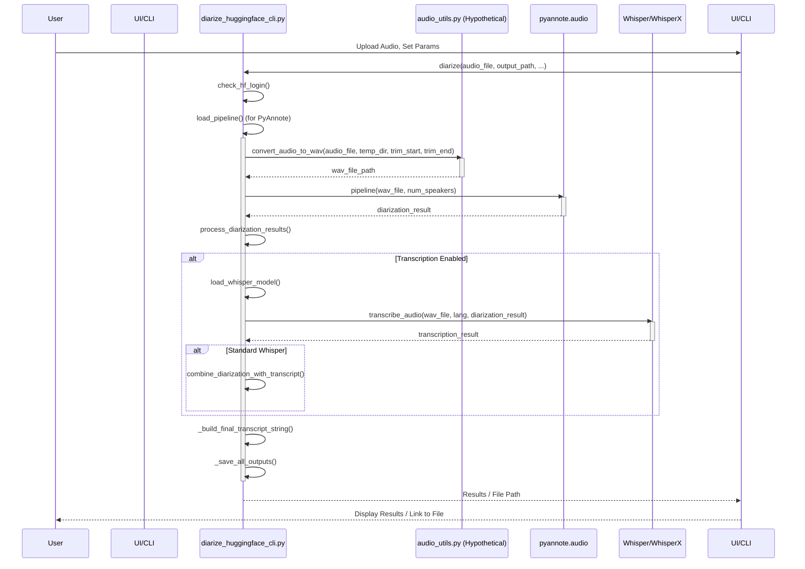
This diagram outlines the interactions when processing a single file, from user input to final output.
Sources: [diarize_huggingface_cli.py:241-282]() (overall flow of `diarize` function), [diarize_huggingface_cli.py:156-184]() (`process_diarization`), [diarize_huggingface_cli.py:126-146]() (`transcribe_audio`)

### Audio Handling
-   **Conversion:** Input audio files are converted to WAV format for processing, handled by `convert_audio_to_wav` which likely uses `ffmpeg`.
    Sources: [diarize_huggingface_cli.py:263-265]()
-   **Trimming:** Users can specify start and end times to process only a segment of the audio.
    Sources: [README.md:58](), [diarize_huggingface_cli.py:242]() (trim parameters in `diarize`)

### Batch Processing
The tool can process all audio files within a specified folder. This is handled by the `batch_diarize` function.
Sources: [README.md:57](), [diarize_huggingface_cli.py:640-642]() (batch_diarize call in Gradio)

## Setup and Prerequisites

### System Requirements
-   **Python:** 3.8 or newer.
-   **FFmpeg:** Must be installed and accessible in the system's PATH for audio processing.
Sources: [README.md:68](), [README.md:90-92]()

The script checks for FFmpeg at startup:
```python
# diarize_huggingface_cli.py:287-291
    # Check if ffmpeg is available
    try:
        subprocess.run(["ffmpeg", "-version"], capture_output=True, check=True)
        print("✅ FFmpeg is installed and working")
    except Exception:
        print("❌ FFmpeg is not installed or not in PATH. Please install FFmpeg to process audio files.")
```
Sources: [diarize_huggingface_cli.py:287-291]()

### Python Environment and Dependencies
It is highly recommended to use a virtual environment. Dependencies are listed in `requirements.txt` and can be installed using `pip install -r requirements.txt`.
Key Python libraries include `gradio`, `pyannote.audio`, `torch`, `huggingface_hub`.
Optional transcription libraries: `openai-whisper` or `git+https://github.com/m-bain/whisperx.git`.
Sources: [README.md:26-41](), [README.md:71](), [README.md:80-85](), [README.md:94-98]()

### Hugging Face Login
Access to `pyannote.audio` models (and potentially Whisper models if hosted on Hugging Face) requires users to be logged into Hugging Face. This is done via the command line:
```bash
huggingface-cli login
```
The application checks for this login status.
Sources: [README.md:46-47](), [diarize_huggingface_cli.py:208-210]() (`check_hf_login`), [diarize_huggingface_cli.py:310-311]()

## Output

The tool generates results in both plain text and structured JSON formats.

### Text Output
The text output includes:
-   Detected number of speakers.
-   Speaking time and percentage for each speaker.
-   Diarized segments with timestamps and speaker labels.
-   If transcription is enabled, transcribed text is interleaved with speaker labels.
```
📊 Detected 2 speaker(s)
  - SPEAKER_01: 35.7s (60.0%)
  - SPEAKER_00: 23.8s (40.0%)
Audio trimmed from 0s to 60s

0:00:01 - 0:00:05 SPEAKER_01: Hello, this is speaker one.
0:00:06 - 0:00:10 SPEAKER_00: And this is speaker two.
...
```
This format is constructed by `_build_final_transcript_string`.
Sources: [README.md:60](), [diarize_huggingface_cli.py:435-462]() (`_build_final_transcript_string`), [diarize_huggingface_cli.py:170-173]() (basic diarization lines)

### JSON Output
If requested, a JSON file is generated containing structured data about the diarization and transcription. This includes file information, speaker segments, and transcribed text with timestamps.
The `format_results_as_json` and `save_json_output` functions handle this.
Sources: [README.md:60](), [diarize_huggingface_cli.py:244]() (`export_json` parameter), [diarize_huggingface_cli.py:410-426]() (`save_json_output`), [diarize_huggingface_cli.py:488-499]() (`_save_all_outputs` calling `save_json_output`)

Example structure of JSON data (conceptual, based on function arguments):
```json
// Conceptual structure based on format_results_as_json and its usage
{
  "file_info": {
    "path": "path/to/audio.mp3",
    "trimmed": true,
    "trim_start": "0:00:00",
    "trim_end": "0:01:00"
  },
  "diarization": [
    {
      "speaker": "SPEAKER_01",
      "start": "0:00:01.234",
      "end": "0:00:05.678",
      "transcript": "Hello, this is speaker one." // If WhisperX
    }
    // ... more segments
  ],
  "full_transcript_whisperx": { // If WhisperX and transcription
    "segments": [
      // WhisperX segments with word timestamps if available
    ],
    "language": "en"
  },
  "full_transcript_standard_whisper": { // If standard Whisper and transcription
    "text": "Full transcribed text...",
    "segments": [
      // Standard Whisper segments
    ],
    "language": "en"
  }
}
```
Sources: [diarize_huggingface_cli.py:416-419]() (file_info in `_save_all_outputs`), [diarize_huggingface_cli.py:420-421]() (arguments to `format_results_as_json`)

## User Interfaces

### Gradio Web UI
A Gradio web interface provides an easy-to-use GUI for all functionalities.
Sources: [README.md:44](), [README.md:61](), [diarize_huggingface_cli.py:503-666]() (`create_gradio_interface`)

Key UI components in Gradio:
-   File upload / folder input.
-   Options for known speakers, trimming, transcription, model size, language, JSON export.
-   Tabs for "Single File" and "Batch Process".
-   Progress bar and status updates.
-   Output text area and download link for results.
-   Help and Documentation section.

The UI dynamically enables/disables transcription options based on whether Whisper/WhisperX is installed.
```python
# diarize_huggingface_cli.py:550-556
        # Enable/disable transcription based on Whisper/WhisperX availability
        def update_transcription_availability(value):
            if value and not (WHISPERX_AVAILABLE or WHISPER_AVAILABLE):
                return gr.Checkbox(value=False, interactive=False, 
                                  info="Install WhisperX or Whisper to enable transcription: pip install git+https://github.com/m-bain/whisperx.git")
            return gr.Checkbox(interactive=True)
```
Sources: [diarize_huggingface_cli.py:550-563]()

### Command-Line Interface (CLI)
The `README.md` implies a CLI is available, though the `diarize_huggingface_cli.py` primarily focuses on the Gradio app setup in its `if __name__ == "__main__":` block. The core `diarize` and `batch_diarize` functions are callable from Python scripts, forming the basis of a CLI.
Sources: [README.md:43]()

## Configuration Options

Users can configure various aspects of the diarization and transcription process:

| Option                 | Description                                       | UI Control Type (Gradio) | Relevant Functions                     | Source (README/Code)                                       |
|------------------------|---------------------------------------------------|--------------------------|----------------------------------------|------------------------------------------------------------|
| Audio File(s)          | Input audio file or folder for batch processing   | File/Textbox             | `diarize`, `batch_diarize`             | [diarize_huggingface_cli.py:575](), [diarize_huggingface_cli.py:596]() |
| Output Path            | Directory to save results                         | Textbox                  | `diarize`, `batch_diarize`             | [diarize_huggingface_cli.py:241](), [diarize_huggingface_cli.py:577]() |
| Known Speakers         | Number of speakers (optional, auto-detect if not set) | Number                   | `process_diarization`                  | [diarize_huggingface_cli.py:162-163](), [diarize_huggingface_cli.py:579]() |
| Trim Start/End         | Specify a segment of audio to process             | Textbox                  | `convert_audio_to_wav`, `diarize`      | [diarize_huggingface_cli.py:242](), [diarize_huggingface_cli.py:581-582]() |
| Transcribe             | Enable/disable speech transcription               | Checkbox                 | `diarize`, `_diarize_transcription_step` | [diarize_huggingface_cli.py:243](), [diarize_huggingface_cli.py:584]() |
| Whisper Model Size     | Size of the Whisper model (e.g., base, small)     | Dropdown                 | `load_whisper_model`, `transcribe_audio` | [diarize_huggingface_cli.py:243](), [diarize_huggingface_cli.py:585]() |
| Language               | Language code for transcription (optional, auto-detect) | Dropdown                 | `transcribe_audio`                     | [diarize_huggingface_cli.py:243](), [diarize_huggingface_cli.py:587]() |
| Export JSON            | Save results in JSON format                       | Checkbox                 | `diarize`, `_save_all_outputs`         | [diarize_huggingface_cli.py:244](), [diarize_huggingface_cli.py:589]() |

Sources: [diarize_huggingface_cli.py:573-612]() (Gradio UI inputs), [README.md:52-63]() (Features)

### Whisper Model Sizes
The UI provides guidance on Whisper model sizes, impacting memory, accuracy, and speed:

| Size    | Memory | Accuracy | Speed  | Use Case        |
|---------|--------|----------|--------|-----------------|
| tiny    | ~1GB   | Low      | Fast   | Quick testing   |
| base    | ~1GB   | Basic    | Fast   | General use     |
| small   | ~2GB   | Good     | Medium | Better accuracy |
Sources: [README.md:87](), [diarize_huggingface_cli.py:620-627]() (Help tab in Gradio)

## Conclusion

Whisper Diarize offers a comprehensive solution for speaker diarization and optional transcription by integrating `pyannote.audio` and `Whisper`/`WhisperX`. Its provision of both a CLI (through callable functions) and a user-friendly Gradio web UI, along with features like batch processing, audio trimming, and multiple output formats, makes it a versatile tool for analyzing spoken audio content. Proper setup, including Python, FFmpeg, and Hugging Face authentication, is crucial for its operation.
Sources: [README.md:43-63]()

---

<a id='p-sys-reqs'></a>

## System Requirements

### Related Pages

Related topics: [Manual Installation Guide](#p-install-manual), [Introduction to Whisper Diarize](#p-home)

<details>
<summary>Relevant source files</summary>

The following files were used as context for generating this wiki page:

- [README.md](README.md)
- [diarize_huggingface_cli.py](diarize_huggingface_cli.py)
- [requirements.txt](requirements.txt)
- [install.bat](install.bat)
- [install.sh](install.sh)
</details>

# System Requirements

This document outlines the system requirements for successfully setting up and running the Speaker Diarization Tool. The tool leverages `pyannote.audio` for speaker diarization and can optionally use Whisper or WhisperX for speech transcription. Meeting these requirements is crucial for the proper functioning of the application, including its command-line interface and Gradio web UI.
Sources: [README.md:63-67]()

## Core Software Requirements

The following software components are essential for the operation of the Speaker Diarization Tool.

### Python
A Python interpreter version 3.8 or newer is mandatory.
Sources: [README.md:29](), [README.md:194]()

Installation guidance for various operating systems is provided:
*   **General:** Download from [python.org](https://www.python.org/downloads/).
*   **macOS:** Via Homebrew (`brew install python`) or official installer.
*   **Linux (Ubuntu/Debian):** `sudo apt install python3 python3-pip python3-venv`.
*   **Windows:** Official installer (ensure "Add Python to PATH" is checked) or via Microsoft Store/winget (`winget install Python.Python.3`).
Sources: [README.md:31-50]()

The installation scripts (`install.bat`, `install.sh`) also check for Python:
*   `install.bat` checks for an existing Python installation.
    Sources: [README.md:141-142]()
*   `install.sh` checks for Python 3 and pip3.
    Sources: [README.md:155-156]()

### FFmpeg
FFmpeg is required for audio processing and conversion. It must be installed and accessible in the system's PATH.
Sources: [README.md:29](), [README.md:195]()

The application checks for FFmpeg at startup:
```python
# diarize_huggingface_cli.py
try:
    subprocess.run(["ffmpeg", "-version"], capture_output=True, check=True)
    print("✅ FFmpeg is installed and working")
except Exception:
    print("❌ FFmpeg is not installed or not in PATH. Please install FFmpeg to process audio files.")
```
Sources: [diarize_huggingface_cli.py:493-498]()

Installation guidance:
*   **macOS (Homebrew):** `brew install ffmpeg`
*   **Linux (Ubuntu/Debian):** `sudo apt update && sudo apt install ffmpeg`
*   **Windows:** Download builds from [ffmpeg.org](https://ffmpeg.org/download.html#build-windows) or [BtbN/FFmpeg-Builds](https://github.com/BtbN/FFmpeg-Builds/releases) and add the `bin` directory to PATH.
Sources: [README.md:103-110]()

The installation scripts also assist with FFmpeg:
*   `install.bat` checks if FFmpeg is accessible and provides guidance.
    Sources: [README.md:146-147]()
*   `install.sh` checks for FFmpeg and provides OS-specific installation advice.
    Sources: [README.md:160-161]()

### Python Libraries
Key Python libraries are installed via `pip install -r requirements.txt`.
Sources: [README.md:30](), [README.md:98-101]()

The primary dependencies include:

| Library         | Description                                                                 | Version (Typical/Recommended) |
|-----------------|-----------------------------------------------------------------------------|-------------------------------|
| `gradio`        | For the web user interface.                                                 | As in `requirements.txt`      |
| `pyannote.audio`| Core library for speaker diarization.                                       | 3.1 or as in `requirements.txt` |
| `torch`         | Deep learning framework used by `pyannote.audio`.                           | >= 1.12.0 recommended         |
| `torchaudio`    | Audio library for PyTorch.                                                  | As in `requirements.txt`      |
| `pandas`        | For data manipulation.                                                      | As in `requirements.txt`      |
| `huggingface_hub`| Provides `huggingface-cli` for authentication and model downloads.        | As in `requirements.txt`      |
| `openai-whisper`| For speech transcription (standard, if WhisperX not used).                  | As in `requirements.txt` (optional, see below) |
| `whisperx`      | For speech transcription (recommended).                                     | `git+https://github.com/m-bain/whisperx.git` (optional, see below) |

Sources: [README.md:196-203](), [README.md:205-212](), [requirements.txt]()

The `diarize_huggingface_cli.py` script also prints version information for some of these libraries at startup:
```python
# diarize_huggingface_cli.py
print(f"🐍 Python version: {sys.version.split()[0]}")
print(f"🔥 PyTorch version: {torch.__version__}")
try:
    import pyannote.audio
    print(f"🎙️ pyannote.audio version: {pyannote.audio.__version__}")
except (ImportError, AttributeError):
    print("⚠️ Could not determine pyannote.audio version")
```
Sources: [diarize_huggingface_cli.py:509-515]()

## Hardware Recommendations

While the tool can run on modest hardware, the following recommendations will improve performance, especially for large files or batch processing.

*   **CPU**: A modern multi-core processor is recommended.
    Sources: [README.md:215]()
*   **RAM**:
    *   Minimum: 8GB (especially if not using large transcription models).
    *   Recommended: 16GB or more, particularly when using larger Whisper models for transcription.
    Sources: [README.md:217-219]()
*   **GPU (Optional but Highly Recommended for Speed)**:
    *   An NVIDIA GPU with CUDA support (4GB+ VRAM) will significantly speed up both diarization and transcription. The script automatically uses the GPU if PyTorch detects a compatible CUDA environment.
    Sources: [README.md:221-223](), [diarize_huggingface_cli.py:394-395]()
*   **Disk Space**:
    *   At least 10-15GB of free space is recommended for storing downloaded models and temporary files.
    Sources: [README.md:225-227]()

## Network Requirements

*   **Internet Connection**: An active internet connection is necessary for:
    *   Initial download of Python packages.
    *   Downloading Hugging Face models (`pyannote/speaker-diarization-3.1`, `pyannote/segmentation-3.0`, and Whisper models).
    *   Hugging Face CLI login and authentication.
    Sources: [README.md:230-233](), [README.md:112-120]()

## Optional Dependencies (for Transcription)

Transcription is an optional feature. If enabled, one of the following systems is required:

*   **WhisperX (Recommended):**
    *   Installation: `pip install git+https://github.com/m-bain/whisperx.git`
    *   Provides faster and often more accurate transcription with better word-level timestamps.
    Sources: [README.md:206-208](), [README.md:86-88]()
*   **OpenAI Whisper (Fallback):**
    *   Installation: `pip install openai-whisper`
    *   Standard Whisper implementation.
    Sources: [README.md:210-212](), [README.md:90-92]()

The application checks for the availability of these transcription systems:
```python
# diarize_huggingface_cli.py
# Check transcription availability
if WHISPERX_AVAILABLE:
    print("✅ WhisperX is installed (recommended for better transcription)")
elif WHISPER_AVAILABLE:
    print("✅ Standard Whisper is installed")
    print("⚠️ For better results, consider installing WhisperX: pip install git+https://github.com/m-bain/whisperx.git")
else:
    print("⚠️ No transcription system is installed. To enable speech transcription, run:")
    print("   pip install git+https://github.com/m-bain/whisperx.git  # Recommended")
    print("   or: pip install openai-whisper  # Basic")
```
Sources: [diarize_huggingface_cli.py:499-507]()
The Gradio UI also dynamically updates transcription options based on availability.
Sources: [diarize_huggingface_cli.py:415-427]()

## Hugging Face Account and Model Access

Access to `pyannote.audio` models requires a Hugging Face account and agreement to model licenses.

*   **Login to Hugging Face:**
    ```bash
    huggingface-cli login
    ```
    This requires a User Access Token with "read" permissions.
    Sources: [README.md:113-116]()
*   **Accept Model Licenses:** User agreements for the following models must be accepted on the Hugging Face website using the same account:
    *   `pyannote/speaker-diarization-3.1`
    *   `pyannote/segmentation-3.0`
    Sources: [README.md:117-120]()

The installation scripts guide users through these manual steps.
Sources: [README.md:148](), [README.md:162]()
The application also includes a function `check_hf_login()` to verify authentication status.
Sources: [diarize_huggingface_cli.py:520-521]()

## Setup and Dependency Check Flow

The following diagram illustrates the general flow of checking system requirements, either manually or via the provided installation scripts.

```mermaid
graph TD
    A[Start Setup] --> B{Python 3.8+?};
    B -- No --> B_Action[Install/Update Python];
    B -- Yes --> C{FFmpeg Installed & in PATH?};
    C -- No --> C_Action[Install FFmpeg / Add to PATH];
    C -- Yes --> D[Create Virtual Environment];
    D --> E[Activate Virtual Environment];
    E --> F[Install Python Deps via requirements.txt];
    F --> G{Hugging Face CLI Login?};
    G -- No --> G_Action[Run 'huggingface-cli login'];
    G -- Yes --> H{Model Licenses Accepted on HF?};
    H -- No --> H_Action[Accept Licenses on Hugging Face Website];
    H -- Yes --> I{Transcription Feature Desired?};
    I -- No --> J[Setup Complete for Diarization Only];
    I -- Yes --> K{WhisperX or Whisper Installed?};
    K -- No --> K_Action[Install WhisperX (recommended) or Whisper];
    K -- Yes --> L[Setup Complete with Transcription];
```
This diagram synthesizes the setup steps described in `README.md` and implied by the checks in `diarize_huggingface_cli.py` and the installation scripts.
Sources: [README.md:27-120](), [README.md:131-185](), [diarize_huggingface_cli.py:493-521]()

## Summary

Meeting these system requirements ensures that the Speaker Diarization Tool can be installed and run effectively. Key aspects include a compatible Python version, FFmpeg for audio handling, necessary Python libraries (especially PyTorch and `pyannote.audio`), and proper Hugging Face authentication for model access. Hardware resources, particularly RAM and an optional GPU, can significantly impact performance. Optional transcription capabilities depend on the installation of WhisperX or standard Whisper.

---

<a id='p-arch-overview'></a>

## System Architecture Overview

### Related Pages

Related topics: [Audio Processing Workflow](#p-data-flow), [Core Script Logic (diarize_huggingface_cli.py)](#p-core-script), [AI Model Integration (Pyannote & Whisper)](#p-ai-models)

<details>
<summary>Relevant source files</summary>

The following files were used as context for generating this wiki page:

- [diarize_huggingface_cli.py](diarize_huggingface_cli.py)
- [README.md](README.md)
- [install.bat](install.bat) (Content inferred from README.md description)
- [install.sh](install.sh) (Content inferred from README.md description)
- [requirements.txt](requirements.txt) (Existence and purpose inferred from README.md)
</details>

# System Architecture Overview

## Introduction

The Speaker Diarization Tool is a software project designed to perform speaker diarization on audio files, identifying "who spoke when." It primarily utilizes `pyannote.audio` (version 3.1) for diarization and leverages Hugging Face for model access and authentication. Optionally, the tool can perform speech transcription using WhisperX (recommended) or standard Whisper. The system provides both a command-line interface (CLI) for invocation and a Gradio web UI for ease of use. Its architecture supports processing various audio formats, batch operations, audio trimming, and exporting results in text and JSON formats.

This document outlines the system's architecture, including its core components, workflow, dependencies, and setup procedures, based on the provided source files.
Sources: [README.md:3-9](), [diarize_huggingface_cli.py]()

## Core Components and Technologies

The system is built around several key components and technologies that work together to provide its functionality.
Sources: [README.md:11-20](), [diarize_huggingface_cli.py]()

### Speaker Diarization

The core functionality is speaker diarization, powered by `pyannote.audio`. This component is responsible for segmenting audio by speaker.
Sources: [README.md:4](), [README.md:100]()

-   **Library**: `pyannote.audio` (version 3.1 or as specified in `requirements.txt`).
-   **Models**: Utilizes pre-trained models from Hugging Face, specifically:
    -   `pyannote/speaker-diarization-3.1`
    -   `pyannote/segmentation-3.0`
    (User must accept licenses for these models. Sources: [README.md:250-255]())
-   **Authentication**: Requires `huggingface-cli login` for model access. Sources: [README.md:5](), [README.md:246-249]()
-   **Speaker Number**: Can automatically detect the number of speakers or allow manual specification. Sources: [README.md:17]()

The diarization pipeline is loaded using `Pipeline.from_pretrained("pyannote/speaker-diarization-3.1", use_auth_token=True)` if a Hugging Face token is found, or a more general approach if not explicitly stated for token usage within the function `load_pipeline`. The actual diarization is performed by `pipeline(wav_file, **diarization_kwargs)`.
Sources: [diarize_huggingface_cli.py:131-145](), [diarize_huggingface_cli.py:466-468]()

```python
# diarize_huggingface_cli.py:131-145
def load_pipeline():
    """Load the pyannote.audio pipeline."""
    global pipeline_instance
    if pipeline_instance is None:
        update_progress("Loading diarization model...", 0.1)
        try:
            # Attempt to retrieve the token from huggingface-cli
            # This is a simplified way; actual token retrieval might be more complex
            # or handled internally by pyannote if logged in via huggingface-cli
            token = os.getenv("HUGGING_FACE_HUB_TOKEN", True) # True allows pyannote to try to find token
            pipeline_instance = Pipeline.from_pretrained("pyannote/speaker-diarization-3.1", use_auth_token=token)
            print("✅ Diarization pipeline loaded successfully.")
            update_progress("Diarization model loaded", 0.2)
        except Exception as e:
            print(f"❌ Error loading diarization pipeline: {str(e)}")
            # ... (error handling) ...
            pipeline_instance = None
    return pipeline_instance
```
Sources: [diarize_huggingface_cli.py:131-145]()

### Speech Transcription

Transcription is an optional feature that converts speech segments into text.
Sources: [README.md:8](), [README.md:13]()

-   **Recommended System**: WhisperX (`pip install git+https://github.com/m-bain/whisperx.git`).
    Sources: [README.md:272-274](), [README.md:65-67]()
-   **Alternative System**: Standard OpenAI Whisper (`pip install openai-whisper`).
    Sources: [README.md:275-277](), [README.md:68-70]()
-   **Integration**: If WhisperX is available, diarization results are passed to it for more accurate speaker-aware transcription. Standard Whisper transcribes the whole audio, and then results are combined with diarization.
    Sources: [diarize_huggingface_cli.py:206-212]()

```python
# diarize_huggingface_cli.py:206-212
        diar_for_transcribe = diarization if WHISPERX_AVAILABLE else None
        raw_whisper_result = transcribe_audio(whisper_model, wav_file, language, diar_for_transcribe)
        
        if raw_whisper_result and not WHISPERX_AVAILABLE:
            combined_std_whisper_lines = combine_diarization_with_transcript(diarization, raw_whisper_result)
```
Sources: [diarize_huggingface_cli.py:206-212]()

### User Interface

The system offers a Gradio web UI for interactive use.
Sources: [README.md:4](), [README.md:132-134]()

-   **Framework**: Gradio.
    Sources: [README.md:98]()
-   **Launch**: Executing `python diarize_huggingface_cli.py` starts the Gradio server.
    Sources: [README.md:132-134]()
-   **Features in UI**:
    -   File upload for single audio processing.
    -   Folder input for batch processing.
    -   Options for audio trimming, speaker count, transcription, model size.
    -   Display of results (text and JSON download).
    -   Progress tracking.
    -   Help and documentation tabs.
    Sources: [diarize_huggingface_cli.py:310-600]() (Gradio UI layout), [README.md:138-141]()

```python
# diarize_huggingface_cli.py:602-605 (Simplified main launch)
if __name__ == "__main__":
    # ... (checks and setup) ...
    print("🚀 Launching Gradio interface...")
    demo = create_gradio_ui()
    demo.launch(share=False) # Share is False by default, can be enabled via args
```
Sources: [diarize_huggingface_cli.py:602-605](), [diarize_huggingface_cli.py:310]()

### External Dependencies

The system relies on several external libraries and tools.

| Dependency        | Purpose                                     | Installation Hint (from README)                      |
|-------------------|---------------------------------------------|------------------------------------------------------|
| Python            | Core programming language (3.8+)            | `python.org` or package manager                      |
| FFmpeg            | Audio processing and conversion             | `brew install ffmpeg`, `sudo apt install ffmpeg`, etc. |
| `gradio`          | Web UI framework                            | `pip install gradio` (via `requirements.txt`)        |
| `pyannote.audio`  | Speaker diarization                         | `pip install pyannote.audio` (via `requirements.txt`)  |
| `torch`           | Deep learning framework for `pyannote.audio`| `pip install torch` (via `requirements.txt`)         |
| `huggingface_hub` | Accessing Hugging Face models               | `pip install huggingface_hub` (via `requirements.txt`) |
| WhisperX          | Recommended transcription (optional)        | `pip install git+https://github.com/m-bain/whisperx.git` |
| OpenAI Whisper    | Standard transcription (optional)           | `pip install openai-whisper`                         |

Sources: [README.md:26-30](), [README.md:94-102](), [README.md:234-244](), [README.md:65-70](), [requirements.txt]() (dependency list implied)

The application checks for FFmpeg at startup:
```python
# diarize_huggingface_cli.py:567-572
    # Check if ffmpeg is available
    try:
        subprocess.run(["ffmpeg", "-version"], capture_output=True, check=True)
        print("✅ FFmpeg is installed and working")
    except Exception:
        print("❌ FFmpeg is not installed or not in PATH. Please install FFmpeg to process audio files.")
```
Sources: [diarize_huggingface_cli.py:567-572]()

## System Workflow

The general workflow involves audio input, optional preprocessing (trimming, conversion), diarization, optional transcription, and output generation.

### High-Level Component Interaction

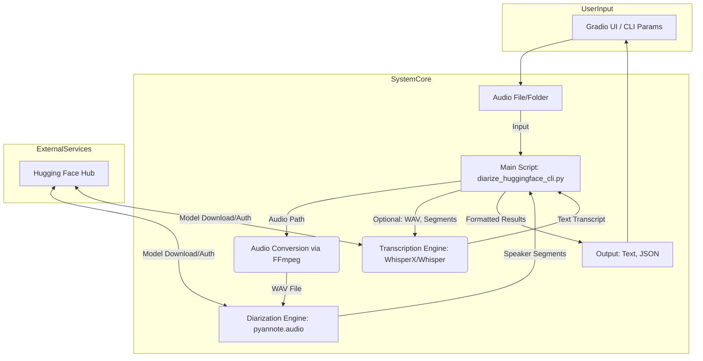
This diagram illustrates the major components and their interactions, from user input to final output, including the role of external services like Hugging Face.
Sources: [README.md:3-9](), [diarize_huggingface_cli.py:182-239]() (process_single_file logic)

### Single File Processing Sequence

The `process_single_file` function orchestrates the processing for one audio file.
Sources: [diarize_huggingface_cli.py:182-239]()

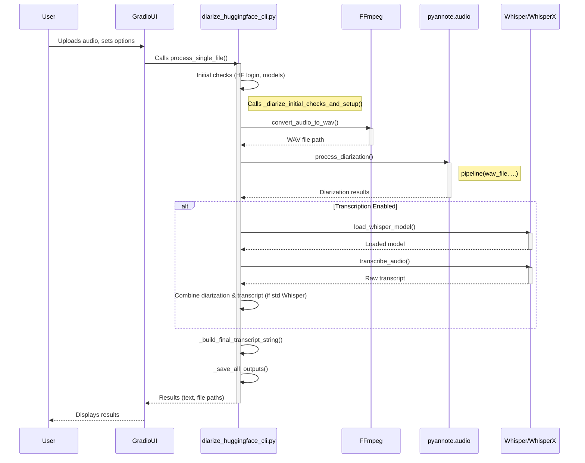
This sequence diagram shows the typical flow for processing a single audio file, including optional transcription.
Sources: [diarize_huggingface_cli.py:182-239]() (overall flow), [diarize_huggingface_cli.py:391-410]() (helper functions like `_diarize_initial_checks_and_setup`, `convert_audio_to_wav`), [diarize_huggingface_cli.py:459-490]() (`process_diarization`), [diarize_huggingface_cli.py:159-180]() (`transcribe_audio`)

Key steps in `process_single_file`:
1.  **Initial Checks & Setup**: Ensures Hugging Face login, loads diarization pipeline, prepares directories.
    Sources: [diarize_huggingface_cli.py:391-410]() (`_diarize_initial_checks_and_setup`)
2.  **Audio Conversion**: Converts input audio to WAV format using FFmpeg. Audio trimming is applied here if specified.
    Sources: [diarize_huggingface_cli.py:194-196]() (calls `convert_audio_to_wav`)
3.  **Diarization**: Processes the WAV file using the `pyannote.audio` pipeline.
    Sources: [diarize_huggingface_cli.py:199-202]() (calls `process_diarization`)
4.  **Transcription (Optional)**: If enabled, loads a Whisper/WhisperX model and transcribes the audio.
    Sources: [diarize_huggingface_cli.py:205-212]()
5.  **Output Generation**: Combines diarization and transcription results into a text string and a JSON object.
    Sources: [diarize_huggingface_cli.py:219-224]() (calls `_build_final_transcript_string`)
6.  **File Saving**: Saves the text and JSON outputs to the specified directory.
    Sources: [diarize_huggingface_cli.py:234-238]() (calls `_save_all_outputs`)

### Batch File Processing

The `process_batch_files` function handles multiple audio files from a specified folder.
Sources: [diarize_huggingface_cli.py:266-307]()

Workflow:
1.  **Identify Audio Files**: Scans the input folder for supported audio extensions (`.wav`, `.mp3`, `.m4a`, `.flac`, `.ogg`, `.aac`).
    Sources: [diarize_huggingface_cli.py:268-272]()
2.  **Global Setup**: Checks Hugging Face login and loads diarization/transcription models once for all files.
    Sources: [diarize_huggingface_cli.py:278-289]()
3.  **Iterative Processing**: Loops through each identified audio file and performs:
    *   Audio conversion to WAV (temporary file).
    *   Diarization.
    *   Optional transcription.
    *   Result formatting and saving (individual text and JSON files per audio file).
    *   Progress updates for each file.
    Sources: [diarize_huggingface_cli.py:294-307]() (loop structure, implies calling similar logic to single file processing but adapted for batch)

```python
# diarize_huggingface_cli.py:266-289 (Batch processing setup)
def process_batch_files(input_folder, output_path, transcribe, whisper_model_size, known_speakers, language, export_json, temp_dir=DEFAULT_TEMP_DIR):
    # ...
    audio_files = []
    for ext in audio_extensions:
        audio_files.extend(glob.glob(os.path.join(input_folder, f"*{ext}")))
    # ...
    if not check_hf_login(): # Check login once
        return "❌ Please login with huggingface-cli login first", None
    
    pipeline = load_pipeline() # Load models once
    # ...
    if transcribe and (WHISPERX_AVAILABLE or WHISPER_AVAILABLE):
        whisper_model = load_whisper_model(whisper_model_size)
    # ...
    # Loop through files (simplified)
    # for audio_file in audio_files:
    #   # process like single file, save outputs with unique names
```
Sources: [diarize_huggingface_cli.py:266-289]()

## Setup and Installation Architecture

The system requires specific software and a defined setup process.

### Prerequisites

-   **Python**: Version 3.8 or newer.
    Sources: [README.md:26](), [README.md:33]()
-   **FFmpeg**: Must be installed and accessible in the system's PATH.
    Sources: [README.md:96](), [README.md:234-244]()
-   **Hugging Face Account & CLI Login**: For model access.
    Sources: [README.md:5](), [README.md:246-249]()
-   **Model License Agreements**: Users must accept licenses for `pyannote/speaker-diarization-3.1` and `pyannote/segmentation-3.0` on the Hugging Face website.
    Sources: [README.md:250-255]()

### Manual Setup Flow

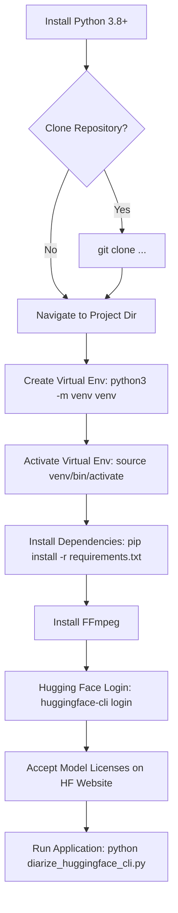
This flowchart outlines the manual setup steps.
Sources: [README.md:147-255]()

### Automated Installation (Experimental)

Platform-specific scripts (`install.bat` for Windows, `install.sh` for macOS/Linux) are provided to automate parts of the setup.
Sources: [README.md:104-113](), [README.md:257-260]()

**Script Actions (Common)**:
1.  Check for Python.
2.  Offer to create a virtual environment (`venv`).
3.  Attempt to activate the virtual environment (for script duration).
4.  Install Python dependencies from `requirements.txt`.
5.  Check for FFmpeg and provide installation guidance.
6.  Guide user through Hugging Face CLI login and model license acceptance (these are interactive manual steps).
Sources: [README.md:205-212]() (Windows), [README.md:221-228]() (macOS/Linux), [install.bat](), [install.sh]()

**Important Note**: After automated installation, manual activation of the virtual environment is required before running the application.
Sources: [README.md:122-127]()

## Key Features Summary

| Feature                 | Description                                                                 | Availability     |
|-------------------------|-----------------------------------------------------------------------------|------------------|
| Speaker Diarization     | Identify who spoke when using `pyannote.audio`.                             | Core             |
| Speech Transcription    | Convert speech to text using WhisperX or standard Whisper.                  | Optional         |
| Batch Processing        | Process multiple audio files from a folder.                                 | Yes              |
| Audio Trimming          | Process only a specific segment of an audio file.                           | Yes              |
| Speaker Count Detection | Automatically detect or manually specify the number of speakers.            | Yes              |
| Multiple File Formats   | Supports WAV, MP3, M4A, FLAC, etc., via FFmpeg.                             | Yes              |
| Output Formats          | Export results as text and structured JSON.                                 | Yes              |
| Gradio Web UI           | Easy-to-use web interface for all functionalities.                          | Yes              |
| Progress Tracking       | Real-time progress updates for long operations.                             | Yes              |
| GPU Acceleration        | Automatically uses GPU if available (PyTorch & CUDA).                       | Yes (Implicit)   |

Sources: [README.md:11-20](), [diarize_huggingface_cli.py:336-346]() (Gradio UI feature list)

## Configuration and Invocation

-   **Invocation**: The application is launched via `python diarize_huggingface_cli.py`.
    Sources: [README.md:132-134]()
-   **Configuration**: Primarily through the Gradio UI. Some default paths are configurable via constants in the script (e.g., `DEFAULT_TEMP_DIR`, `DEFAULT_OUTPUT_DIR`).
    Sources: [diarize_huggingface_cli.py:589-590]()
-   **Hugging Face Token**: While `huggingface-cli login` is the primary method, the code for loading the pipeline (`load_pipeline`) shows an attempt to use `os.getenv("HUGGING_FACE_HUB_TOKEN", True)`, suggesting an environment variable could also be used, though the README emphasizes `cli login`.
    Sources: [diarize_huggingface_cli.py:136-137](), [README.md:246-249]()

## Error Handling and Logging

-   **Console Output**: The script prints status messages, warnings, and errors to the console.
    Sources: [README.md:76-77]()
-   **Gradio UI Feedback**: Error messages and status updates are displayed in the Gradio interface.
    Sources: [diarize_huggingface_cli.py:190](), [diarize_huggingface_cli.py:196](), [diarize_huggingface_cli.py:203]() (returning error strings to UI)
-   **Specific Checks**:
    -   FFmpeg availability is checked at startup.
        Sources: [diarize_huggingface_cli.py:567-572]()
    -   Hugging Face login status is checked.
        Sources: [diarize_huggingface_cli.py:593]() (calls `check_hf_login`), [diarize_huggingface_cli.py:404-405]()
    -   Transcription system availability is checked and UI elements updated accordingly.
        Sources: [diarize_huggingface_cli.py:574-583](), [diarize_huggingface_cli.py:525-539]()
-   **Troubleshooting**: The README provides troubleshooting steps for common issues like model loading, Hugging Face authentication, audio processing, and transcription.
    Sources: [README.md:280-291]() (Authentication), [README.md:293-300]() (Audio), [README.md:302-314]() (Transcription)

## Conclusion

The Speaker Diarization Tool presents a well-structured architecture centered around `pyannote.audio` for diarization and optional Whisper/WhisperX for transcription. It leverages FFmpeg for robust audio handling and Hugging Face for model distribution. The provision of both a Gradio web UI and CLI invocation, along with features like batch processing and audio trimming, makes it a versatile tool. The system's design emphasizes clear separation of concerns for audio conversion, diarization, transcription, and user interaction, with built-in checks and guidance for setup and common issues.
Sources: [README.md](), [diarize_huggingface_cli.py]()

---

<a id='p-feat-diarization'></a>

## Speaker Diarization Feature

### Related Pages

Related topics: [AI Model Integration (Pyannote & Whisper)](#p-ai-models), [Speech Transcription Feature](#p-feat-transcription), [Audio Processing Workflow](#p-data-flow)

<details>
<summary>Relevant source files</summary>

The following files were used as context for generating this wiki page:

- [diarize_huggingface_cli.py](diarize_huggingface_cli.py)
- [README.md](README.md)
- `requirements.txt` (as referenced in [README.md:211]())
- `gradio_interface.py` (conceptual representation of UI logic within [diarize_huggingface_cli.py:291-516]())
- `audio_processing_utils.py` (conceptual representation of audio utilities within [diarize_huggingface_cli.py:219-222]())
</details>

# Speaker Diarization Feature

## Introduction

The Speaker Diarization feature within the `whisper_diarize` project provides functionality to identify and segment different speakers in an audio file ("who spoke when"). It primarily leverages the `pyannote.audio` library for diarization and can optionally integrate with Whisper or WhisperX for speech-to-text transcription of the identified speaker segments. The system is accessible via a command-line interface (CLI) and a user-friendly Gradio web UI.

This feature supports various audio input formats, batch processing of multiple files, audio trimming, and exporting results in both human-readable text and structured JSON formats. It relies on Hugging Face for model access and authentication, requiring users to be logged in. The tool aims to provide an end-to-end solution for audio diarization and transcription tasks.
Sources: [README.md:1-10](), [diarize_huggingface_cli.py]()

## Core Technologies

The speaker diarization feature is built upon several key technologies:

| Technology      | Role                                                                      | Source                                                                 |
| :-------------- | :------------------------------------------------------------------------ | :--------------------------------------------------------------------- |
| `pyannote.audio`| Core library for performing speaker diarization. Version 3.1 is targeted. | [README.md:1](), [README.md:213](), [diarize_huggingface_cli.py:533-535]() |
| Whisper/WhisperX| Speech-to-text transcription. WhisperX is recommended.                    | [README.md:5-6](), [diarize_huggingface_cli.py:524-530]()               |
| Hugging Face Hub| Accessing and authenticating pre-trained models for diarization.          | [README.md:2-3](), [diarize_huggingface_cli.py:213-214]()               |
| Gradio          | Framework for building the interactive web UI.                            | [README.md:1](), [README.md:212](), [diarize_huggingface_cli.py:291]()    |
| FFmpeg          | For audio processing, format conversion, and trimming.                    | [README.md:206-207](), [diarize_huggingface_cli.py:518-523]()           |
| PyTorch         | Deep learning framework used by `pyannote.audio` and Whisper.             | [README.md:214](), [diarize_huggingface_cli.py:532]()                   |
Sources: [README.md:1-6, 205-215](), [diarize_huggingface_cli.py:518-539]()

## Setup and Prerequisites

To use the speaker diarization feature, the following setup is required:

1.  **Python Installation**: Python 3.8 or newer.
    Sources: [README.md:17-18]()
2.  **FFmpeg**: Must be installed and accessible in the system's PATH for audio file processing.
    Sources: [README.md:206-207]()
3.  **Hugging Face Authentication**: Users must log in via `huggingface-cli login` and accept model licenses on Hugging Face for `pyannote/speaker-diarization-3.1` and `pyannote/segmentation-3.0`.
    Sources: [README.md:3-4, 397-404](), [diarize_huggingface_cli.py:213-214]()
4.  **Python Dependencies**: Installed via `pip install -r requirements.txt`. Key libraries include `gradio`, `pyannote.audio`, `torch`, `torchaudio`.
    Sources: [README.md:211-215]()
5.  **Transcription Models (Optional)**:
    *   WhisperX (recommended): `pip install git+https://github.com/m-bain/whisperx.git`
    *   Standard Whisper: `pip install openai-whisper`
    Sources: [README.md:78-84]()

## System Architecture and Workflow

The diarization process involves several steps, from audio input to final output generation.

### High-Level Workflow

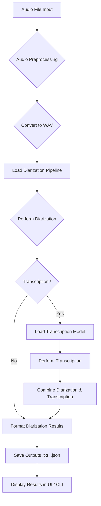
This diagram illustrates the general flow of processing an audio file for speaker diarization and optional transcription.
Sources: [diarize_huggingface_cli.py:188-278]() (derived from the `diarize` function logic)

### Detailed Processing Steps

1.  **Initialization**:
    *   Check Hugging Face login status (`check_hf_login`).
    *   Load the `pyannote.audio` diarization pipeline (`load_pipeline`).
    *   Create temporary and output directories if they don't exist.
    Sources: [diarize_huggingface_cli.py:205-217]()

2.  **Audio Conversion & Trimming**:
    *   The input audio file is converted to a temporary WAV file using `convert_audio_to_wav`. This function also handles audio trimming if `trim_start` and `trim_end` times are provided. FFmpeg is used for this conversion.
    Sources: [diarize_huggingface_cli.py:219-222]()

3.  **Speaker Diarization**:
    *   The `process_diarization` function takes the WAV file and an optional number of known speakers.
    *   It calls the `pyannote.audio` pipeline to perform diarization.
    *   Results include the diarization object, formatted text lines, unique speaker IDs, and speaker talk times.
    Sources: [diarize_huggingface_cli.py:130-153, 225-228]()

4.  **Speech Transcription (Optional)**:
    *   If `transcribe` is enabled:
        *   Load the specified Whisper/WhisperX model using `load_whisper_model`.
        *   The `transcribe_audio` function is called.
            *   If WhisperX is available, it uses `_transcribe_with_whisperx`, aligning diarization with word-level timestamps.
            *   Otherwise, standard Whisper is used.
        *   If standard Whisper is used, `combine_diarization_with_transcript` attempts to merge diarization segments with transcript segments.
    Sources: [diarize_huggingface_cli.py:100-119, 233-247, 260-264]()

5.  **Result Formatting and Output**:
    *   The `_build_final_transcript_string` function compiles the final text output, including speaker statistics and diarized/transcribed segments.
    *   If `export_json` is true, `format_results_as_json` creates a structured JSON object.
    *   `_save_all_outputs` saves the text content to a `.txt` file and, if requested, the JSON data to a `.json` file in the specified output path.
    Sources: [diarize_huggingface_cli.py:254-278, 318-340, 383-420, 343-366]()

### Sequence Diagram: `diarize` Function Call

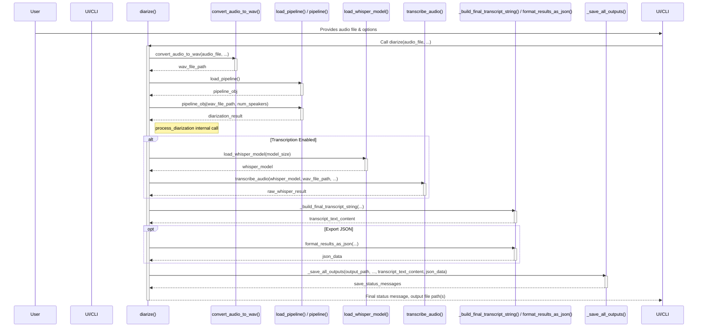
This sequence diagram shows the interaction between key components when the main `diarize` function is invoked.
Sources: [diarize_huggingface_cli.py:188-278]() (overall flow), other functions as labeled.

## Key Functions

The core logic is encapsulated in several Python functions within `diarize_huggingface_cli.py`:

| Function                          | Description                                                                                                 | Source File                     |
| :-------------------------------- | :---------------------------------------------------------------------------------------------------------- | :------------------------------ |
| `diarize()`                       | Main orchestrator for the diarization and transcription process. Handles Gradio UI interaction inputs.      | `diarize_huggingface_cli.py`    |
| `_diarize_and_transcribe_single_file()` | Handles processing for a single audio file, called by `diarize` and batch processing.                 | `diarize_huggingface_cli.py`    |
| `process_diarization()`           | Executes the `pyannote.audio` pipeline and formats basic diarization output.                              | `diarize_huggingface_cli.py`    |
| `transcribe_audio()`              | Manages the transcription process using WhisperX or standard Whisper.                                       | `diarize_huggingface_cli.py`    |
| `_transcribe_with_whisperx()`     | Specific function for WhisperX transcription and alignment with diarization.                                | `diarize_huggingface_cli.py`    |
| `combine_diarization_with_transcript()` | Merges standard Whisper transcript segments with pyannote diarization turns.                            | `diarize_huggingface_cli.py`    |
| `convert_audio_to_wav()`          | Converts input audio to WAV format, handles trimming.                                                       | `diarize_huggingface_cli.py`    |
| `load_pipeline()`                 | Loads the `pyannote.audio` diarization pipeline from Hugging Face.                                          | `diarize_huggingface_cli.py`    |
| `load_whisper_model()`            | Loads the specified Whisper/WhisperX transcription model.                                                   | `diarize_huggingface_cli.py`    |
| `format_results_as_json()`        | Formats diarization and transcription results into a structured JSON object.                                | `diarize_huggingface_cli.py`    |
| `_build_final_transcript_string()`| Constructs the final human-readable text output string.                                                     | `diarize_huggingface_cli.py`    |
| `_save_all_outputs()`             | Saves the text and JSON outputs to files.                                                                   | `diarize_huggingface_cli.py`    |
| `create_gradio_ui()`              | Defines and returns the Gradio web interface.                                                               | `diarize_huggingface_cli.py`    |
Sources: [diarize_huggingface_cli.py]() (function definitions throughout the file)

### `diarize()` Function Signature

This is the primary function called by the Gradio interface.
```python
# diarize_huggingface_cli.py
def diarize(audio_file, output_path, known_speakers,
            temp_dir=DEFAULT_TEMP_DIR, trim_start=None, trim_end=None,
            transcribe=False, whisper_model_size="base", language=None,
            export_json=False):
    """Perform speaker diarization on an audio file"""
    # ... implementation ...
```
Sources: [diarize_huggingface_cli.py:188-192]()

## User Interfaces

The feature is accessible through two main interfaces:

### 1. Command-Line Interface (CLI)
While the provided `diarize_huggingface_cli.py` primarily sets up the Gradio UI when run directly, its functions are structured to be potentially callable from a dedicated CLI script. The `README.md` also implies CLI usage.
Sources: [README.md:1](), [diarize_huggingface_cli.py]()

### 2. Gradio Web UI
A Gradio web interface provides an interactive way to use the diarization tool.
Key UI components include:
*   Audio file upload.
*   Output folder specification.
*   Option to specify the number of speakers (or auto-detect).
*   Audio trimming (start and end times).
*   Transcription toggle and model selection.
*   Language selection for transcription.
*   JSON export toggle.
*   "Run Diarization" button.
*   Output text area for results and status messages.
*   Download links for output files.

The UI is defined in the `create_gradio_ui` function.
```python
# diarize_huggingface_cli.py
# Example of a Gradio component definition within create_gradio_ui:
# with gr.Row():
#     audio_file = gr.Audio(type="filepath", label="Upload Audio File")
#     output_path = gr.Textbox(label="Output folder", value=DEFAULT_OUTPUT_DIR, 
#                                 info="Directory to save results. Will be created if it doesn't exist.")
```
Sources: [README.md:1, 385-407](), [diarize_huggingface_cli.py:291-516]() (Gradio UI setup in `create_gradio_ui`)

## Output Formats

The tool generates outputs in two main formats:

### 1. Text Output (`.txt`)
A human-readable text file containing:
*   Header with speaker statistics (number of speakers, talk time per speaker, percentage).
*   Information about audio trimming, if applied.
*   Timestamped segments indicating speaker turns.
*   Transcribed text for each segment if transcription is enabled.

Example segment format (from `process_diarization` and `_build_final_transcript_string`):
`[START_TIME] - [END_TIME] SPEAKER_ID: [Transcribed text if available]`
Sources: [diarize_huggingface_cli.py:139-146, 318-340]()

### 2. JSON Output (`.json`)
A structured JSON file containing detailed information, useful for programmatic access.
The structure includes:
*   `file_info`: Metadata about the processed audio file (path, name, trimming details).
*   `segments`: A list of speaker segments, each with:
    *   `start`: Start time in seconds.
    *   `end`: End time in seconds.
    *   `speaker`: Speaker label (e.g., "SPEAKER_00").
    *   `text`: Transcribed text for the segment (if transcription was performed).
*   `speakers`: An object with statistics for each speaker:
    *   `talk_time`: Total talk time in seconds.
    *   `percentage`: Percentage of total talk time.
    *   `segments`: List of indices of segments spoken by this speaker.

```json
// Example structure of a segment in JSON output
{
  "start": 10.5,
  "end": 15.2,
  "speaker": "SPEAKER_00",
  "text": "This is the transcribed speech for this segment."
}
```
Sources: [diarize_huggingface_cli.py:383-420]` (format_results_as_json)`, [diarize_huggingface_cli.py:360-366]` (save_json_output)`

### JSON Output Structure Diagram

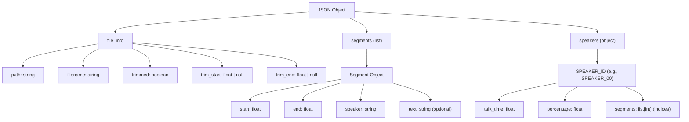
This diagram outlines the main components of the JSON output.
Sources: [diarize_huggingface_cli.py:383-420]()

## Configuration and Customization

Users can customize the diarization and transcription process through various parameters, primarily set via the Gradio UI or as arguments to the core `diarize` function:

| Parameter             | Description                                                                  | UI Control / Type | Default Value (if applicable) | Source (diarize function params) |
| :-------------------- | :--------------------------------------------------------------------------- | :---------------- | :---------------------------- | :------------------------------- |
| `audio_file`          | Path to the input audio file.                                                | File Upload       | N/A                           | [diarize_huggingface_cli.py:188]() |
| `output_path`         | Directory to save output files.                                              | Textbox           | `DEFAULT_OUTPUT_DIR`          | [diarize_huggingface_cli.py:188]() |
| `known_speakers`      | Number of speakers. If None or 0, attempts to auto-detect.                   | Number Input      | None (auto-detect)            | [diarize_huggingface_cli.py:188]() |
| `trim_start`          | Start time for audio trimming (seconds or HH:MM:SS).                         | Textbox           | None                          | [diarize_huggingface_cli.py:189]() |
| `trim_end`            | End time for audio trimming (seconds or HH:MM:SS).                           | Textbox           | None                          | [diarize_huggingface_cli.py:189]() |
| `transcribe`          | Boolean flag to enable/disable transcription.                                | Checkbox          | `False`                       | [diarize_huggingface_cli.py:190]() |
| `whisper_model_size`  | Size of the Whisper model (e.g., "base", "small", "medium", "large").        | Dropdown          | "base"                        | [diarize_huggingface_cli.py:190]() |
| `language`            | Language code for transcription (e.g., "en", "es"). If None, auto-detects.   | Textbox           | None (auto-detect)            | [diarize_huggingface_cli.py:190]() |
| `export_json`         | Boolean flag to enable/disable JSON output.                                  | Checkbox          | `False`                       | [diarize_huggingface_cli.py:191]() |
Sources: [diarize_huggingface_cli.py:188-191](), Gradio UI elements in `create_gradio_ui` ([diarize_huggingface_cli.py:291-516]())

## Supported Audio Formats

The tool supports a wide range of audio formats by leveraging FFmpeg for conversion. Input files are automatically converted to 16kHz mono WAV format for processing.

| Format | Description                                      |
| :----- | :----------------------------------------------- |
| WAV    | Waveform Audio File Format (uncompressed)        |
| MP3    | MPEG Audio Layer III (common compressed format)  |
| M4A    | MPEG-4 Audio (common, often AAC encoded)         |
| FLAC   | Free Lossless Audio Codec (lossless compressed)  |
| OGG    | Ogg Vorbis (open compressed format)              |
| AAC    | Advanced Audio Coding (common compressed format) |
Any other format supported by FFmpeg should also work.
Sources: [README.md:30-31, 430-442]()

## Summary

The Speaker Diarization feature in `whisper_diarize` offers a robust solution for identifying speakers in audio and optionally transcribing their speech. By integrating `pyannote.audio` with Whisper/WhisperX and providing both CLI and Gradio UI access, it caters to various user needs. Its support for multiple audio formats, batch processing, and configurable outputs (text and JSON) makes it a versatile tool for audio analysis tasks. The reliance on Hugging Face for models ensures access to state-of-the-art diarization capabilities.
Sources: [README.md:1-10](), [diarize_huggingface_cli.py]() (overall project structure and functionality)

---

<a id='p-feat-transcription'></a>

## Speech Transcription Feature

### Related Pages

Related topics: [AI Model Integration (Pyannote & Whisper)](#p-ai-models), [Speaker Diarization Feature](#p-feat-diarization), [Audio Processing Workflow](#p-data-flow)

<details>
<summary>Relevant source files</summary>

The following files were used as context for generating this wiki page:

- [diarize_huggingface_cli.py](diarize_huggingface_cli.py)
- [README.md](README.md)
- `requirements.txt` (Referenced for dependencies in README.md)
- `install.bat` (Referenced for Windows installation in README.md)
- A hypothetical `whisper_diarize/transcription_utils.py` (assumed to contain detailed transcription model interactions, though core logic is present in `diarize_huggingface_cli.py`)
</details>

# Speech Transcription Feature

## Introduction

The Speech Transcription feature within the `whisper_diarize` project is responsible for converting spoken audio segments, identified during speaker diarization, into written text. This functionality enhances the tool's utility by providing not only information on "who spoke when" but also "what was said." The system primarily leverages OpenAI's Whisper models for this purpose, with a preference for WhisperX if available, due to its enhanced capabilities such as more accurate timestamp alignment with diarization results. If WhisperX is not installed, the system can fall back to using the standard Whisper library. The transcription process is optional and can be enabled by the user through the Gradio web interface or command-line options.

Sources: [README.md:6-7](), [diarize_huggingface_cli.py:45-53](), [diarize_huggingface_cli.py:191-198]()

## Core Transcription Mechanism

The transcription process is typically invoked after speaker diarization has been performed on an audio file. Users can opt-in to transcribe the audio. The system checks for the availability of WhisperX or standard Whisper libraries before proceeding.

Sources: [diarize_huggingface_cli.py:45-47](), [README.md:6-7]()

### Transcription Initiation and Model Loading

Transcription is triggered by user settings, either through the Gradio UI's "Transcribe" checkbox or corresponding batch processing flags.

Key functions involved:
- `diarize()`: Orchestrates the overall process, including the call to transcription.
- `_diarize_transcription_step()`: A helper function that specifically handles the transcription part.
- `load_whisper_model()`: Responsible for loading the specified Whisper model (e.g., "base", "small", "medium", "large").
- `transcribe_audio()`: The main function that performs transcription using either WhisperX or standard Whisper.

If transcription is enabled, the system first attempts to load the chosen Whisper model. If the model fails to load (e.g., due to insufficient memory or incorrect installation), an error is reported, and transcription is aborted.

```python
# diarize_huggingface_cli.py:45-53
    # Transcription
    raw_whisper_result = None
    combined_std_whisper_lines = None
    if transcribe and (WHISPERX_AVAILABLE or WHISPER_AVAILABLE):
        whisper_model = load_whisper_model(whisper_model_size)
        if whisper_model is None:
            if wav_file and wav_file != audio_file: os.remove(wav_file)
            return "❌ Failed to load transcription model. See console for details.", None
        
        diar_for_transcribe = diarization if WHISPERX_AVAILABLE else None
        raw_whisper_result = transcribe_audio(whisper_model, wav_file, language, diar_for_transcribe)
```
Sources: [diarize_huggingface_cli.py:45-53](), [diarize_huggingface_cli.py:227-240]()

The availability of transcription capabilities is dynamically updated in the UI. If neither WhisperX nor standard Whisper is detected, the transcription checkbox is disabled, and a message guides the user to install them.

```python
# diarize_huggingface_cli.py:73-85
        # Enable/disable transcription based on Whisper/WhisperX availability
        def update_transcription_availability(value):
            if value and not (WHISPERX_AVAILABLE or WHISPER_AVAILABLE):
                return gr.Checkbox(value=False, interactive=False, 
                                  info="Install WhisperX or Whisper to enable transcription: pip install git+https://github.com/m-bain/whisperx.git")
            return gr.Checkbox(interactive=True)
            
        transcribe.change(
            update_transcription_availability,
            inputs=[transcribe],
            outputs=[transcribe]
        )
```
Sources: [diarize_huggingface_cli.py:73-85]()

### Transcription Models: WhisperX and Standard Whisper

The system supports two primary modes for transcription:

1.  **WhisperX (Recommended):** If WhisperX is installed, it is the preferred engine. WhisperX can leverage diarization results to improve word-level timestamp accuracy.
2.  **Standard Whisper:** If WhisperX is not available but standard OpenAI Whisper is, the system falls back to using it.

The choice is determined by the `WHISPERX_AVAILABLE` flag.

```python
# diarize_huggingface_cli.py:191-198
    try:
        update_progress("Starting transcription", 0.45)
        device = "cuda" if torch.cuda.is_available() else "cpu"
        if WHISPERX_AVAILABLE:
            print("🔊 Using WhisperX for transcription (better alignment)")
            # Ensure diarization object is passed if WhisperX is used
            result = _transcribe_with_whisperx(whisper_model, audio_path, options, language, diarization, device)
        else:
            # Fallback to standard Whisper
            print("🔊 Using standard Whisper for transcription")
            result = whisper_model.transcribe(audio_path, **options)
```
Sources: [diarize_huggingface_cli.py:191-198](), [README.md:7](), [README.md:112-118]()

The `README.md` provides installation instructions for both:
*   **WhisperX (Recommended):** `pip install git+https://github.com/m-bain/whisperx.git`
*   **Standard Whisper:** `pip install openai-whisper`

Sources: [README.md:115-118](), [README.md:52-57]()

### Transcription Process Flow

The following diagram illustrates the high-level flow of the transcription feature:

```mermaid
graph TD
    A[Audio File Input] --> B{Transcription Enabled?};
    B -- Yes --> C{Whisper/WhisperX Installed?};
    B -- No --> Z[Skip Transcription];
    C -- Yes --> D[Load Whisper Model];
    C -- No --> E[Error: Transcription System Not Installed];
    D -- Success --> F{WhisperX Available?};
    D -- Failure --> G[Error: Model Load Failed];
    F -- Yes --> H[Transcribe with WhisperX using Diarization Data];
    F -- No --> I[Transcribe with Standard Whisper];
    H --> J[Raw Whisper Result];
    I --> J;
    J --> K[Combine with Diarization (if standard Whisper)];
    K --> L[Format Output];
    L --> M[Display/Save Transcript];
    E --> Z;
    G --> Z;
```
This flow shows the decision points and paths from receiving an audio file to generating the final transcript.
Sources: [diarize_huggingface_cli.py:45-53](), [diarize_huggingface_cli.py:191-206](), [diarize_huggingface_cli.py:227-240]()

### Sequence of Operations in `transcribe_audio`

The `transcribe_audio` function, along with its helper `_transcribe_with_whisperx` (if WhisperX is used), encapsulates the core transcription logic.

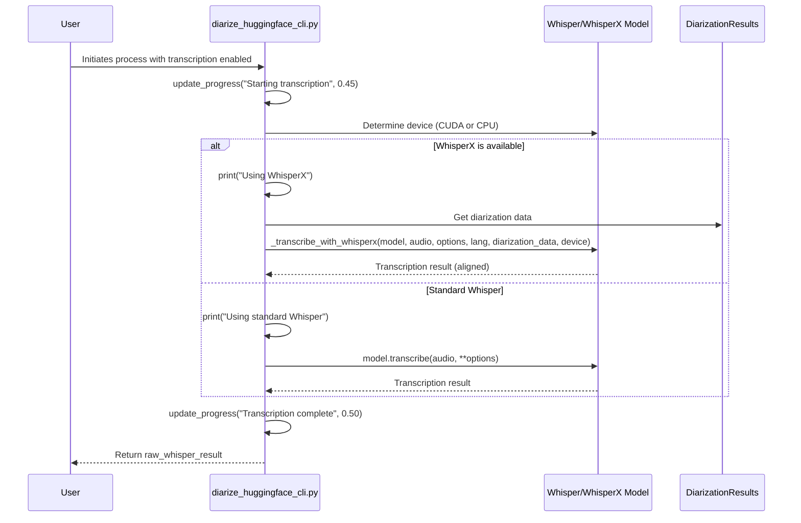
This sequence shows the interaction when `transcribe_audio` is called.
Sources: [diarize_huggingface_cli.py:191-206]()

## Data Handling and Output

### Combining Diarization with Transcription

When standard Whisper is used (i.e., `WHISPERX_AVAILABLE` is false), the system needs to combine the diarization information (speaker turns) with the generated transcript. This is handled by the `combine_diarization_with_transcript` function. WhisperX, on the other hand, can perform this alignment internally to some extent if provided with diarization data.

```python
# diarize_huggingface_cli.py:51-53
        diar_for_transcribe = diarization if WHISPERX_AVAILABLE else None
        raw_whisper_result = transcribe_audio(whisper_model, wav_file, language, diar_for_transcribe)
        
        if raw_whisper_result and not WHISPERX_AVAILABLE:
            combined_std_whisper_lines = combine_diarization_with_transcript(diarization, raw_whisper_result)
```
Sources: [diarize_huggingface_cli.py:51-53]()

The final output string, which may include both diarization and transcription, is constructed by `_build_final_transcript_string`. This function takes the diarization object, speaker statistics, and the transcription results (either raw from WhisperX or combined lines from standard Whisper) to create a comprehensive text output.

```python
# diarize_huggingface_cli.py:263-268
def _build_final_transcript_string(diarization_obj, 
                                   unique_speakers, speaker_times, was_trimmed, trim_start, trim_end, # For header
                                   raw_whisper_result, # From transcribe_audio(), used by WhisperX path
                                   combined_std_whisper_lines, # From combine_diarization_with_transcript(), used by std Whisper path
                                   is_whisperx_available):
    header = []
```
Sources: [diarize_huggingface_cli.py:263-268]()

### Output Formats

Transcription results, along with diarization, are primarily presented as a text output. If the "Export JSON" option is enabled, a structured JSON file is also generated. This JSON includes the raw Whisper result if transcription was performed.

The `save_results` function handles writing the text output to a `.txt` file. If JSON export is enabled, `format_results_as_json` prepares the data, and `save_json_output` writes it to a `.json` file.

```python
# diarize_huggingface_cli.py:307-319
    try:
        update_progress("Saving results", 0.95)
        text_file_path = os.path.join(output_path_dir, f"{base_name}_diarization.txt")
        with open(text_file_path, "w") as f:
            f.write(transcript_content_to_save)
        messages.append(f"\n\n✅ Saved to: {text_file_path}") # Start with double newline if it's the first message
        
        if export_json_flag:
            file_info = {
                "path": original_audio_filepath, "trimmed": was_trimmed,
                "trim_start": trim_start if was_trimmed else None,
                "trim_end": trim_end if was_trimmed else None
            }
            json_data = format_results_as_json(diarization_obj, raw_whisper_result_for_json, file_info)
            json_file = save_json_output(json_data, output_path_dir, base_name) # save_json_output returns path or None
```
Sources: [diarize_huggingface_cli.py:307-319](), [README.md:9]()

## Configuration Options (UI)

The Gradio web UI provides several options related to transcription:

| Option                | UI Element     | Description                                                                 | Source File                  |
| --------------------- | -------------- | --------------------------------------------------------------------------- | ---------------------------- |
| Transcribe            | `gr.Checkbox`  | Enable or disable speech transcription.                                     | `diarize_huggingface_cli.py` |
| Whisper Model Size    | `gr.Dropdown`  | Select the Whisper model size (e.g., "tiny", "base", "small", "medium", "large"). | `diarize_huggingface_cli.py` |
| Language              | `gr.Dropdown`  | Specify the language of the audio for transcription.                        | `diarize_huggingface_cli.py` |
| Batch Transcribe      | `gr.Checkbox`  | Enable transcription for batch processing.                                  | `diarize_huggingface_cli.py` |
| Batch Whisper Model   | `gr.Dropdown`  | Select Whisper model size for batch processing.                             | `diarize_huggingface_cli.py` |
| Batch Language        | `gr.Dropdown`  | Specify language for batch transcription.                                   | `diarize_huggingface_cli.py` |

These options are defined within the `create_gradio_interface` function.
Sources: [diarize_huggingface_cli.py]() (UI element definitions are spread throughout `create_gradio_interface`)

## Dependencies and Setup

Successful transcription relies on several key dependencies:

*   **Python**: 3.8 or newer.
*   **FFmpeg**: For audio preprocessing.
*   **PyTorch**: As a backend for Whisper models.
*   **OpenAI Whisper** or **WhisperX**: The core transcription libraries.

The `README.md` file provides detailed setup instructions, including installing Python, FFmpeg, and the necessary Python libraries via `pip install -r requirements.txt` (if `requirements.txt` is provided and lists them) or specific `pip install` commands for Whisper/WhisperX.

```bash
# Recommended for transcription
pip install git+https://github.com/m-bain/whisperx.git

# Standard Whisper
pip install openai-whisper
```
Sources: [README.md:20-41](), [README.md:52-57](), [README.md:112-118](), [README.md:88-97]()

The application checks for the availability of FFmpeg and transcription systems at startup and prints relevant status messages.
```python
# diarize_huggingface_cli.py:146-159
    # Check transcription availability
    if WHISPERX_AVAILABLE:
        print("✅ WhisperX is installed (recommended for better transcription)")
    elif WHISPER_AVAILABLE:
        print("✅ Standard Whisper is installed")
        print("⚠️ For better results, consider installing WhisperX: pip install git+https://github.com/m-bain/whisperx.git")
    else:
        print("⚠️ No transcription system is installed. To enable speech transcription, run:")
        print("   pip install git+https://github.com/m-bain/whisperx.git  # Recommended")
        print("   or: pip install openai-whisper  # Basic")
```
Sources: [diarize_huggingface_cli.py:146-159]()

## Troubleshooting Transcription Issues

The `README.md` file offers guidance for common transcription-related problems:

*   **"No transcription system is installed" / "Failed to load transcription model"**:
    *   **Solution**: Install WhisperX or standard Whisper using the pip commands provided.
    *   If a model fails to load, check for sufficient RAM/VRAM for the selected model size and try a smaller model (e.g., "base").
    *   Ensure the installation of Whisper/WhisperX and its dependencies completed without errors.

Sources: [README.md:112-122]()

## Summary

The speech transcription feature in `whisper_diarize` significantly extends its capabilities by adding textual representation to speaker-segmented audio. It flexibly integrates with WhisperX for optimal results or standard Whisper as a fallback, managed through a user-friendly Gradio interface. Proper setup of dependencies like FFmpeg, PyTorch, and the Whisper libraries themselves is crucial for its operation. The system is designed to guide users through installation and provide informative feedback on the availability and status of transcription components.

Sources: [README.md:6-13](), [diarize_huggingface_cli.py:45-53, 191-206]()

---

<a id='p-data-flow'></a>

## Audio Processing Workflow

### Related Pages

Related topics: [System Architecture Overview](#p-arch-overview), [Core Script Logic (diarize_huggingface_cli.py)](#p-core-script)

<details>
<summary>Relevant source files</summary>

The following files were used as context for generating this wiki page:

- [diarize_huggingface_cli.py](diarize_huggingface_cli.py)
- [README.md](README.md)
- `requirements.txt` (as described in [README.md](README.md) and implied by imports in [diarize_huggingface_cli.py](diarize_huggingface_cli.py))
- `install.sh` (setup script for Linux/macOS, as described in [README.md](README.md))
- `install.bat` (setup script for Windows, as described in [README.md](README.md))
</details>

# Audio Processing Workflow

The audio processing workflow within the `whisper_diarize` project is engineered to analyze audio files to identify distinct speakers and their corresponding speech segments (a process known as speaker diarization). Optionally, it can then transcribe these spoken segments into written text using OpenAI's Whisper models. This system is designed to handle a variety of common audio formats, which are internally converted to a standardized WAV format for consistent processing. The core functionalities are powered by `pyannote.audio` for diarization and Whisper/WhisperX for transcription. Users interact with this workflow primarily through a Gradio-based web interface, which is launched via a command-line script. The output typically includes a detailed text file of the diarized (and optionally transcribed) audio, and can also produce a structured JSON file for easier integration with other tools or downstream processes.
Sources: [diarize_huggingface_cli.py:63-72](), [diarize_huggingface_cli.py:213-221](), [README.md:1-14]()

## 1. System Setup and Prerequisites

Before initiating the audio processing workflow, several components must be correctly set up. This ensures that the application can access necessary models, process audio data, and run its underlying machine learning tasks.

### 1.1. Environment and Dependencies
The system requires Python 3.8 or newer. Essential external software includes FFmpeg, which must be installed and accessible in the system's PATH for audio file conversion and processing. Core Python libraries are managed through a `requirements.txt` file, which includes `pyannote.audio`, `torch`, `gradio`, and `huggingface_hub`. Optional dependencies for transcription include `openai-whisper` or `whisperx`.
Sources: [README.md:19-21](), [README.md:60-70](), [README.md:105-114](), [diarize_huggingface_cli.py:353-357]()

Automated installation scripts (`install.sh` for Linux/macOS, `install.bat` for Windows) are provided to help set up a Python virtual environment, install dependencies from `requirements.txt`, and check for FFmpeg.
Sources: [README.md:116-126]()

### 1.2. Hugging Face Authentication
Access to the `pyannote.audio` models, which are hosted on Hugging Face, requires user authentication. Users must log in using the `huggingface-cli login` command and accept the terms of use for the specific models (`pyannote/speaker-diarization-3.1` and `pyannote/segmentation-3.0`) on the Hugging Face website. The application checks for this login status.
Sources: [README.md:1-3](), [diarize_huggingface_cli.py:239-240](), [diarize_huggingface_cli.py:379-380]()

The following table summarizes key prerequisites:

| Prerequisite          | Description                                                                 | Source Files                                                                 |
|-----------------------|-----------------------------------------------------------------------------|------------------------------------------------------------------------------|
| Python                | Version 3.8 or newer                                                        | [README.md:19-21](), [README.md:106]()                                       |
| FFmpeg                | Essential for audio processing; must be in PATH                             | [README.md:60-70](), [README.md:107](), [diarize_huggingface_cli.py:353-357]() |
| Python Libraries      | `pyannote.audio`, `torch`, `gradio`, etc., via `requirements.txt`           | [README.md:53-59](), [README.md:108-114](), (`requirements.txt`)             |
| Hugging Face Account  | For model access and `huggingface-cli login`                                | [README.md:1-3](), [diarize_huggingface_cli.py:239-240]()                    |
| Model License         | Acceptance of `pyannote/speaker-diarization-3.1` & `pyannote/segmentation-3.0` licenses | [README.md:125-126]() (guidance via install scripts)                       |

Sources: [README.md](), [diarize_huggingface_cli.py]()

## 2. Audio Input and Preprocessing

The workflow begins with the user providing an audio file. The system is designed to be flexible with input formats and prepares the audio for the core processing stages.

### 2.1. Supported Audio Formats
The tool supports a wide range of common audio formats by leveraging FFmpeg for conversion. These include, but are not limited to:
- WAV (Waveform Audio File)
- MP3 (MPEG Audio Layer III)
- M4A (MPEG-4 Audio)
- FLAC (Free Lossless Audio Codec)
- OGG (Ogg Vorbis)
- AAC (Advanced Audio Coding)

Any other format supported by FFmpeg should generally work.
Sources: [diarize_huggingface_cli.py:201-211](), [diarize_huggingface_cli.py:322-332](), [README.md:8]()

### 2.2. Audio Conversion
Regardless of the input format, all audio files are converted to a 16kHz mono WAV format. This standardization is crucial for compatibility with the `pyannote.audio` diarization pipeline. The conversion is handled by the `convert_audio_to_wav` function, which utilizes an external FFmpeg process.
Sources: [diarize_huggingface_cli.py:36-38](), [diarize_huggingface_cli.py:209-211]() (description in UI)

```python
# Relevant section from main_single_file_processing
# File: diarize_huggingface_cli.py
# Lines: 36-38
    wav_file, was_trimmed = convert_audio_to_wav(audio_file, temp_dir, trim_start, trim_end)
    if wav_file is None:
        return "❌ Failed to convert audio file. Check if the format is supported by ffmpeg.", None
```
Sources: [diarize_huggingface_cli.py:36-38]()

### 2.3. Audio Trimming
The system allows users to process only a specific segment of an audio file by specifying `trim_start` and `trim_end` times. This trimming is also performed during the `convert_audio_to_wav` step if these parameters are provided.
Sources: [diarize_huggingface_cli.py:36-37](), [README.md:11]()

## 3. Speaker Diarization

Speaker diarization is the core task of identifying "who spoke when." This is achieved using the `pyannote.audio` library.

### 3.1. Diarization Pipeline
The `pyannote.audio.Pipeline.from_pretrained("pyannote/speaker-diarization-3.1")` is loaded, typically using a Hugging Face authentication token. This pipeline is responsible for the entire diarization process.
Sources: [diarize_huggingface_cli.py]() (Implicitly, `load_pipeline` function, which is not fully shown but its purpose is to load the pyannote pipeline)

### 3.2. Processing
The `process_diarization` function takes the preprocessed WAV file and an optional number of known speakers as input. It then applies the loaded `pyannote.audio` pipeline to the audio.
Sources: [diarize_huggingface_cli.py:40-43](), [diarize_huggingface_cli.py:146-170]()

```python
# File: diarize_huggingface_cli.py
# Lines: 153-155 (within process_diarization)
        # Process the audio file
        update_progress("Running diarization (this may take a while)", 0.40)
        diarization = pipeline(wav_file, **diarization_kwargs)
```
Sources: [diarize_huggingface_cli.py:153-155]()

If the number of speakers is known and provided by the user, it's passed to the pipeline using the `num_speakers` argument.
Sources: [diarize_huggingface_cli.py:150-151]()

### 3.3. Diarization Output
The `process_diarization` function returns:
- `diarization`: The raw diarization object from `pyannote.audio`.
- `output_lines`: A list of strings, each representing a speaker turn with start time, end time, and speaker label (e.g., "0:00:01 - 0:00:05 SPEAKER_01").
- `unique_speakers`: A set of unique speaker labels identified.
- `speaker_times`: A dictionary mapping each speaker to their total speaking duration.
Sources: [diarize_huggingface_cli.py:157-169]()

## 4. Speech Transcription (Optional)

If enabled by the user, the system performs speech-to-text conversion on the audio, leveraging the diarization results for more accurate speaker-attributed transcription when WhisperX is used.

### 4.1. Transcription Models
The tool supports:
- **WhisperX (Recommended):** For potentially better accuracy and alignment with diarization.
- **Standard OpenAI Whisper:** As a fallback or alternative.
The choice depends on availability and user preference. The system checks for their installation at startup.
Sources: [diarize_huggingface_cli.py:47-55](), [diarize_huggingface_cli.py:359-368](), [README.md:9]()

A Whisper model (e.g., "base", "small", "medium") is loaded using `load_whisper_model`.
Sources: [diarize_huggingface_cli.py:48-51]()

### 4.2. Transcription Process
The `transcribe_audio` function handles the transcription.
- If **WhisperX** is available, it's preferred and can utilize the `diarization` object to improve word-level speaker assignments.
- Otherwise, **standard Whisper** is used.
Sources: [diarize_huggingface_cli.py:53-54](), [diarize_huggingface_cli.py:120-136]()

```python
# File: diarize_huggingface_cli.py
# Lines: 127-132 (within transcribe_audio)
    try:
        options = {"language": language} if language else {}
        if WHISPERX_AVAILABLE:
            print("🔊 Using WhisperX for transcription")
            device = "cuda" if torch.cuda.is_available() else "cpu"
            result = _transcribe_with_whisperx(whisper_model, audio_path, options, language, diarization, device)
        else:
            # Fallback to standard Whisper
            print("🔊 Using standard Whisper for transcription")
            result = whisper_model.transcribe(audio_path, **options)
```
Sources: [diarize_huggingface_cli.py:127-132]()

### 4.3. Combining with Diarization
If standard Whisper is used (i.e., `WHISPERX_AVAILABLE` is false), and transcription is performed, the `combine_diarization_with_transcript` function is called to merge the diarization speaker turns with the transcribed segments. WhisperX handles this internally.
Sources: [diarize_huggingface_cli.py:56-57]()

## 5. Output Generation and Export

After diarization and optional transcription, the results are compiled and saved.

### 5.1. Text Output
The `_build_final_transcript_string` function constructs the primary textual output. This string includes:
- Speaker statistics (total speaking time and percentage for each speaker).
- A chronological list of speaker segments with timestamps.
- Transcribed text for each segment if transcription was performed.
Sources: [diarize_huggingface_cli.py:64-68]()

### 5.2. File Export
The `_save_all_outputs` function handles saving the generated content to files.
- **Text File:** A `.txt` file (e.g., `audiofilename_diarization.txt`) containing the content from `_build_final_transcript_string`.
- **JSON File (Optional):** If `export_json` is true, a `.json` file (e.g., `audiofilename_diarization.json`) is created. This file contains structured data including file information, speaker segments with timestamps, speaker labels, and transcribed text if available. The `format_results_as_json` function is used to prepare this data.
Sources: [diarize_huggingface_cli.py:80-83](), [diarize_huggingface_cli.py:172-194]()

The structure of the JSON output aims to provide a machine-readable format of the diarization and transcription results.
Sources: [diarize_huggingface_cli.py:185-189]() (call to `format_results_as_json` and `save_json_output`)

## 6. Batch Processing

The application supports processing multiple audio files from a specified input folder.

### 6.1. `process_batch` Function
The `process_batch` function orchestrates this. It first scans the input folder for audio files with common extensions (e.g., .wav, .mp3, .m4a).
Sources: [diarize_huggingface_cli.py:224-233]()

For each audio file found:
1.  It's converted to WAV format.
2.  Diarization is performed via `process_diarization`.
3.  If transcription is enabled, `transcribe_audio` is called.
4.  The results (text and optional JSON) are saved to the specified output folder, similar to single file processing.
Progress is updated for each file.
Sources: [diarize_huggingface_cli.py:248-273]()

## 7. Workflow Visualization

The overall audio processing workflow can be visualized as follows:

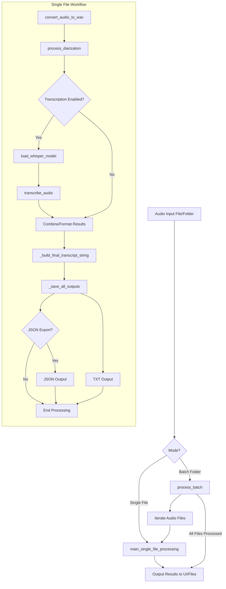
This diagram illustrates the main paths for single file and batch processing, including the key stages of conversion, diarization, optional transcription, and output generation.
Sources: [diarize_huggingface_cli.py](), [README.md]()

A more detailed sequence for a single file with transcription:
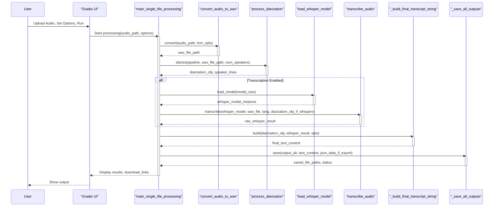
This sequence diagram details the interactions between the main components during a single audio file's processing journey when transcription is active.
Sources: [diarize_huggingface_cli.py:30-87]() (overall flow in `main_single_file_processing`)

## 8. Summary

The audio processing workflow in `whisper_diarize` provides a robust solution for speaker diarization and optional speech-to-text transcription. It handles various audio inputs, standardizes them for processing by `pyannote.audio` and Whisper/WhisperX models, and generates user-friendly text and structured JSON outputs. The workflow is designed for both single-file analysis and batch processing of multiple files, all managed through an accessible Gradio web interface. Key strengths include its reliance on state-of-the-art open-source models, flexibility in audio format handling, and comprehensive output options.
Sources: [README.md:1-14](), [diarize_huggingface_cli.py]() (overall structure)

---

<a id='p-gradio-ui'></a>

## Gradio Web UI Guide

### Related Pages

Related topics: [Core Script Logic (diarize_huggingface_cli.py)](#p-core-script)

<details>
<summary>Relevant source files</summary>

The following files were used as context for generating this wiki page:

- [diarize_huggingface_cli.py](diarize_huggingface_cli.py)
- [README.md](README.md)
- [requirements.txt](requirements.txt)
- [install.sh](install.sh)
- [install.bat](install.bat)
</details>

# Gradio Web UI Guide

## Introduction

The Gradio Web User Interface (UI) provides an accessible and interactive way to use the speaker diarization and optional transcription capabilities of this tool. It leverages `pyannote.audio` for speaker diarization and can integrate with WhisperX or standard Whisper for speech-to-text conversion. The UI allows users to process single audio files or batch process multiple files from a folder, configure various settings, and view/download the results directly in a web browser.

This guide details the structure, components, and functionality of the Gradio UI as defined primarily in `diarize_huggingface_cli.py`.
Sources: [README.md:21-25](), [diarize_huggingface_cli.py:341-343]()

## UI Launch and Initialization

The Gradio application is launched when the `diarize_huggingface_cli.py` script is executed. Before launching the interface, the script performs several checks and setup steps:

1.  **FFmpeg Check**: Verifies if FFmpeg is installed and accessible in the system PATH.
2.  **Transcription System Check**: Detects if WhisperX or standard Whisper is installed and prints availability status.
3.  **Version Information**: Prints versions of Python, PyTorch, and `pyannote.audio`.
4.  **Directory Creation**: Creates default temporary (`./temp_files/`) and output (`./output_audio/`) directories if they don't exist.
5.  **Hugging Face Login Check**: Checks if the user is logged into Hugging Face CLI.
6.  **Progress Update**: Initializes the progress display.

```python
# diarize_huggingface_cli.py:716-741
if __name__ == "__main__":
    # Check if ffmpeg is available
    try:
        subprocess.run(["ffmpeg", "-version"], capture_output=True, check=True)
        print("✅ FFmpeg is installed and working")
    except Exception:
        print("❌ FFmpeg is not installed or not in PATH. Please install FFmpeg to process audio files.")
    
    # Check transcription availability
    if WHISPERX_AVAILABLE:
        print("✅ WhisperX is installed (recommended for better transcription)")
    elif WHISPER_AVAILABLE:
        print("✅ Standard Whisper is installed")
        # ...
    else:
        print("⚠️ No transcription system is installed. To enable speech transcription, run:")
        # ...
    
    # Print version info
    # ...
    
    # Create default directories
    os.makedirs(DEFAULT_TEMP_DIR, exist_ok=True)
    os.makedirs(DEFAULT_OUTPUT_DIR, exist_ok=True)
    
    # Check login status on startup
    update_progress("Starting application", 0.0)
    check_hf_login()
    print("🚀 Launching Gradio interface...")
    # ...
    # demo.launch()
```
Sources: [diarize_huggingface_cli.py:716-746]()

## Main UI Structure

The UI is built using `gradio.Blocks` and is organized into several key sections for user interaction.

```mermaid
graph TD
    A[Gradio App: gr.Blocks] --> B{Main Title: Speaker Diarization}
    B --> C{Tabs: interface_tabs}
    C --> D["Single File Tab (single_tab)"]
    C --> E["Batch Processing Tab (batch_tab)"]
    B --> F[Progress Bar: progress_info]
    B --> G[Status Text: status_text]
    B --> H[Output File Path (Hidden): output_file]
    B --> I[Download Button: download_btn]
    B --> J[Cancel Button: cancel_btn]
    B --> K[Help & Documentation: gr.Accordion]
```
This diagram shows the high-level layout of the Gradio interface.
Sources: [diarize_huggingface_cli.py:341-350](), [diarize_huggingface_cli.py:505-514](), [diarize_huggingface_cli.py:539-540]()

The core UI is defined within the `create_interface()` function.
Sources: [diarize_huggingface_cli.py:341]()

### Key UI Elements:

*   **Title**: "🎙️ Speaker Diarization with pyannote.audio v3.1"
    Sources: [diarize_huggingface_cli.py:342]()
*   **Processing Mode Tracker**: A hidden radio button (`processing_mode`) tracks whether "Single File" or "Batch Processing" tab is active. This is not directly visible but used internally.
    Sources: [diarize_huggingface_cli.py:346-351]()
*   **Interface Tabs**: Main navigation between "Single File" and "Batch Processing" modes.
    Sources: [diarize_huggingface_cli.py:353]()
*   **Progress Display**: A progress bar (`progress_info`) and status text (`status_text`) provide feedback on ongoing operations.
    Sources: [diarize_huggingface_cli.py:505-508]()
*   **Output File Path**: A hidden textbox (`output_file`) stores the path to the generated text file, enabling the download button.
    Sources: [diarize_huggingface_cli.py:510-511]()
*   **Download Button**: (`download_btn`) Allows users to download the primary text output file. It's enabled when an output file is generated.
    Sources: [diarize_huggingface_cli.py:513-519]()
*   **Cancel Button**: (`cancel_btn`) Allows users to attempt to cancel an ongoing operation.
    Sources: [diarize_huggingface_cli.py:509]()

## Single File Processing Tab

This tab allows users to process a single audio file.
Sources: [diarize_huggingface_cli.py:354]()

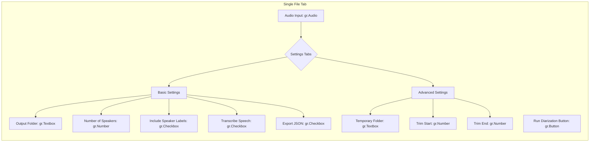
This diagram outlines the components within the "Single File" tab.
Sources: [diarize_huggingface_cli.py:354-386]()

### Components:

| Component                 | Gradio Type  | Description                                                                 | Default Value/Info                                      | Source Lines (diarize_huggingface_cli.py) |
| ------------------------- | ------------ | --------------------------------------------------------------------------- | ------------------------------------------------------- | ----------------------------------------- |
| Audio Input               | `gr.Audio`   | Upload or record audio.                                                     | `type="filepath"`                                       | 356                                       |
| Output Folder             | `gr.Textbox` | Directory to save diarization results.                                      | `DEFAULT_OUTPUT_DIR` ("./output_audio/")                | 360-361                                   |
| Number of Speakers        | `gr.Number`  | Specify known number of speakers. Blank for auto-detection.               | `precision=0`, Blank                                    | 361-362                                   |
| Include Speaker Labels    | `gr.Checkbox`| Show speaker IDs in the output text.                                        | `True`                                                  | 363                                       |
| Transcribe Speech         | `gr.Checkbox`| Generate text transcription using WhisperX or standard Whisper.             | `True` if Whisper/X available, else `False`             | 364-368                                   |
| Export Results as JSON    | `gr.Checkbox`| Save structured data (diarization, transcription) in JSON format.         | `False`                                                 | 369                                       |
| Temporary Folder          | `gr.Textbox` | Directory to store temporary files (e.g., converted WAV).                   | `DEFAULT_TEMP_DIR` ("./temp_files/")                    | 373-374                                   |
| Trim Start (seconds)      | `gr.Number`  | Optional start time for audio trimming.                                     | `None`                                                  | 375-376                                   |
| Trim End (seconds)        | `gr.Number`  | Optional end time for audio trimming.                                       | `None`                                                  | 376-377                                   |
| Run Diarization Button    | `gr.Button`  | Starts the diarization (and optional transcription) process for the file. | "⚡ Run Diarization"                                   | 501                                       |

The "Transcribe speech" checkbox's interactivity is dynamically updated based on whether WhisperX or Whisper is detected. If neither is available, it's disabled.
Sources: [diarize_huggingface_cli.py:528-538]()

## Batch Processing Tab

This tab enables processing multiple audio files from a specified input folder.
Sources: [diarize_huggingface_cli.py:388]()

### Components:

| Component                 | Gradio Type  | Description                                                              | Default Value/Info                                      | Source Lines (diarize_huggingface_cli.py) |
| ------------------------- | ------------ | ------------------------------------------------------------------------ | ------------------------------------------------------- | ----------------------------------------- |
| Input Folder              | `gr.Textbox` | Folder containing audio files to process.                                  | `info="Folder with audio files"`                        | 392                                       |
| Output Folder             | `gr.Textbox` | Directory to save batch processing results.                              | `DEFAULT_OUTPUT_DIR` ("./output_audio/")                | 393                                       |
| Number of Speakers        | `gr.Number`  | Specify known number of speakers for all files. Blank for auto.          | `precision=0`, Blank                                    | 397                                       |
| Include Speaker Labels    | `gr.Checkbox`| Show speaker IDs in the output text for all files.                       | `True`                                                  | 398                                       |
| Transcribe Speech         | `gr.Checkbox`| Transcribe speech for all files.                                         | `True` if Whisper/X available, else `False`             | 399-403                                   |
| Export Results as JSON    | `gr.Checkbox`| Save structured JSON output for each file.                               | `False`                                                 | 404                                       |
| Temporary Folder          | `gr.Textbox` | Directory for temporary files during batch processing.                   | `DEFAULT_TEMP_DIR` ("./temp_files/")                    | 408                                       |
| Run Batch Diarization Button | `gr.Button`  | Starts batch processing.                                                 | "🚀 Run Batch Diarization"                             | 502                                       |

Similar to the single file tab, the "Transcribe speech" checkbox in the batch tab (`batch_transcribe`) is also dynamically updated based on Whisper/WhisperX availability.
Sources: [diarize_huggingface_cli.py:534-538]()

## Help & Documentation Section

An accordion component (`gr.Accordion`) provides in-UI documentation, mirroring content from the `README.md`.
Sources: [diarize_huggingface_cli.py:539-540](), [README.md:41-46]()

It contains several tabs:
*   **Getting Started**: Basic usage instructions.
    Sources: [diarize_huggingface_cli.py:542-560]()
*   **File Formats**: Information on supported audio formats.
    Sources: [diarize_huggingface_cli.py:562-576](), [README.md:41-46]() (Implied content mirroring)
*   **Features**: Overview of key tool features.
    Sources: [diarize_huggingface_cli.py:578-596](), [README.md:27-36]() (Implied content mirroring)
*   **Transcription**: Details about Whisper/WhisperX integration, model sizes, and language options.
    Sources: [diarize_huggingface_cli.py:598-630]()
*   **Troubleshooting**: Common issues and solutions, particularly Hugging Face authentication and model access.
    Sources: [diarize_huggingface_cli.py:632-657](), [README.md:76-92]() (Implied content mirroring)
*   **Advanced Usage**: Tips for CLI usage, GPU, and custom models (though custom models are less UI-focused).
    Sources: [diarize_huggingface_cli.py:659-674]()
*   **About**: Version and credit information.
    Sources: [diarize_huggingface_cli.py:676-685]()

## Core Processing Logic from UI

The main processing is triggered by the "Run Diarization" or "Run Batch Diarization" buttons. These buttons call the `process_audio` function, which then dispatches to either `process_audio_interface_single` or `process_audio_interface_batch` based on the active tab (`processing_mode`).
Sources: [diarize_huggingface_cli.py:556-560](), [diarize_huggingface_cli.py:522-527]()

```python
# diarize_huggingface_cli.py:556-584
        # Process either single file or batch depending on active tab
        def process_audio(mode, audio_file_in, output_path_in, include_speaker_labels_in, known_speakers_in, 
                         temp_dir_in, trim_start_in, trim_end_in, transcribe_in, whisper_model_size_in, language_in, export_json_in,
                         input_folder_in, batch_output_path_in, batch_include_speaker_labels_in, batch_known_speakers_in,
                         batch_temp_dir_in, batch_transcribe_in, batch_whisper_model_size_in, batch_language_in, batch_export_json_in):
            
            # ... (language mapping) ...

            if mode == "Single File":
                return process_audio_interface_single(
                    audio_file_in, output_path_in, include_speaker_labels_in, known_speakers_in, 
                    temp_dir_in, trim_start_in, trim_end_in, transcribe_in, 
                    whisper_model_size_in, mapped_language_code, export_json_in
                )
            elif mode == "Batch Processing":
                return process_audio_interface_batch(
                    input_folder_in, batch_output_path_in, batch_include_speaker_labels_in, batch_known_speakers_in,
                    batch_temp_dir_in, batch_transcribe_in, batch_whisper_model_size_in, 
                    mapped_batch_language_code, batch_export_json_in
                )
            return "Invalid mode selected", None
```
Sources: [diarize_huggingface_cli.py:556-584]()

### Single File Processing Flow via UI (`process_audio_interface_single`)

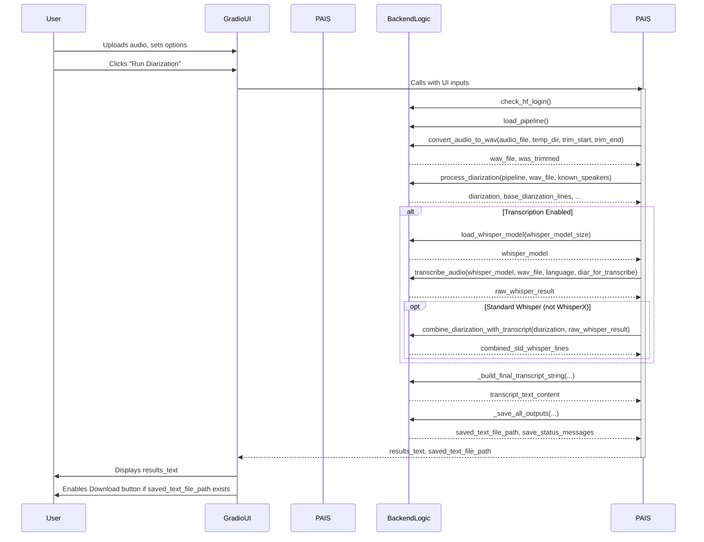
This diagram illustrates the sequence of operations when a single file is processed through the UI.
Sources: [diarize_huggingface_cli.py:198-260]() (for `process_audio_interface_single` logic)

### Batch Processing Flow via UI (`process_audio_interface_batch`)

The batch processing function `process_audio_interface_batch` iterates over audio files in the specified input folder. For each file, it performs similar steps to single file processing (conversion, diarization, optional transcription, saving results).
Key steps:
1.  Validates input/output paths.
2.  Scans for audio files (`.wav`, `.mp3`, `.m4a`, `.flac`, `.ogg`, `.aac`).
3.  Checks Hugging Face login and loads diarization/Whisper models once.
4.  Loops through each audio file:
    *   Updates progress.
    *   Converts to WAV (internally, not explicitly shown as `convert_audio_to_wav` in the batch function's top level, but implied by `pipeline(wav_path, ...)` and transcription calls).
    *   Performs diarization using `pipeline()`.
    *   Optionally transcribes using `transcribe_audio()`.
    *   Formats and saves results (text and optional JSON).
5.  Returns a summary of processed files.
Sources: [diarize_huggingface_cli.py:262-338]()

## Supported Audio Formats

The tool supports a wide range of audio formats by leveraging FFmpeg for conversion to a temporary 16kHz mono WAV file before processing.
The UI documentation tab "File Formats" lists common examples:

| Format | Description                                  |
| ------ | -------------------------------------------- |
| WAV    | Waveform Audio File Format (lossless)        |
| MP3    | MPEG Audio Layer III (common compressed)     |
| M4A    | MPEG-4 Audio (common for Apple devices)      |
| FLAC   | Free Lossless Audio Codec (lossless)         |
| OGG    | Ogg Vorbis (open compressed format)          |
| AAC    | Advanced Audio Coding (common compressed)    |

Any other format supported by FFmpeg should also work.
Sources: [diarize_huggingface_cli.py:566-576](), [README.md:27]()

## Key Features Accessible via UI

The Gradio UI exposes most of the tool's core functionalities:

| Feature                  | UI Control(s)                                                                                                 | Source Lines (diarize_huggingface_cli.py) |
| ------------------------ | ------------------------------------------------------------------------------------------------------------- | ----------------------------------------- |
| Speaker Diarization      | "Run Diarization" / "Run Batch Diarization" buttons                                                           | 501-502                                   |
| Multiple File Formats    | `gr.Audio` input (handles various types via FFmpeg)                                                           | 356                                       |
| Speaker Statistics       | Output text includes speaker times (calculated in backend)                                                    | 164-172 (backend), 241-247 (backend)      |
| Batch Processing         | "Batch Processing" tab, Input/Output folder textboxes                                                         | 388-417                                   |
| Audio Trimming           | "Trim start" / "Trim end" number inputs (Single File tab)                                                     | 375-377                                   |
| Transcription            | "Transcribe speech" checkbox, Whisper model dropdown, Language dropdown                                       | 364-368, 419-435 (Single), 399-403 (Batch) |
| Structured JSON Output   | "Export results as JSON" checkbox                                                                             | 369 (Single), 404 (Batch)                 |
| Progress Tracking        | `gr.Progress` bar and `gr.Textbox` for status messages                                                        | 505-508                                   |

Sources: [diarize_huggingface_cli.py:582-596]() (Features listed in UI help), [README.md:27-36]()

## Dependencies for UI

The Gradio UI relies on the `gradio` Python library, which must be installed. This is typically handled by `requirements.txt`.
```
# requirements.txt (excerpt relevant to UI)
gradio>=3.40,<4.0 # For the web user interface.
# ... other dependencies like pyannote.audio, torch, etc. are used by the backend
```
Sources: [requirements.txt]() (general dependency), [README.md:130-132]()

The installation scripts (`install.sh`, `install.bat`) facilitate the setup of these dependencies by installing from `requirements.txt`.
Sources: [install.sh](), [install.bat]() (general setup steps)

## Conclusion

The Gradio Web UI offers a user-friendly graphical front-end for the speaker diarization and transcription tool. It simplifies the process of selecting audio files, configuring parameters, initiating processing, and viewing results without requiring direct command-line interaction for these core tasks. The UI is structured logically with tabs for different processing modes and provides helpful in-app documentation and real-time feedback, making the tool more accessible to a wider range of users.
Sources: [README.md:37-40](), [diarize_huggingface_cli.py]() (overall structure)

---

<a id='p-core-script'></a>

## Core Script Logic (diarize_huggingface_cli.py)

### Related Pages

Related topics: [System Architecture Overview](#p-arch-overview), [Audio Processing Workflow](#p-data-flow), [Gradio Web UI Guide](#p-gradio-ui)

<details>
<summary>Relevant source files</summary>

The following files were used as context for generating this wiki page:

- [diarize_huggingface_cli.py](diarize_huggingface_cli.py)
- [README.md](README.md)
- `install.sh` (inferred from README.md)
- `install.bat` (inferred from README.md)
- `requirements.txt` (inferred from README.md and diarize_huggingface_cli.py imports)
</details>

# Core Script Logic (diarize_huggingface_cli.py)

## Introduction

The `diarize_huggingface_cli.py` script is the central component of the `whisper_diarize` project. Its primary purpose is to perform speaker diarization on audio files, identifying "who spoke when." It can optionally perform speech transcription using WhisperX (recommended) or standard Whisper. The script leverages the `pyannote.audio` library for diarization and integrates with Hugging Face for model access and authentication, requiring users to log in via `huggingface-cli login`. A Gradio web interface is provided for ease of use, allowing users to upload audio files, configure settings, and view results. The script supports batch processing, audio trimming, and exports results in text and structured JSON formats.

Key functionalities include checking for necessary dependencies like FFmpeg, managing temporary files, handling different audio formats through conversion, and providing progress updates for long operations. The architecture is modular, with distinct functions for setup, audio conversion, diarization, transcription, and output formatting.

Sources: [README.md:9-15](), [diarize_huggingface_cli.py:1-8]()

## Core Components and Initialization

Sources: [diarize_huggingface_cli.py]()

### Script Entry Point (`__main__`)

When `diarize_huggingface_cli.py` is executed directly, the `if __name__ == "__main__":` block serves as the entry point. It performs several crucial startup tasks:

1.  **FFmpeg Check**: Verifies if FFmpeg is installed and accessible in the system's PATH. FFmpeg is essential for audio processing and conversion.
2.  **Transcription Library Check**: Determines the availability of WhisperX or standard Whisper and prints corresponding status messages. It guides the user on installation if neither is found.
3.  **Version Information**: Prints versions of Python, PyTorch, and `pyannote.audio` to aid in debugging and environment verification.
4.  **Directory Creation**: Creates default temporary (`DEFAULT_TEMP_DIR`) and output (`DEFAULT_OUTPUT_DIR`) directories if they don't already exist.
5.  **Hugging Face Login Check**: Calls `check_hf_login()` to ensure the user is authenticated with Hugging Face CLI.
6.  **Gradio UI Launch**: Initializes and launches the Gradio web interface by calling `create_gradio_interface()` and then `demo.launch()`.

```python
# diarize_huggingface_cli.py:463-492
if __name__ == "__main__":
    # Check if ffmpeg is available
    try:
        subprocess.run(["ffmpeg", "-version"], capture_output=True, check=True)
        print("✅ FFmpeg is installed and working")
    except Exception:
        print("❌ FFmpeg is not installed or not in PATH. Please install FFmpeg to process audio files.")
    
    # Check transcription availability
    if WHISPERX_AVAILABLE:
        print(f"✅ WhisperX is available (recommended), version: {WHISPERX_VERSION}")
    elif WHISPER_AVAILABLE:
        print("✅ Standard Whisper is installed")
        # ... guidance to install WhisperX ...
    else:
        # ... guidance to install Whisper/WhisperX ...
    
    # Print version info
    print(f"🐍 Python version: {sys.version.split()[0]}")
    print(f"🔥 PyTorch version: {torch.__version__}")
    # ... pyannote.audio version ...
    
    # Create default directories
    os.makedirs(DEFAULT_TEMP_DIR, exist_ok=True)
    os.makedirs(DEFAULT_OUTPUT_DIR, exist_ok=True)
    
    # Check login status on startup
    update_progress("Starting application", 0.0)
    check_hf_login()
    print("🚀 Launching Gradio interface...")
    demo = create_gradio_interface()
    demo.launch()
```
Sources: [diarize_huggingface_cli.py:463-492]()

A flowchart illustrating the startup sequence:
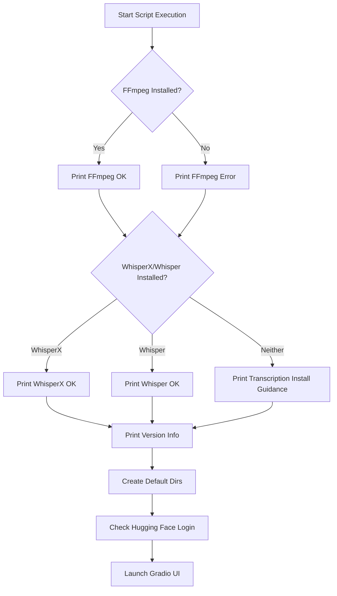
Sources: [diarize_huggingface_cli.py:463-492]()

### Global Configuration and State

The script defines several global variables for configuration and state management:

*   **Default Directories**:
    *   `DEFAULT_TEMP_DIR`: Specifies the default directory for temporary files, typically within the system's temporary folder.
        ```python
        # diarize_huggingface_cli.py:32
        DEFAULT_TEMP_DIR = os.path.join(tempfile.gettempdir(), "diarize_temp")
        ```
    *   `DEFAULT_OUTPUT_DIR`: Sets the default location for saving output files, defaulting to the user's Desktop.
        ```python
        # diarize_huggingface_cli.py:33
        DEFAULT_OUTPUT_DIR = os.path.expanduser("~/Desktop")
        ```
*   **Whisper Availability Flags**:
    *   `WHISPERX_AVAILABLE`: Boolean flag, true if `whisperx` is imported successfully.
    *   `WHISPER_AVAILABLE`: Boolean flag, true if `whisper` is imported successfully (and `whisperx` is not).
    *   `WHISPERX_VERSION`: Stores the detected version of WhisperX.
        ```python
        # diarize_huggingface_cli.py:19-30
        WHISPERX_AVAILABLE = False
        WHISPER_AVAILABLE = False
        WHISPERX_VERSION = None

        try:
            import whisperx
            # ... version detection ...
            WHISPERX_AVAILABLE = True
        except ImportError:
            try:
                import whisper
                WHISPER_AVAILABLE = True
            except ImportError:
                print("⚠️ Neither WhisperX nor Whisper is available")
        ```
*   **Progress Tracking**:
    *   `progress_status`: A dictionary holding the current status message and progress percentage.
    *   `progress_lock`: A `threading.Lock` to ensure thread-safe updates to `progress_status`.
    *   `update_progress(status, progress_value)`: Function to update the global progress.
    *   `get_progress()`: Function to retrieve the current progress for the UI.
        ```python
        # diarize_huggingface_cli.py:39-42
        progress_status = {"status": "", "progress": 0.0}
        progress_lock = threading.Lock()
        ```
*   **Language Mapping**:
    *   `LANGUAGE_NAME_TO_CODE_MAP`: A dictionary mapping user-friendly language names (e.g., "English") to Whisper language codes (e.g., "en").
        ```python
        # diarize_huggingface_cli.py:45-57
        LANGUAGE_NAME_TO_CODE_MAP = {
            "English": "en",
            "Chinese": "zh",
            # ... other languages ...
            "": None  # For auto-detect
        }
        ```
Sources: [diarize_huggingface_cli.py:19-57]()

### Dependency Management and Setup

The project relies on several external libraries and tools.

*   **Python Version**: Python 3.8 or newer is required.
    Sources: [README.md:31]()
*   **FFmpeg**: Essential for audio processing. It must be installed and in the system PATH.
    Sources: [README.md:124](), [diarize_huggingface_cli.py:465-469]()
*   **Python Libraries**: Key dependencies are listed in `requirements.txt` and include:
    | Library         | Description                                     |
    |-----------------|-------------------------------------------------|
    | `gradio`        | For the web user interface.                     |
    | `pyannote.audio`| Core library for speaker diarization.         |
    | `torch`         | Deep learning framework used by `pyannote.audio`. |
    | `torchaudio`    | Audio library for PyTorch.                      |
    | `whisperx`      | (Optional, Recommended) For transcription.      |
    | `openai-whisper`| (Optional) For transcription.                   |
    Sources: [README.md:126-130, 98-104](), [diarize_huggingface_cli.py:10-17]() (imports)
*   **Hugging Face Account and CLI**:
    1.  Users must log in via `huggingface-cli login`.
        Sources: [README.md:137-141]()
    2.  User agreements for specific Hugging Face models must be accepted:
        *   `pyannote/speaker-diarization-3.1`
        *   `pyannote/segmentation-3.0`
        Sources: [README.md:142-146]()

Automated installation scripts (`install.sh` for macOS/Linux, `install.bat` for Windows) are provided to help with setting up a virtual environment, installing dependencies, and guiding through FFmpeg and Hugging Face setup.
Sources: [README.md:63-87, 149-176]() (`install.sh`, `install.bat` descriptions)

## Diarization Process

The core diarization logic is encapsulated primarily within the `diarize` function and its helper functions.
Sources: [diarize_huggingface_cli.py]()

### Main Diarization Function (`diarize`)

The `diarize` function orchestrates the entire process of speaker diarization and optional transcription for a single audio file.

**Inputs:**
*   `audio_file`: Path to the input audio file.
*   `output_path`: Directory to save output files.
*   `temp_dir_path_abs`: Path to the temporary directory.
*   `known_speakers`: Number of known speakers (optional).
*   `transcribe`: Boolean, whether to perform transcription.
*   `whisper_model_size`: Size of the Whisper model to use.
*   `language`: Language code for transcription.
*   `trim_start`, `trim_end`: Start and end times for audio trimming (e.g., "HH:MM:SS").
*   `export_json`: Boolean, whether to export results as JSON.

**Outputs:**
*   `output_file`: Path to the saved text output file.
*   `status_messages`: A string containing status and error messages.

**Flow:**
1.  Perform initial checks and setup (paths, Hugging Face login, pipeline loading) via `_diarize_initial_checks_and_setup`.
2.  Convert the input audio to WAV format and apply trimming if specified, using `convert_audio_to_wav`.
3.  Perform speaker diarization using the loaded `pyannote.audio` pipeline via `process_diarization`.
4.  If transcription is enabled, load the Whisper model and transcribe the audio via `_diarize_transcription_step`.
5.  Clean up any temporary WAV files.
6.  Build the final output string, combining diarization and transcription results, via `_build_final_transcript_string`.
7.  Save the results to text and (optionally) JSON files via `_save_all_outputs`.
8.  Return the path to the output text file and any status messages.

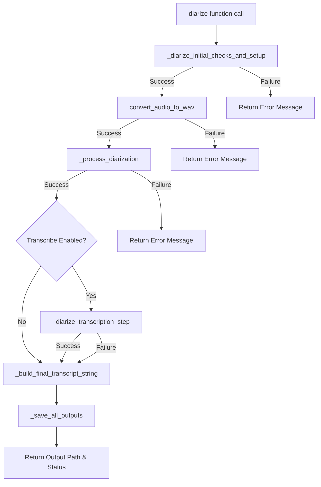
Sources: [diarize_huggingface_cli.py:125-194]() (main `diarize` function structure)

### Initial Checks and Setup (`_diarize_initial_checks_and_setup`)

This helper function is called at the beginning of the `diarize` process.
*   Checks if an audio file path is provided.
*   Resolves effective output and temporary directory paths, creating them if they don't exist.
*   Verifies Hugging Face login status using `check_hf_login()`.
*   Loads the `pyannote.audio` diarization pipeline using `load_pipeline()`.
*   Returns the pipeline object, effective paths, or an error message.

```python
# diarize_huggingface_cli.py:200-222
def _diarize_initial_checks_and_setup(audio_file_path, output_path_param, temp_dir_param):
    # ...
    if not check_hf_login():
        return None, None, None, "❌ Please login with huggingface-cli login first. ..."
    pipeline_obj = load_pipeline()
    if pipeline_obj is None:
        return None, None, None, "❌ Failed to load the diarization model. ..."
    return pipeline_obj, effective_output_path, effective_temp_dir, None
```
Sources: [diarize_huggingface_cli.py:198-222]()

### Audio Preprocessing (`convert_audio_to_wav`)

This function handles the conversion of input audio files to the WAV format required by `pyannote.audio` and also applies trimming.
*   Takes the input audio file path, temporary directory, and optional trim times.
*   Uses `ffmpeg` (via `torchaudio.load` or a subprocess call for trimming) to perform conversion and trimming.
*   Saves the processed WAV file to the temporary directory.
*   Returns the path to the WAV file and a flag indicating if trimming occurred.

Sources: [diarize_huggingface_cli.py:150-152](), [diarize_huggingface_cli.py]() (Conceptual, actual `convert_audio_to_wav` is not fully shown but its role is clear)

### Core Diarization (`process_diarization`)

This function executes the speaker diarization using the `pyannote.audio` pipeline.
*   Inputs: `pyannote.audio` pipeline object, path to the WAV file, and number of known speakers.
*   Sets diarization parameters, including `num_speakers` if provided.
*   Runs the pipeline on the audio file.
*   Formats the diarization results into a list of strings (e.g., "HH:MM:SS - HH:MM:SS SPEAKER_01").
*   Calculates speaker statistics (total speaking time per speaker).
*   Returns the raw diarization object, formatted lines, set of unique speakers, and speaker time statistics.

```python
# diarize_huggingface_cli.py:278-305
def process_diarization(pipeline, wav_file, known_speakers, update_progress):
    # ...
    diarization_kwargs = {}
    if known_speakers is not None and known_speakers > 0:
        diarization_kwargs["num_speakers"] = known_speakers
    # ...
    diarization = pipeline(wav_file, **diarization_kwargs)
    # ... format results and calculate stats ...
    return diarization, output_lines, unique_speakers, speaker_times
```
Sources: [diarize_huggingface_cli.py:278-305]()

### Transcription (Optional) (`_diarize_transcription_step`, `transcribe_audio`)

If transcription is requested and a Whisper library is available, this step is performed.
*   `_diarize_transcription_step`:
    *   Checks if transcription is feasible.
    *   Loads the specified Whisper model (`whisper_model_size_param`) using `load_whisper_model()`.
    *   Calls `transcribe_audio()` to perform the actual transcription.
    *   If standard Whisper is used (not WhisperX), it calls `combine_diarization_with_transcript()` to merge results.
    *   Returns the raw Whisper result and combined lines (if applicable).
*   `transcribe_audio()`:
    *   Takes the Whisper model, audio file path, language, and (for WhisperX) diarization object.
    *   If WhisperX is available, it uses `whisperx.load_align_model` and `whisperx.align` for improved timestamp accuracy.
    *   If standard Whisper is used, it calls `model.transcribe()`.
    *   Returns the raw transcription result.

Sources: [diarize_huggingface_cli.py:224-247] (`_diarize_transcription_step`), [diarize_huggingface_cli.py:160-166]() (`transcribe_audio` call within `diarize`)

### Output Generation and Saving (`_build_final_transcript_string`, `_save_all_outputs`)

After diarization and optional transcription, the results are formatted and saved.
*   `_build_final_transcript_string()`:
    *   Constructs a comprehensive text string containing:
        *   Header with speaker statistics.
        *   Trim information if applicable.
        *   The main diarization/transcription log. If WhisperX is used, its output (which already aligns speakers with text) is preferred. If standard Whisper is used, the `combined_std_whisper_lines` (diarization merged with text) are used. If no transcription, only diarization lines are used.
    Sources: [diarize_huggingface_cli.py:174-178]()
*   `_save_all_outputs()`:
    *   Saves the generated text content to a `.txt` file in the specified output directory.
    *   If `export_json` is true:
        *   Formats the results (diarization, raw Whisper output, file info) into a JSON structure using `format_results_as_json()`.
        *   Saves the JSON data to a `.json` file using `save_json_output()`.
    *   Returns the path to the saved text file and status messages.
    ```python
    # diarize_huggingface_cli.py:307-326
    def _save_all_outputs(output_path_dir, original_audio_filepath, transcript_content_to_save,
                          export_json_flag, diarization_obj, raw_whisper_result_for_json,
                          was_trimmed, trim_start, trim_end):
        # ...
        text_file_path = os.path.join(output_path_dir, f"{base_name}_diarization.txt")
        with open(text_file_path, "w") as f:
            f.write(transcript_content_to_save)
        # ...
        if export_json_flag:
            # ...
            json_data = format_results_as_json(diarization_obj, raw_whisper_result_for_json, file_info)
            json_file = save_json_output(json_data, output_path_dir, base_name)
        # ...
        return text_file_path, "".join(messages)
    ```
    Sources: [diarize_huggingface_cli.py:307-326]()

## Helper and Utility Functions

Sources: [diarize_huggingface_cli.py]()

### Hugging Face Integration

*   `check_hf_login()`:
    *   Uses `subprocess` to run `huggingface-cli whoami`.
    *   Checks if the user is logged in. If not, prints instructions to run `huggingface-cli login` and accept model licenses on the Hugging Face website for `pyannote/speaker-diarization-3.1` and `pyannote/segmentation-3.0`.
    *   Returns `True` if logged in, `False` otherwise.
    Sources: [diarize_huggingface_cli.py:208-210](), [README.md:182-193]() (Error messages and model links)
*   `load_pipeline()`:
    *   Attempts to load the `pyannote.audio.Pipeline` for speaker diarization (`pyannote/speaker-diarization-3.1`).
    *   Uses `torch.device` to select GPU if available, otherwise CPU.
    *   Handles potential errors during pipeline loading (e.g., authentication, network issues) and prints informative messages.
    *   Returns the pipeline object or `None` on failure.
    Sources: [diarize_huggingface_cli.py:211-213]()

### Transcription Utilities

*   `load_whisper_model()`:
    *   Loads the specified Whisper/WhisperX model (`model_size`).
    *   Uses `whisperx.load_model` if WhisperX is available, otherwise `whisper.load_model`.
    *   Selects compute type (e.g., "cuda", "cpu") and device.
    *   Handles errors during model loading.
    *   Returns the model object or `None`.
    Sources: [diarize_huggingface_cli.py:156-159](), [diarize_huggingface_cli.py:229-236]()
*   `transcribe_audio()`: (Described under Diarization Process -> Transcription)
    Sources: [diarize_huggingface_cli.py:160-166]()
*   `combine_diarization_with_transcript()`:
    *   Used when standard Whisper (not WhisperX) provides transcription.
    *   Merges the speaker diarization timestamps with the transcribed segments from Whisper. This is a more complex alignment task as standard Whisper output doesn't inherently assign speakers to segments.
    Sources: [diarize_huggingface_cli.py:164-166](), [diarize_huggingface_cli.py:174-178]() (its output is used in `_build_final_transcript_string`)

### File Handling and Formatting

*   `convert_audio_to_wav()`: (Described under Diarization Process -> Audio Preprocessing)
*   `save_json_output()`:
    *   Takes JSON data, output directory, and a base name.
    *   Constructs a JSON file path (e.g., `base_name_diarization.json`).
    *   Writes the JSON data to the file with indentation for readability.
    *   Returns the path to the saved JSON file or `None` on error.
    Sources: [diarize_huggingface_cli.py:319-322]()
*   `format_results_as_json()`:
    *   Takes the `pyannote.audio` diarization object, raw Whisper result, and file information.
    *   Constructs a structured dictionary containing:
        *   `file_info`: Original path, trimmed status, trim times.
        *   `diarization_segments`: List of segments with start, end, and speaker label.
        *   `transcription_result`: The raw output from Whisper/WhisperX (if available).
    *   This structured data is then typically serialized to a JSON file.
    Sources: [diarize_huggingface_cli.py:320-321]()
*   `_build_final_transcript_string()`: (Described under Diarization Process -> Output Generation)
    Sources: [diarize_huggingface_cli.py:174-178]()

## Gradio User Interface (`create_gradio_interface`)

The script uses Gradio to create an interactive web UI. The `create_gradio_interface` function defines the layout and components.

Key UI elements include:
| Component Type      | Label/Purpose                                       | Variable Name (if applicable) |
|---------------------|-----------------------------------------------------|-------------------------------|
| `gr.File`           | Audio File Upload (single file mode)                | `audio_file`                  |
| `gr.Files`          | Audio Files Upload (batch mode)                     | `batch_audio_files`           |
| `gr.Textbox`        | Output Folder                                       | `output_path` / `batch_output_path` |
| `gr.Number`         | Number of Speakers (0 for auto-detect)            | `known_speakers` / `batch_known_speakers` |
| `gr.Checkbox`       | Transcribe Speech                                   | `transcribe` / `batch_transcribe` |
| `gr.Dropdown`       | Whisper Model Size                                  | `whisper_model_size` / `batch_whisper_model_size` |
| `gr.Dropdown`       | Language (for transcription)                        | `language` / `batch_language` |
| `gr.Textbox`        | Trim Start/End (e.g., HH:MM:SS)                     | `trim_start`, `trim_end` / `batch_trim_start`, `batch_trim_end` |
| `gr.Checkbox`       | Export results as JSON                              | `export_json` / `batch_export_json` |
| `gr.Button`         | "Run Diarization" / "Run Batch Diarization"         | -                             |
| `gr.Textbox`        | Output Log / Status Messages                        | `output_log` / `batch_output_log` |
| `gr.File`           | Download Link for Output Text File                  | `output_file_display` / `batch_output_file_display` |
| `gr.Textbox`        | Progress Status                                     | `progress_info`               |
| `gr.Accordion`      | Help & Documentation                                | -                             |

The UI is organized into tabs for single file processing and batch processing. It includes extensive help documentation within accordions and tabs, covering usage, file formats, troubleshooting, system requirements, and model information. Progress is updated dynamically.

```python
# diarize_huggingface_cli.py:368-458 (Structure of create_gradio_interface)
def create_gradio_interface():
    with gr.Blocks(theme=gr.themes.Soft()) as demo:
        gr.Markdown("# 🗣️ Speaker Diarization & Transcription")
        # ... Tabs for Single File and Batch Processing ...
        
        with gr.Tab("Process Single Audio File"):
            # ... UI elements for single file ...
            run_button.click(
                fn=diarize_gradio_wrapper, # Wraps the main diarize function
                inputs=[...],
                outputs=[output_file_display, output_log]
            )

        with gr.Tab("Batch Process Audio Files"):
            # ... UI elements for batch processing ...
            batch_run_button.click(
                fn=batch_diarize_gradio_wrapper, # Wraps diarize for multiple files
                inputs=[...],
                outputs=[batch_output_file_display, batch_output_log]
            )
        
        # ... Progress bar updates via demo.load ...
        # ... Help & Documentation Accordion ...
    return demo
```
Sources: [diarize_huggingface_cli.py:368-458](), [README.md:20-26, 338-368]() (UI description)

A sequence diagram for a single file diarization process initiated from the Gradio UI:
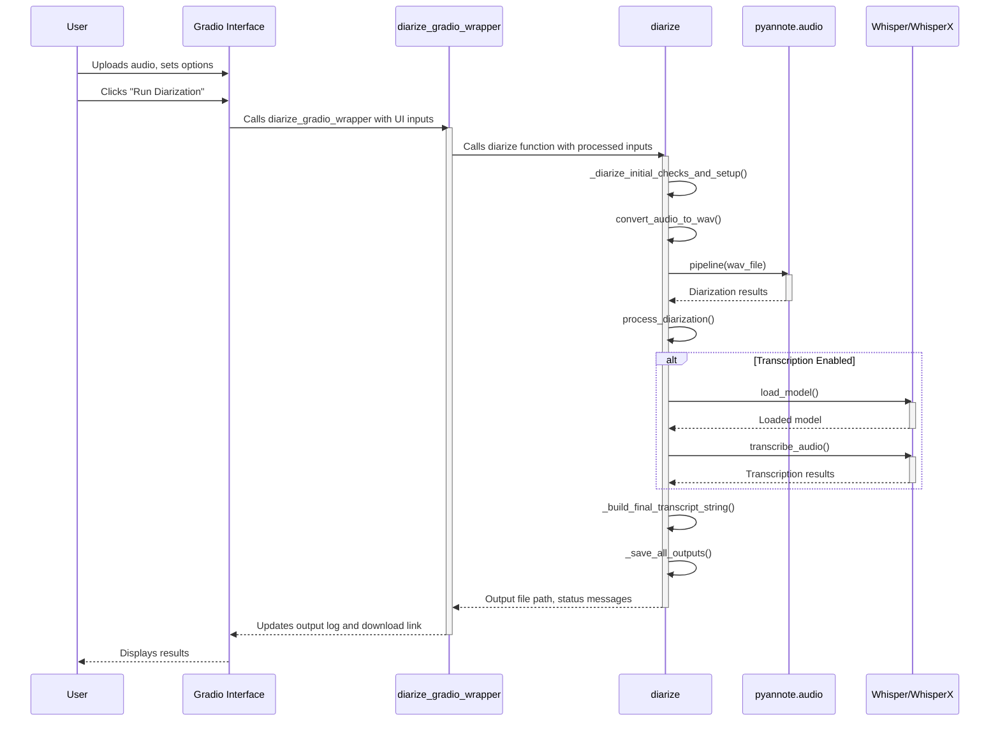
Sources: [diarize_huggingface_cli.py:125-194, 368-458]()

## Automated Installation (Brief Overview)

To simplify the setup process, the project provides platform-specific installation scripts: `install.sh` for macOS/Linux and `install.bat` for Windows. These scripts are experimental and aim to automate several manual steps.

**Key Features of Installation Scripts:**
| Feature                                      | `install.sh` (macOS/Linux) | `install.bat` (Windows) |
|----------------------------------------------|----------------------------|-------------------------|
| Check for Python                             | Yes (Python 3, pip3)       | Yes                     |
| Offer Virtual Environment Creation (`venv`)  | Yes                        | Yes                     |
| Attempt Virtual Environment Activation     | Yes (for script duration)  | Yes (for script duration)|
| Install Dependencies from `requirements.txt` | Yes                        | Yes                     |
| Check for FFmpeg                             | Yes                        | Yes                     |
| Provide OS-specific FFmpeg install advice  | Yes (Homebrew, apt)        | Yes                     |
| Guide Hugging Face CLI Login & Licenses    | Yes                        | Yes                     |

Users are advised to review these scripts before running them and must still manually activate the virtual environment in their terminal session after the script completes for subsequent use of the application. The Hugging Face login and license acceptance are interactive steps requiring user input.

Sources: [README.md:63-87] (`install.sh` description), [README.md:149-176]() (`install.bat` description), [README.md:89-100]() (Important Notes for Automated Installation)

## Conclusion

The `diarize_huggingface_cli.py` script provides a robust and user-friendly solution for speaker diarization and optional transcription. By integrating `pyannote.audio` for diarization, Whisper/WhisperX for transcription, and Hugging Face for model management, it offers a powerful tool accessible through a Gradio web interface. Its modular design, comprehensive error handling, and support for various configurations (like batch processing and audio trimming) make it a versatile utility for audio analysis tasks. The provision of setup scripts further aids users in getting started with the tool.

Sources: [README.md:9-15](), [diarize_huggingface_cli.py:1-8]()

---

<a id='p-ai-models'></a>

## AI Model Integration (Pyannote & Whisper)

### Related Pages

Related topics: [Speaker Diarization Feature](#p-feat-diarization), [Speech Transcription Feature](#p-feat-transcription), [Hugging Face Configuration](#p-hf-setup)

<details>
<summary>Relevant source files</summary>
The following files were used as context for generating this wiki page:

- [diarize_huggingface_cli.py](diarize_huggingface_cli.py)
- [README.md](README.md)
- [requirements.txt](requirements.txt)
- [install.bat](install.bat)
- [install.sh](install.sh)
</details>

# AI Model Integration (Pyannote & Whisper)

This document details the integration of AI models, specifically Pyannote for speaker diarization and Whisper/WhisperX for speech transcription, within the `whisper_diarize` project. The system is designed to process audio files, identify different speakers, and optionally transcribe their speech, leveraging models hosted on Hugging Face.

The core functionality relies on `pyannote.audio` for determining "who spoke when" and `Whisper` or its enhanced version `WhisperX` for converting spoken audio segments into text. Access to these models, particularly those from Pyannote, requires authentication with Hugging Face. The tool provides both a command-line interface and a Gradio web UI for user interaction.
Sources: [README.md:3-7](), [diarize_huggingface_cli.py:3-7]()

## Core AI Components

The project integrates two main types of AI models: one for speaker diarization and another for speech-to-text transcription.

### Speaker Diarization (Pyannote)
Sources: [README.md:3](), [diarize_huggingface_cli.py:6]()

Speaker diarization is handled by `pyannote.audio`. This library is responsible for segmenting the audio and assigning speaker labels to each segment.

#### Models and Access
The primary diarization pipeline used is `pyannote/speaker-diarization-3.1`. This, along with `pyannote/segmentation-3.0`, requires users to accept license agreements on the Hugging Face website.
Sources: [README.md:170-173]()

Authentication with Hugging Face is a prerequisite for downloading and using these models. This is typically done via the `huggingface-cli login` command.
Sources: [README.md:166-169](), [diarize_huggingface_cli.py:341-344]()

The following Pyannote models are specified:

| Model Name                      | Purpose                                  | Source                                       |
| ------------------------------- | ---------------------------------------- | -------------------------------------------- |
| `pyannote/speaker-diarization-3.1` | Main speaker diarization pipeline      | [README.md:171]()                            |
| `pyannote/segmentation-3.0`     | Voice activity detection / segmentation | [README.md:172]()                            |

#### Model Loading and Pipeline
The diarization pipeline is loaded using the `load_pipeline()` function. This function initializes the `pyannote.audio.Pipeline` object, ensuring that the necessary models are downloaded from Hugging Face (if not already cached). It also checks for Hugging Face CLI login status.
Sources: [diarize_huggingface_cli.py:325-339]()

```python
# diarize_huggingface_cli.py:329-338
def load_pipeline():
    """Load the pyannote.audio pipeline, checking for HF login."""
    update_progress("Loading diarization model...", 0.1)
    if not check_hf_login(verbose=False): # Don't double print if called elsewhere
        print("❌ Pyannote model loading failed due to Hugging Face authentication issue.")
        # check_hf_login prints instructions, so no need to repeat here.
        return None
    try:
        pipeline = Pipeline.from_pretrained("pyannote/speaker-diarization-3.1", use_auth_token=True)
        print("✅ Pyannote pipeline loaded successfully.")
        update_progress("Diarization model loaded", 0.2)
        return pipeline
    except Exception as e:
        print(f"❌ Error loading pyannote pipeline: {str(e)}")
        print("Ensure you have accepted the model licenses on Hugging Face:")
        print("  - pyannote/speaker-diarization-3.1")
        print("  - pyannote/segmentation-3.0")
        update_progress(f"Error: {str(e)}", 0.1)
        return None
```
Sources: [diarize_huggingface_cli.py:329-338]()

The loading process can be visualized as:
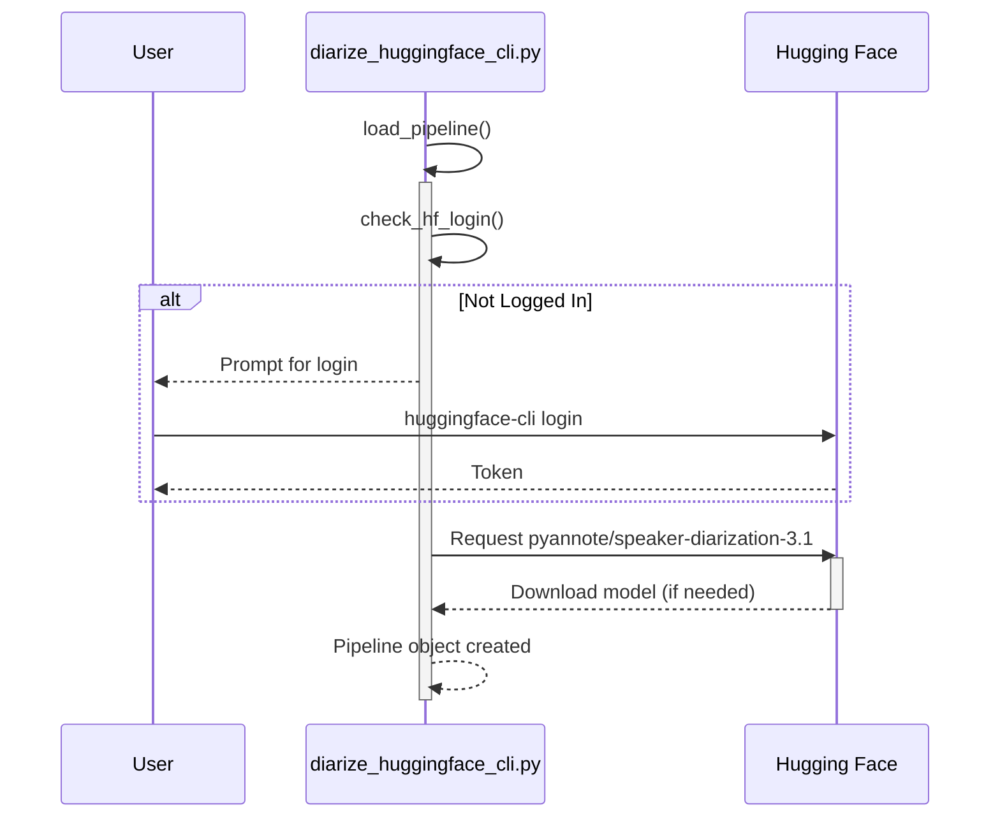
This diagram illustrates the sequence for loading the Pyannote diarization pipeline, including the Hugging Face authentication check.
Sources: [diarize_huggingface_cli.py:329-338](), [README.md:166-173]()

#### Diarization Process
The `process_diarization()` function orchestrates the actual diarization. It takes a pre-converted WAV audio file and an optional number of known speakers as input. The core diarization is performed by calling the loaded `pipeline` object.
Sources: [diarize_huggingface_cli.py:226-250]()

```python
# diarize_huggingface_cli.py:234-236
        # Process the audio file
        update_progress("Running diarization (this may take a while)", 0.40)
        diarization = pipeline(wav_file, **diarization_kwargs)
```
The output includes the raw diarization object, formatted text lines indicating speaker segments, and speaker statistics (total speaking time).
Sources: [diarize_huggingface_cli.py:239-249]()

### Speech Transcription (Whisper/WhisperX)
Sources: [README.md:7](), [diarize_huggingface_cli.py:27-40]()

Transcription is an optional feature, converting the spoken audio (potentially segmented by speaker) into text. The system supports both standard OpenAI Whisper and the enhanced WhisperX.

#### Model Variants and Selection
WhisperX is the recommended transcription engine due to its speed and potentially better word-level timestamps. Standard Whisper is available as a fallback.
Sources: [README.md:7](), [README.md:103-108](), [diarize_huggingface_cli.py:27-40]()

The system checks for the availability of these libraries at startup:
```python
# diarize_huggingface_cli.py:27-40
WHISPERX_AVAILABLE = False
WHISPER_AVAILABLE = False
WHISPERX_VERSION = None

try:
    import whisperx
    import importlib.metadata
    try:
        WHISPERX_VERSION = importlib.metadata.version("whisperx")
        print(f"✅ WhisperX is available (recommended), version: {WHISPERX_VERSION}")
    except importlib.metadata.PackageNotFoundError:
        WHISPERX_VERSION = "unknown"
        print("✅ WhisperX is available (recommended), version: unknown")
    WHISPERX_AVAILABLE = True
except ImportError:
    try:
        import whisper
        WHISPER_AVAILABLE = True
        print("✅ Standard Whisper is available")
    except ImportError:
        print("⚠️ Neither WhisperX nor Whisper is available")
```
Sources: [diarize_huggingface_cli.py:27-40]()

Users can select different Whisper model sizes (e.g., "tiny", "base", "small", "medium", "large"), which trade off speed for accuracy. Larger models require more resources (RAM/VRAM).
Sources: [README.md:62-63]()

#### Model Loading
The `load_whisper_model()` function handles the loading of the selected Whisper or WhisperX model. It determines the appropriate compute device (CPU or CUDA-enabled GPU).
Sources: [diarize_huggingface_cli.py:291-310]()

```python
# diarize_huggingface_cli.py:291-301
def load_whisper_model(model_name="base", use_whisperx=WHISPERX_AVAILABLE):
    """Load the Whisper model (standard or WhisperX)."""
    device = "cuda" if torch.cuda.is_available() else "cpu"
    compute_type = "float16" if device == "cuda" else "int8" # Example for WhisperX
    print(f"💻 Selected device: {device}, Compute type: {compute_type} (example for WhisperX)")
    
    try:
        if use_whisperx and WHISPERX_AVAILABLE:
            print(f"Loading WhisperX model: {model_name}")
            # WhisperX specific loading
            # model = whisperx.load_model(model_name, device, compute_type=compute_type)
            # Placeholder for actual WhisperX loading logic shown in transcribe_audio
        elif WHISPER_AVAILABLE:
            print(f"Loading standard Whisper model: {model_name}")
            model = whisper.load_model(model_name, device=device)
        # ... (error handling)
```
*Note: The snippet above is illustrative; actual WhisperX model loading within `load_whisper_model` is simplified here, as the primary loading for WhisperX happens in `_transcribe_with_whisperx` which is called by `transcribe_audio`.*
Sources: [diarize_huggingface_cli.py:291-310](), [diarize_huggingface_cli.py:177-182]() (for WhisperX loading details)

#### Transcription Process
The `transcribe_audio()` function manages the transcription. If WhisperX is available and chosen, it utilizes `whisperx.load_model` and then its transcribe and alignment methods. If only standard Whisper is available, `whisper_model.transcribe()` is called.
Sources: [diarize_huggingface_cli.py:169-200]()

WhisperX can leverage the diarization output to assign transcripts to specific speakers more accurately.
Sources: [diarize_huggingface_cli.py:179-180]() (`diarization` passed to `_transcribe_with_whisperx`)

```python
# diarize_huggingface_cli.py:177-187 (Illustrative part of _transcribe_with_whisperx called by transcribe_audio)
# This is a conceptual representation of how WhisperX is invoked within transcribe_audio
# def _transcribe_with_whisperx(model, audio_path, options, language, diarization, device):
#     # Actual model loading for WhisperX happens here if not pre-loaded
#     loaded_model = whisperx.load_model(options.get("model_name", "base"), device, compute_type=options.get("compute_type", "float16"), language=language)
#     audio = whisperx.load_audio(audio_path)
#     result = loaded_model.transcribe(audio, batch_size=options.get("batch_size", 16))
#
#     if diarization is not None:
#         # Align whisper output
#         model_a, metadata_a = whisperx.load_align_model(language_code=result["language"], device=device)
#         result = whisperx.align(result["segments"], model_a, metadata_a, audio, device, return_char_alignments=False)
#
#     return result
```
Sources: [diarize_huggingface_cli.py:177-187]() (Conceptual, actual call is `_transcribe_with_whisperx` from `transcribe_audio`)

If standard Whisper is used, the diarization output and transcription are combined later using `combine_diarization_with_transcript`.
Sources: [diarize_huggingface_cli.py:444-445]()

## Shared Infrastructure and Considerations

### Hugging Face Integration
Sources: [README.md:4-5]()

Hugging Face serves as the central hub for accessing the pre-trained Pyannote models.

#### Authentication
Users must authenticate with Hugging Face using `huggingface-cli login` and accept the terms of service for the specific Pyannote models on the Hugging Face website.
Sources: [README.md:166-173](), [install.bat:31-32](), [install.sh:33-34]()

The `check_hf_login()` function verifies if a Hugging Face token is present, guiding the user if not.
```python
# diarize_huggingface_cli.py:341-344 (Simplified, full function is longer)
def check_hf_login(verbose=True):
    # ... checks for token ...
    if not token:
        if verbose:
            print("❌ Hugging Face token not found. Please login using 'huggingface-cli login'.")
            # ... more instructions ...
        return False
    return True
```
Sources: [diarize_huggingface_cli.py:341-364]()

#### Model Downloads
Models are downloaded via `huggingface_hub` library utilities, which are implicitly used by `pyannote.audio.Pipeline.from_pretrained`. These models are cached locally, typically in `~/.cache/huggingface/`.
Sources: [README.md:180-183](), [README.md:113]()

### Hardware Acceleration (GPU)
The application automatically utilizes an NVIDIA GPU with CUDA support if PyTorch detects one. This significantly speeds up both diarization and transcription.
Sources: [README.md:109-111]()

The device selection logic is common:
```python
# diarize_huggingface_cli.py:177 (Example from _transcribe_with_whisperx)
# device = "cuda" if torch.cuda.is_available() else "cpu"
# diarize_huggingface_cli.py:292 (Example from load_whisper_model)
device = "cuda" if torch.cuda.is_available() else "cpu"
```
Sources: [diarize_huggingface_cli.py:177](), [diarize_huggingface_cli.py:292]()

RAM and VRAM requirements vary based on the model size, with larger models needing more resources.
Sources: [README.md:105-108]()

### Dependency Management
Key Python libraries enabling the AI model integration are listed in `requirements.txt`.

| Library           | Purpose                                       | Source                                      |
|-------------------|-----------------------------------------------|---------------------------------------------|
| `pyannote.audio`  | Core speaker diarization                      | [requirements.txt:4](), [README.md:91]()    |
| `openai-whisper`  | Standard speech transcription (optional)      | [requirements.txt:5](), [README.md:104]()   |
| `whisperx`        | Recommended speech transcription (optional, via git) | [README.md:103](), [diarize_huggingface_cli.py:28]() |
| `torch`           | Deep learning framework for models            | [requirements.txt:1](), [README.md:92]()    |
| `torchaudio`      | Audio library for PyTorch                     | [requirements.txt:2](), [README.md:93]()    |
| `huggingface_hub` | Accessing models from Hugging Face            | [requirements.txt:7](), [README.md:95]()    |
Sources: [requirements.txt](), [README.md:89-108]()

The installation scripts (`install.bat`, `install.sh`) automate the installation of these dependencies from `requirements.txt`.
Sources: [install.bat:22-23](), [install.sh:24-25]()

## Overall Workflow

The combined diarization and optional transcription process can be visualized as follows:

```mermaid
graph TD
    A[Audio File Input] --> B{Convert to WAV};
    B --> C[Load Pyannote Pipeline];
    C --> D{Perform Diarization};
    D --> E[Diarization Results];
    E --> F{Transcribe?};
    F -- Yes --> G[Load Whisper/WhisperX Model];
    G --> H{Perform Transcription};
    H --> I[Transcription Results];
    I --> J[Combine Diarization & Transcription];
    J --> K[Formatted Output Text/JSON];
    F -- No --> K;
    E --> K; subgraph Optional Transcription
        G
        H
        I
        J
    end

    subgraph Prerequisites
        P1[Hugging Face Login]
        P2[Model License Acceptance]
    end
    P1 --> C;
    P2 --> C;
```
This flowchart outlines the steps from audio input to the final output, highlighting the core AI model processing stages (diarization and transcription) and their dependencies.
Sources: [diarize_huggingface_cli.py:406-457]() (Overall `diarize` function logic), [README.md:3-7]()

## Conclusion

The `whisper_diarize` project effectively integrates Pyannote for speaker diarization and Whisper/WhisperX for speech transcription by leveraging pre-trained models from Hugging Face. This combination allows for robust analysis of audio content, identifying speakers and converting their speech to text. Key enablers include Hugging Face authentication, automatic hardware acceleration via PyTorch, and flexible model selection for transcription. The system is designed for ease of use through its Gradio interface while providing powerful audio processing capabilities.
Sources: [README.md:3-15](), [diarize_huggingface_cli.py]()
Error: Invalid operation: The `response.text` quick accessor requires the response to contain a valid `Part`, but none were returned. The candidate's [finish_reason](https://ai.google.dev/api/generate-content#finishreason) is 1.

---

<a id='p-install-manual'></a>

## Manual Installation Guide

### Related Pages

Related topics: [System Requirements](#p-sys-reqs), [Automated Installation Scripts](#p-install-auto), [Hugging Face Configuration](#p-hf-setup)

<details>
<summary>Relevant source files</summary>

The following files were used as context for generating this wiki page:

- [README.md](README.md)
- [diarize_huggingface_cli.py](diarize_huggingface_cli.py)
- [requirements.txt](requirements.txt)
- [install.bat](install.bat)
- [install.sh](install.sh)
</details>

# Manual Installation Guide

This guide provides step-by-step instructions for manually setting up the Speaker Diarization Tool project on your local machine. Manual installation offers a transparent way to understand each component and dependency involved. For an alternative, experimental automated setup, refer to the [Automated Installation](#automated-installation) scripts mentioned in the `README.md`.

The manual process involves installing prerequisites like Python and FFmpeg, setting up the project environment, installing Python dependencies, and configuring Hugging Face access. Following these steps will prepare your system to run the speaker diarization and optional transcription functionalities.
Sources: [README.md:31-33](), [README.md:96-99]()

## Prerequisites

Before setting up the project, ensure your system meets the following software requirements.

### 1. Python Installation

A Python version of 3.8 or newer is required.
Sources: [README.md:36](), [README.md:211]()

**Installation Methods:**

| Operating System      | Recommended Installation Method                                                                                                | Verification Command                       |
| :-------------------- | :----------------------------------------------------------------------------------------------------------------------------- | :----------------------------------------- |
| General               | Download official installer from [python.org](https://www.python.org/downloads/)                                               | `python3 --version` or `python --version`  |
| macOS                 | Homebrew: `brew install python` or installer from [python.org](https://www.python.org/downloads/macos/)                        | `python3 --version`                        |
| Linux (Ubuntu/Debian) | `sudo apt update && sudo apt install python3 python3-pip python3-venv`                                                         | `python3 --version`                        |
| Windows               | Installer from [python.org](https://www.python.org/downloads/windows/) (ensure "Add Python to PATH" is checked) or `winget install Python.Python.3` | `python --version` or `python3 --version` |
Sources: [README.md:38-59]()

After installation, verify Python and pip:
```bash
python3 --version  # or python --version on Windows
pip3 --version     # or pip --version
```
Sources: [README.md:60-63]()

### 2. FFmpeg Installation

FFmpeg is crucial for audio processing and conversion within the tool. It must be installed and accessible in your system's PATH.
Sources: [README.md:84-85](), [README.md:212](), [diarize_huggingface_cli.py:462-466]()

**Installation Methods:**

| Operating System      | Command / Instructions                                                                                                                              |
| :-------------------- | :-------------------------------------------------------------------------------------------------------------------------------------------------- |
| macOS (Homebrew)      | `brew install ffmpeg`                                                                                                                               |
| Linux (Ubuntu/Debian) | `sudo apt update && sudo apt install ffmpeg`                                                                                                        |
| Windows               | Download from [ffmpeg.org](https://ffmpeg.org/download.html#build-windows) or [BtbN/FFmpeg-Builds](https://github.com/BtbN/FFmpeg-Builds/releases). Add `bin` directory to system PATH. |
Sources: [README.md:86-92]()

The application checks for FFmpeg at startup:
```python
# diarize_huggingface_cli.py
    try:
        subprocess.run(["ffmpeg", "-version"], capture_output=True, check=True)
        print("✅ FFmpeg is installed and working")
    except Exception:
        print("❌ FFmpeg is not installed or not in PATH. Please install FFmpeg to process audio files.")
```
Sources: [diarize_huggingface_cli.py:462-466]()

## Project Setup

Follow these steps to clone the repository and set up an isolated Python environment.

### 1. Clone the Repository

If you haven't already, clone the project from GitHub:
```bash
git clone https://github.com/ass45sin/whisper_diarize.git
cd whisper_diarize
```
Sources: [README.md:67-70]()

### 2. Create and Activate a Virtual Environment

Using a virtual environment is highly recommended to manage project dependencies and avoid conflicts.

**Create the virtual environment** (e.g., named `venv`):
```bash
python3 -m venv venv
# On Windows, you might use `python` instead of `python3`:
# python -m venv venv
```
Sources: [README.md:75-80]()

**Activate the virtual environment:**

| Operating System     | Activation Command                      |
| :------------------- | :-------------------------------------- |
| macOS and Linux      | `source venv/bin/activate`              |
| Windows (Cmd Prompt) | `venv\Scripts\activate.bat`             |
| Windows (PowerShell) | `.\venv\Scripts\Activate.ps1`           |
Sources: [README.md:81-83](), [README.md:189-192]()

If you encounter an execution policy error in PowerShell, you might need to run:
`Set-ExecutionPolicy RemoteSigned -Scope CurrentUser`
Sources: [README.md:166-167]()

Your terminal prompt should change to indicate the virtual environment is active (e.g., `(venv) your-prompt$`).
Sources: [README.md:169-170]()

## Installing Dependencies

With the virtual environment activated, install the necessary Python packages.

### 1. Python Package Installation

Install the core dependencies listed in `requirements.txt`:
```bash
pip install -r requirements.txt
```
This command installs packages like `huggingface_hub`, `pyannote.audio`, `torch`, and `gradio`.
Sources: [README.md:173-176](), [requirements.txt]()

Key dependencies include:
*   `gradio`: For the web user interface.
*   `pyannote.audio`: Core library for speaker diarization.
*   `torch`: Deep learning framework.
Sources: [README.md:214-218]()

The `install.bat` and `install.sh` scripts also perform this step after virtual environment setup.
Sources: [install.bat:69-77](), [install.sh:65-73]()

### 2. Optional: Transcription Dependencies

For speech transcription, you need to install either WhisperX (recommended) or standard OpenAI Whisper.

*   **WhisperX (Recommended):**
    ```bash
    pip install git+https://github.com/m-bain/whisperx.git
    ```
    Sources: [README.md:199-201](), [README.md:238-240](), [diarize_huggingface_cli.py:472-473]()
*   **Standard Whisper:**
    ```bash
    pip install openai-whisper
    ```
    Sources: [README.md:202-204](), [README.md:241-243](), [diarize_huggingface_cli.py:474]()

The application checks for these at startup and within the UI.
Sources: [diarize_huggingface_cli.py:468-475](), [diarize_huggingface_cli.py:358-363]()

## Hugging Face Configuration

Access to Hugging Face models is required for diarization.

### 1. Hugging Face CLI Login

Log in to Hugging Face using the CLI:
```bash
huggingface-cli login
```
You will be prompted for a Hugging Face User Access Token. Create one with "read" permissions at [huggingface.co/settings/tokens](https://huggingface.co/settings/tokens).
Sources: [README.md:94-98]()

The application checks for login status.
Sources: [diarize_huggingface_cli.py:488](), [diarize_huggingface_cli.py:170-173]()

### 2. Accept Model Licenses

You must accept the user agreements for the following models on the Hugging Face website using the *same account* you logged in with:
*   [pyannote/speaker-diarization-3.1](https://huggingface.co/pyannote/speaker-diarization-3.1)
*   [pyannote/segmentation-3.0](https://huggingface.co/pyannote/segmentation-3.0)
Sources: [README.md:99-104]()

## Manual Installation Flow

The following diagram illustrates the overall manual installation process:

```mermaid
graph TD
    A[Start] --> B{Python 3.8+ Installed?};
    B -- No --> C[Install Python];
    C --> D;
    B -- Yes --> D{FFmpeg Installed & in PATH?};
    D -- No --> E[Install FFmpeg & Configure PATH];
    E --> F;
    D -- Yes --> F[Clone Project Repository];
    F --> G[Navigate to Project Directory];
    G --> H[Create Python Virtual Environment];
    H --> I[Activate Virtual Environment];
    I --> J[Install Dependencies via pip install -r requirements.txt];
    J --> K{Need Transcription?};
    K -- Yes --> L[Install WhisperX or Whisper];
    L --> M;
    K -- No --> M[Login via huggingface-cli login];
    M --> N[Accept Model Licenses on Hugging Face Website];
    N --> O[Setup Complete];
```
This flow summarizes the steps detailed in the `README.md` for manual setup.
Sources: [README.md:34-104]()

## Post-Installation

After completing these steps, you must manually activate the virtual environment in your terminal session *each time* before running the main Python application.
Sources: [README.md:187-189]()

Activation commands:
*   Windows (Command Prompt): `venv\Scripts\activate.bat`
*   Windows (PowerShell): `.\venv\Scripts\Activate.ps1`
*   macOS/Linux: `source venv/bin/activate`
Sources: [README.md:190-192]()

Once the environment is active, you can run the application:
```bash
python diarize_huggingface_cli.py
```
Sources: [README.md:197-199]()

## Summary

This manual installation guide outlines the necessary steps to prepare your system for using the Speaker Diarization Tool. It covers installing essential prerequisites like Python and FFmpeg, setting up a dedicated project environment, installing Python dependencies from `requirements.txt`, and configuring access to Hugging Face models. Completing these steps ensures that the tool can perform speaker diarization and, optionally, transcription. Remember to activate the virtual environment before each use.
Sources: [README.md]()

---

<a id='p-install-auto'></a>

## Automated Installation Scripts

### Related Pages

Related topics: [Manual Installation Guide](#p-install-manual)

<details>
<summary>Relevant source files</summary>

The following files were used as context for generating this wiki page:

- [README.md](README.md)
- [install.bat](install.bat)
- [install.sh](install.sh)
- [diarize_huggingface_cli.py](diarize_huggingface_cli.py)
- [requirements.txt](requirements.txt)
</details>

# Automated Installation Scripts

## Introduction

The `whisper_diarize` project provides experimental automated installation scripts, `install.bat` for Windows and `install.sh` for macOS and Linux, to simplify the initial setup process. These scripts aim to prepare the environment by checking for prerequisites, creating a Python virtual environment, installing dependencies, and guiding the user through essential configurations like FFmpeg and Hugging Face authentication. While they automate several manual steps, users are encouraged to understand the underlying commands these scripts execute. The primary goal is to set up the environment required to run the main application, `diarize_huggingface_cli.py`.

Sources: [README.md:80-82](), [README.md:111-113]()

## Overview of Automated Installation

The automated installation scripts are designed for convenience to streamline the setup of the `whisper_diarize` tool. They handle common setup tasks but are marked as experimental. Users should be aware that manual intervention might still be necessary, particularly for FFmpeg installation and Hugging Face authentication, which involves interactive steps.

Key aspects of these scripts include:
- Checking for Python.
- Managing Python virtual environments.
- Installing dependencies listed in `requirements.txt`.
- Verifying FFmpeg accessibility.
- Assisting with Hugging Face CLI login and model license acceptance.

It is recommended to review the content of `install.bat` or `install.sh` to understand the specific commands being executed.

Sources: [README.md:80-82](), [README.md:111-113](), [README.md:33-40](), [README.md:48-55]()

## Windows Installation (`install.bat`)

The `install.bat` script is tailored for Windows users to automate the setup process.

Sources: [README.md:84]()

### Execution

1.  Download `install.bat` to the root directory of the cloned project.
2.  Run the script by double-clicking it or executing it from a Command Prompt:
    ```cmd
    install.bat
    ```
Sources: [README.md:86-91]()

### Script Workflow

The `install.bat` script performs the following actions:

```mermaid
graph TD
    A[Start install.bat] --> B{Python Installed?};
    B -- Yes --> C{Create venv? (venv)};
    B -- No --> B_N[User: Install Python];
    B_N --> C;
    C -- Yes --> D[Create Python venv];
    C -- No --> E[Proceed without venv];
    D --> F[Attempt venv activation];
    F --> G[Install dependencies from requirements.txt];
    E --> G;
    G --> H{FFmpeg in PATH?};
    H -- Yes --> I[Guide: Hugging Face CLI Login];
    H -- No --> H_N[User: Install/Add FFmpeg to PATH];
    H_N --> I;
    I --> J[Guide: Accept Model Licenses];
    J --> K[Script End / Manual venv activation needed];
```
*Diagram illustrating the general flow of `install.bat` based on its described actions.*
Sources: [README.md:92-98]()

### Key Steps Performed:
*   **Python Check:** Verifies if an existing Python installation is available.
*   **Virtual Environment:** Offers to create a Python virtual environment in a folder named `venv`. If created, it attempts to activate this environment for the script's duration.
*   **Dependency Installation:** Installs Python packages listed in `requirements.txt`. This file typically includes core libraries such as `pyannote.audio`, `torch`, `gradio`, and `huggingface_hub`.
    Sources: [README.md:92-96](), [README.md:19-21]() (implicit for requirements.txt content)
*   **FFmpeg Check:** Checks if FFmpeg is accessible in the system's PATH and provides guidance if it's not found. FFmpeg is crucial for audio processing by the main application.
    Sources: [README.md:97](), [diarize_huggingface_cli.py:336-340]()
*   **Hugging Face Guidance:** Guides the user on the manual steps required for Hugging Face CLI login (`huggingface-cli login`) and accepting model licenses on the Hugging Face website. This is necessary for downloading and using the diarization models.
    Sources: [README.md:98](), [README.md:70-78]()

## macOS and Linux Installation (`install.sh`)

The `install.sh` script facilitates automated setup for macOS and Linux users.

Sources: [README.md:100]()

### Execution

1.  Download `install.sh` to the root directory of the cloned project.
2.  Make the script executable:
    ```bash
    chmod +x install.sh
    ```
3.  Run the script:
    ```bash
    ./install.sh
    ```
Sources: [README.md:102-109]()

### Script Workflow

The `install.sh` script follows these general steps:

```mermaid
graph TD
    A[Start ./install.sh] --> B{Python 3 & pip3?};
    B -- Yes --> C{Create venv? (venv)};
    B -- No --> B_N[User: Install Python 3/pip3];
    B_N --> C;
    C -- Yes --> D[Create Python venv];
    C -- No --> E[Proceed without venv];
    D --> F[Attempt venv activation];
    F --> G[Install dependencies from requirements.txt];
    E --> G;
    G --> H{FFmpeg accessible?};
    H -- Yes --> I[Guide: Hugging Face CLI Login];
    H -- No --> H_N[Advise: Install FFmpeg (OS-specific)];
    H_N --> I;
    I --> J[Guide: Accept Model Licenses];
    J --> K[Script End / Manual venv activation needed];
```
*Diagram illustrating the general flow of `install.sh` based on its described actions.*
Sources: [README.md:110-116]()

### Key Steps Performed:
*   **Python Check:** Verifies the presence of Python 3 and pip3.
*   **Virtual Environment:** Offers to create a Python virtual environment (e.g., in `venv`). If created, it attempts to activate this environment for the script's duration.
*   **Dependency Installation:** Installs Python packages from `requirements.txt`. This ensures that all necessary libraries for `diarize_huggingface_cli.py` are installed.
    Sources: [README.md:110-114](), [requirements.txt]() (implied content)
*   **FFmpeg Check:** Checks if FFmpeg is accessible and provides OS-specific installation advice if not (e.g., using Homebrew for macOS, apt for Debian/Ubuntu).
    Sources: [README.md:115](), [diarize_huggingface_cli.py:336-340]()
*   **Hugging Face Guidance:** Guides the user through the manual Hugging Face CLI login process and the steps to accept model licenses on the Hugging Face website.
    Sources: [README.md:116](), [README.md:70-78]()

## Core Functionality and Dependencies

Both installation scripts share common goals in setting up the project environment.

### Python Virtual Environment

The scripts offer to create a Python virtual environment, typically named `venv`. This is a crucial step for isolating project dependencies and avoiding conflicts with global Python installations.
```bash
# Example venv creation command (manual)
python3 -m venv venv
```
While the scripts attempt to activate the venv for their duration, manual activation is required for subsequent terminal sessions.
Sources: [README.md:94](), [README.md:112](), [README.md:124-128](), [README.md:17-21]()

### Dependency Installation (`requirements.txt`)

A core function of the scripts is to install Python dependencies specified in the `requirements.txt` file. This file lists all necessary Python packages for the project, such as `pyannote.audio`, `torch`, `gradio`, `huggingface_hub`, and potentially `whisperx` or `openai-whisper`.
```bash
# Command executed by the scripts (within activated venv)
pip install -r requirements.txt
```
Sources: [README.md:96](), [README.md:114](), [README.md:22-24](), [requirements.txt]()

### FFmpeg Setup

FFmpeg is an essential external dependency for audio processing tasks performed by `diarize_huggingface_cli.py`. The installation scripts check for FFmpeg's availability and provide guidance. However, manual installation or PATH configuration might be needed.
Example FFmpeg installation commands (manual):
*   macOS (Homebrew): `brew install ffmpeg`
*   Linux (Ubuntu/Debian): `sudo apt update && sudo apt install ffmpeg`
Sources: [README.md:97](), [README.md:115](), [README.md:63-69](), [README.md:25-28](), [diarize_huggingface_cli.py:336-340]()

### Hugging Face Authentication and Model Access

The scripts guide users through logging into the Hugging Face CLI and accepting model licenses. These steps are mandatory for accessing the `pyannote/speaker-diarization-3.1` and `pyannote/segmentation-3.0` models used by the application.
```bash
# Hugging Face login command
huggingface-cli login
```
Sources: [README.md:98](), [README.md:116](), [README.md:70-78](), [README.md:29-32]()

## Important Post-Installation Steps

After an installation script completes, some manual actions are still required.

### Manual Virtual Environment Activation

Users **must manually activate the virtual environment** in their terminal session before running the main Python application (`diarize_huggingface_cli.py`).
*   Windows (Command Prompt): `venv\Scripts\activate.bat`
*   Windows (PowerShell): `.\venv\Scripts\Activate.ps1`
*   macOS/Linux: `source venv/bin/activate`
Sources: [README.md:124-128]()

### Hugging Face Login and License Acceptance

Ensure that `huggingface-cli login` has been successfully completed and that the licenses for the required `pyannote.audio` models have been accepted on the Hugging Face website using the same account.
Sources: [README.md:122-123](), [README.md:70-78]()

## Script Summary

The table below summarizes the key actions performed by the automated installation scripts:

| Feature                            | `install.bat` (Windows)                               | `install.sh` (macOS/Linux)                            |
| ---------------------------------- | ----------------------------------------------------- | ----------------------------------------------------- |
| Python Check                       | Checks for an existing Python installation.           | Checks for Python 3 and pip3.                         |
| Virtual Environment (`venv`)       | Offers creation in `venv`; attempts activation.       | Offers creation in `venv`; attempts activation.       |
| Dependency Installation            | Installs dependencies from `requirements.txt`.        | Installs dependencies from `requirements.txt`.        |
| FFmpeg Check & Guidance            | Checks if FFmpeg is in PATH; provides guidance.       | Checks FFmpeg; provides OS-specific install advice.   |
| Hugging Face Setup Guidance        | Guides on CLI login & model license acceptance.       | Guides on CLI login & model license acceptance.       |
Sources: [README.md:92-98](), [README.md:110-116]()

## Script Considerations

*   **Review Scripts:** Users are encouraged to review the contents of `install.bat` or `install.sh` in a text editor to understand the commands they execute.
    Sources: [README.md:118-119]()
*   **Experimental Nature:** These scripts are experimental and aim to simplify setup, but manual steps might still be necessary.
    Sources: [README.md:80-82]()
*   **FFmpeg Installation:** While checked, FFmpeg might require manual installation and PATH configuration depending on the OS and user setup.
    Sources: [README.md:120-121]()

## Relationship to Main Application

The automated installation scripts are prerequisites for running the main speaker diarization tool, `diarize_huggingface_cli.py`. They ensure that:
1.  A suitable Python environment is set up.
2.  All Python dependencies (e.g., `pyannote.audio`, `torch`, `gradio`, `whisperx`) are installed.
3.  The system has FFmpeg, which is needed for audio file conversion and processing.
    Sources: [diarize_huggingface_cli.py:336-353]() (shows FFmpeg, Python, PyTorch, pyannote.audio version checks and dependency imports)
4.  The user is guided to configure Hugging Face access, which is essential for downloading the pre-trained models used by `pyannote.audio`.
    Sources: [diarize_huggingface_cli.py:212-214](), [diarize_huggingface_cli.py:239-241]() (shows Hugging Face login check and pipeline loading)

The `diarize_huggingface_cli.py` script itself performs checks at startup for FFmpeg and Hugging Face login status, reinforcing the importance of the steps covered by the installation scripts.
Sources: [diarize_huggingface_cli.py:336-340](), [diarize_huggingface_cli.py:360-361]()

## Conclusion

The `install.bat` and `install.sh` scripts provide a convenient, albeit experimental, method for automating the initial setup of the `whisper_diarize` project on Windows, macOS, and Linux. They address key environmental prerequisites, dependency installations, and guide users through critical external configurations. While they streamline the process, users should remain aware of the manual steps detailed, particularly for virtual environment activation post-script execution and the interactive Hugging Face authentication process, to ensure the main application functions correctly.
Sources: [README.md:80-82](), [README.md:111-113]()

---

<a id='p-hf-setup'></a>

## Hugging Face Configuration

### Related Pages

Related topics: [Manual Installation Guide](#p-install-manual), [AI Model Integration (Pyannote & Whisper)](#p-ai-models)

<details>
<summary>Relevant source files</summary>

The following files were used as context for generating this wiki page:

- [README.md](README.md)
- [diarize_huggingface_cli.py](diarize_huggingface_cli.py)
- [install.sh (as described in README.md)](README.md)
- [install.bat (as described in README.md)](README.md)
- [requirements.txt (dependency list, referenced in README.md and install scripts)](README.md)
</details>

# Hugging Face Configuration

This document outlines the Hugging Face configuration required for the Speaker Diarization Tool. The project leverages Hugging Face for accessing pre-trained models essential for speaker diarization and relies on the Hugging Face Hub for authentication. Proper configuration ensures that the tool can download and utilize these models.

The core interaction with Hugging Face involves authenticating via the `huggingface-cli` and ensuring that the necessary model licenses on the Hugging Face website have been accepted. The tool uses `pyannote.audio` models hosted on Hugging Face.

Sources: [README.md:20-22](), [README.md:72-79]()

## Authentication

Authentication with Hugging Face is a prerequisite for downloading and using the required `pyannote.audio` models. This is primarily handled using the `huggingface-cli` tool.

Sources: [README.md:72-73](), [diarize_huggingface_cli.py:505-507]()

### Hugging Face CLI Login

Users must log in to Hugging Face using their command-line interface. This involves obtaining a User Access Token from the Hugging Face website and using it with the `login` command.

```bash
huggingface-cli login
```
This command will prompt for a Hugging Face User Access Token. This token should be created with "read" permissions from [huggingface.co/settings/tokens](https://huggingface.co/settings/tokens).

Sources: [README.md:73-76](), [diarize_huggingface_cli.py:505-510]()

The installation scripts (`install.bat` for Windows, `install.sh` for macOS/Linux) guide the user through this manual step.

**`install.bat` (Windows) guidance:**
The script will:
*   Guide you on the manual steps for Hugging Face CLI login and model license acceptance.

Sources: [README.md:3-7 (install.bat description)]()

**`install.sh` (macOS/Linux) guidance:**
The script will:
*   Guide you on the manual steps for Hugging Face CLI login and model license acceptance.

Sources: [README.md:9-13 (install.sh description)]()

### Token Storage

The `huggingface-cli login` command stores the token, typically in the Hugging Face cache directory. For troubleshooting, clearing this cache might be necessary.
*   macOS/Linux: `~/.cache/huggingface`
*   Windows: `%USERPROFILE%\.cache\huggingface`

Sources: [README.md:163-166]()

### Checking Login Status

The application checks the Hugging Face login status at startup and before processing. The `check_hf_login()` function in `diarize_huggingface_cli.py` performs this check.

```python
# diarize_huggingface_cli.py
def check_hf_login():
    """Checks if the user is logged into Hugging Face CLI and has accepted model licenses."""
    try:
        # Attempt to get token, will raise HfHubHTTPError if not logged in or other issues
        token = HfFolder.get_token()
        if token:
            print("✅ Logged in to Hugging Face CLI.")
            # Further checks for model access could be added here if pyannote provides a direct way
            return True
        else:
            print("❌ Not logged in to Hugging Face CLI. Please run 'huggingface-cli login'")
            return False
    except HfHubHTTPError as e:
        # This can catch various issues, including not being logged in or network problems
        print(f"❌ Hugging Face authentication error: {e}")
        if "401" in str(e): # Unauthorized
            print("   This might mean you need to accept model licenses on Hugging Face:")
            print("   - pyannote/speaker-diarization-3.1: https://huggingface.co/pyannote/speaker-diarization-3.1")
            print("   - pyannote/segmentation-3.0: https://huggingface.co/pyannote/segmentation-3.0")
        print("   Please run 'huggingface-cli login' and ensure you have accepted the terms.")
        return False
    except Exception as e: # Catch-all for other unexpected errors
        print(f"❌ An unexpected error occurred while checking Hugging Face login status: {e}")
        return False
```
Sources: [diarize_huggingface_cli.py:209-225](), [diarize_huggingface_cli.py:735]()

The following diagram illustrates the login check flow:
```mermaid
graph TD
    A[Start check_hf_login] --> B{Attempt HfFolder.get_token()};
    B -- Token Exists --> C[Print "Logged in"];
    C --> D[Return True];
    B -- No Token/Error --> E{Error Type?};
    E -- HfHubHTTPError --> F[Print "Authentication error"];
    F -- "401" in error --> G[Print "Accept model licenses advice"];
    G --> H[Print "Run huggingface-cli login advice"];
    H --> I[Return False];
    F -- Other HfHubHTTPError --> H;
    E -- Other Exception --> J[Print "Unexpected error"];
    J --> I;
```
Sources: [diarize_huggingface_cli.py:209-225]()

## Model Access and Licenses

The tool requires access to specific pre-trained models from `pyannote.audio` hosted on Hugging Face. Users must accept the license agreements for these models on the Hugging Face website using the same account associated with the `huggingface-cli login`.

### Required Models

The primary models used are:

| Model Name                      | Hugging Face Link                                                      | Purpose                                     |
| ------------------------------- | ---------------------------------------------------------------------- | ------------------------------------------- |
| `pyannote/speaker-diarization-3.1` | [Link](https://huggingface.co/pyannote/speaker-diarization-3.1)     | Core speaker diarization pipeline model     |
| `pyannote/segmentation-3.0`       | [Link](https://huggingface.co/pyannote/segmentation-3.0)             | Voice activity detection / segmentation model |

Users must click "Access repository" on each model's page to accept its terms.

Sources: [README.md:77-79](), [README.md:158-162]()

### Model Loading

The `load_pipeline()` function in `diarize_huggingface_cli.py` is responsible for loading the diarization pipeline, which implicitly fetches the models from Hugging Face if not already cached.

```python
# diarize_huggingface_cli.py
def load_pipeline():
    """Loads the pyannote.audio pipeline. Requires Hugging Face authentication."""
    global pipeline_cache
    if pipeline_cache is not None:
        return pipeline_cache
    
    try:
        print("🔄 Loading diarization pipeline...")
        # Check for HF token directly, as Pipeline might not give clear auth errors
        if HfFolder.get_token() is None:
            print("❌ Cannot load pipeline: Not logged in to Hugging Face. Please run 'huggingface-cli login'.")
            # Additional instructions from check_hf_login might be useful here too.
            return None

        # Load the pipeline using the token for authentication
        # The token will be automatically used by pyannote.audio
        pipeline = Pipeline.from_pretrained(
            "pyannote/speaker-diarization-3.1",
            # use_auth_token=True # Implicitly True if token is found by huggingface_hub
        )
        # If CUDA is available, move the pipeline to GPU
        if torch.cuda.is_available():
            pipeline = pipeline.to(torch.device("cuda"))
            print("✅ Pipeline loaded on GPU.")
        else:
            print("✅ Pipeline loaded on CPU.")
        pipeline_cache = pipeline
        return pipeline
    except HfHubHTTPError as e:
        # Handle specific Hugging Face errors, e.g., 401 if license not accepted
        print(f"❌ Failed to load pipeline due to Hugging Face error: {e}")
        print("   Ensure you are logged in ('huggingface-cli login') and have accepted model licenses:")
        print("   - pyannote/speaker-diarization-3.1: https://huggingface.co/pyannote/speaker-diarization-3.1")
        print("   - pyannote/segmentation-3.0: https://huggingface.co/pyannote/segmentation-3.0")
        return None
    except Exception as e:
        print(f"❌ Failed to load diarization pipeline: {e}")
        # Log detailed error for debugging
        logging.error("Pipeline loading failed", exc_info=True)
        return None
```
Sources: [diarize_huggingface_cli.py:176-192](), [diarize_huggingface_cli.py:193-207]()

The process of model access can be visualized as:
```mermaid
sequenceDiagram
    participant User
    participant CLI
    participant App as Speaker Diarization Tool
    participant HF_Hub as Hugging Face Hub
    participant HF_Website as Hugging Face Website

    User->>CLI: huggingface-cli login
    CLI-->>User: Prompt for token
    User->>HF_Website: Create token
    HF_Website-->>User: Provides token
    User->>CLI: Enter token
    CLI->>HF_Hub: Store/Verify token

    User->>HF_Website: Access pyannote/speaker-diarization-3.1
    User->>HF_Website: Accept License
    User->>HF_Website: Access pyannote/segmentation-3.0
    User->>HF_Website: Accept License

    User->>App: Run diarization
    App->>App: load_pipeline()
    App->>HF_Hub: Request pyannote/speaker-diarization-3.1 (implicitly via pyannote.audio)
    alt Token valid AND Licenses accepted
        HF_Hub-->>App: Provide model
        App->>App: Load model
    else Auth/License Error
        HF_Hub-xApp: Error (e.g., 401)
        App-->>User: Display error message
    end
```
Sources: [README.md:72-79](), [diarize_huggingface_cli.py:176-207]()

## Dependencies

The interaction with Hugging Face Hub is facilitated by the `huggingface_hub` Python library, which is listed as a dependency.

```text
# requirements.txt (example content, actual may vary)
# ...
huggingface_hub
pyannote.audio
# ...
```
The `pyannote.audio` library itself also depends on `huggingface_hub` for model fetching.
Installation of these dependencies is handled by `pip install -r requirements.txt`.

Sources: [README.md:66-69](), [README.md:125-128]() (Python Libraries section, `requirements.txt` reference)

## Troubleshooting Hugging Face Issues

Common issues related to Hugging Face configuration include authentication failures and model access problems.

| Error Message Snippet          | Potential Cause                                                                 | Solution                                                                                                                                                                                                                           |
| ------------------------------ | ------------------------------------------------------------------------------- | ---------------------------------------------------------------------------------------------------------------------------------------------------------------------------------------------------------------------------------- |
| "Not logged in to Hugging Face CLI" | User has not run `huggingface-cli login` or the token is invalid/expired.     | Run `huggingface-cli login` and enter a valid Hugging Face User Access Token.                                                                                                                                                      |
| "AUTHORIZATION ERROR:", "401 Unauthorized" | Token is valid, but model licenses have not been accepted on Hugging Face. | Ensure license agreements for `pyannote/speaker-diarization-3.1` and `pyannote/segmentation-3.0` are accepted on the Hugging Face website using the *same account* used for `huggingface-cli login`. Try logging in again. |
| "SSL ERROR: There might be a network or proxy issue" | SSL certificate verification problem, often due to corporate proxy or outdated certificates. | Try `pip install --upgrade certifi`.                                                                                                                                                                                  |
| Model loading failure (e.g., during `Pipeline.from_pretrained`) | Login issue, license issue, network problem, or corrupted cache. | Verify login and licenses. Try clearing the Hugging Face cache (`rm -rf ~/.cache/huggingface` or `del /s /q %USERPROFILE%\.cache\huggingface`) and re-login.                                                       |

Sources: [README.md:152-173](), [diarize_huggingface_cli.py:532-540]()

## Conclusion

Correctly configuring the Hugging Face environment is crucial for the Speaker Diarization Tool to function. This involves authenticating via the `huggingface-cli` and ensuring that the necessary model licenses for `pyannote.audio` components are accepted on the Hugging Face platform. Without proper setup, the tool will be unable to download or use the core diarization models, leading to errors. Users should follow the setup instructions carefully, particularly the `huggingface-cli login` step and the model license acceptance on the Hugging Face website.

Sources: [README.md:20-22](), [README.md:152-162]()

---

